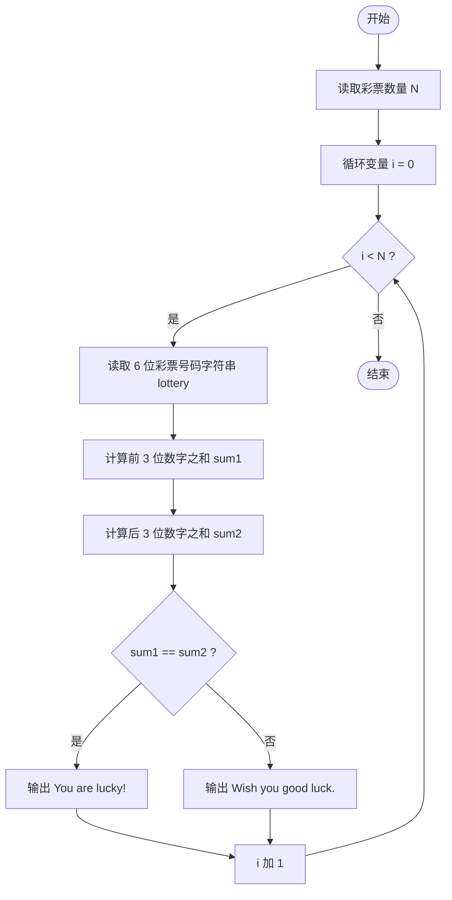
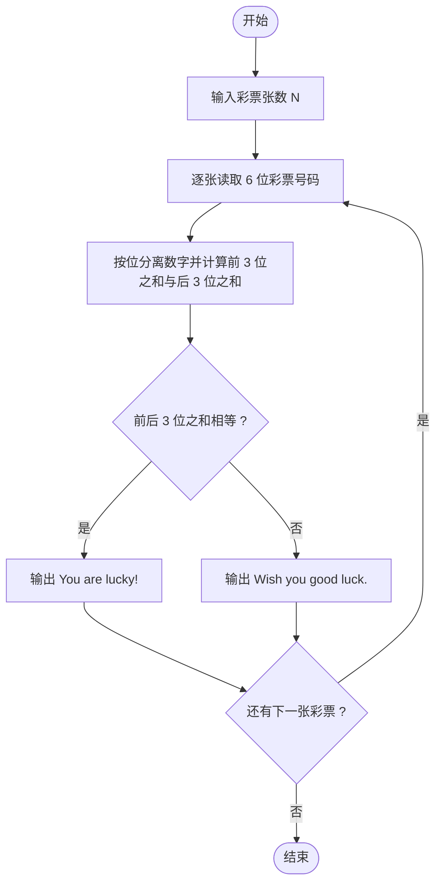

# L1-062 - 幸运彩票（15 分）

- **时间限制**: 400 ms
- **内存限制**: 65536 KB
- **代码长度限制**: 16 KB

---

## 题目描述

彩票的号码有 6 位数字，若一张彩票的前 3 位上的数之和等于后 3 位上的数之和，则称这张彩票是幸运的。本题就请你判断给定的彩票是不是幸运的。

### 输入格式:

输入在第一行中给出一个正整数 N（$$\le$$ 100）。随后 N 行，每行给出一张彩票的 6 位数字。

### 输出格式:

对每张彩票，如果它是幸运的，就在一行中输出 `You are lucky!`；否则输出 `Wish you good luck.`。

### 输入样例:
```in
2
233008
123456
```

### 输出样例:
```out
You are lucky!
Wish you good luck.
```

## 示例

### 示例 1

**输入:**
```
2
233008
123456
```

**输出:**
```
You are lucky!
Wish you good luck.
```

---

## 题目详解

### 一、解题思路

一张 6 位数字彩票是否幸运，取决于前 3 位数字之和与后 3 位数字之和是否相等。

解题步骤：

1. 读入彩票数量 `N`。
2. 对每张彩票：用字符串类型读取 6 位号码（字符串方式可避免前导零被吞掉的问题），再逐位用 `字符 - '0'` 转成数字。
3. 分别累加前 3 位（下标 0~2）和后 3 位（下标 3~5）的数字之和，记为 `sum1`、`sum2`。
4. 比较 `sum1` 与 `sum2`：相等输出 `You are lucky!`，否则输出 `Wish you good luck.`。

### 二、代码流程说明

1. 读取正整数 `N`，表示彩票张数。
2. 进入 `for` 循环，循环变量 `i` 从 0 到 `N-1`，逐张处理：
   - 读取 6 位号码字符串 `lottery`；
   - 计算前 3 位之和：`sum1 = (lottery[0]-'0') + (lottery[1]-'0') + (lottery[2]-'0')`；
   - 计算后 3 位之和：`sum2 = (lottery[3]-'0') + (lottery[4]-'0') + (lottery[5]-'0')`；
   - 用 `if (sum1 == sum2)` 判断：相等输出 `You are lucky!`，否则输出 `Wish you good luck.`。
3. `N` 张彩票全部处理完后程序结束。

### 三、代码流程图



### 四、解题流程图


