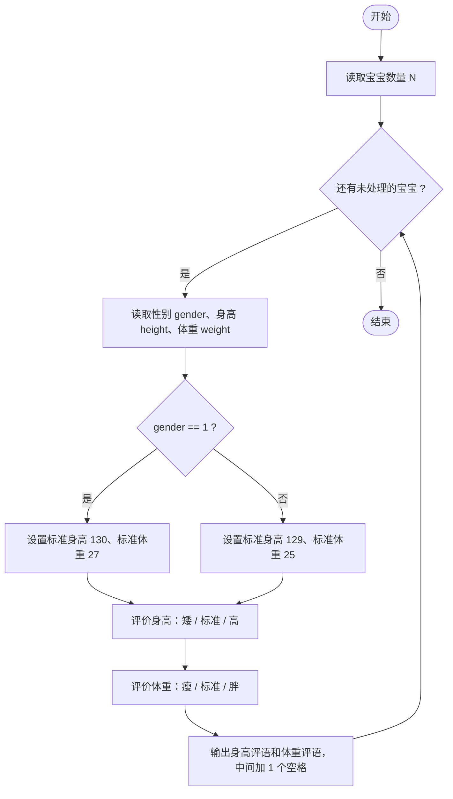
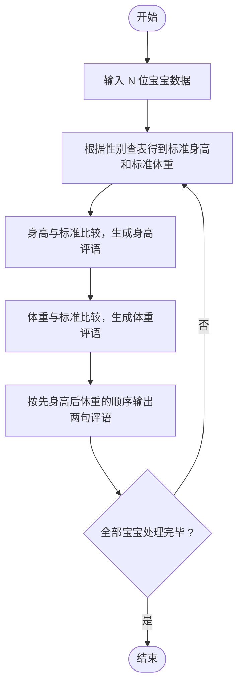

# L1-063 - 吃鱼还是吃肉（10 分）

- **时间限制**: 400 ms
- **内存限制**: 65536 KB
- **代码长度限制**: 16 KB

---

## 题目描述


  

国家给出了 8 岁男宝宝的标准身高为 130 厘米、标准体重为 27 公斤；8 岁女宝宝的标准身高为 129 厘米、标准体重为 25 公斤。

现在你要根据小宝宝的身高体重，给出补充营养的建议。

### 输入格式:

输入在第一行给出一个不超过 10 的正整数 $$N$$，随后 $$N$$ 行，每行给出一位宝宝的身体数据：
```
性别 身高 体重
```
其中`性别`是 1 表示男生，0 表示女生。`身高`和`体重`都是不超过 200 的正整数。

### 输出格式:

对于每一位宝宝，在一行中给出你的建议：

- 如果太矮了，输出：`duo chi yu!`（多吃鱼）；
- 如果太瘦了，输出：`duo chi rou!`（多吃肉）；
- 如果正标准，输出：`wan mei!`（完美）；
- 如果太高了，输出：`ni li hai!`（你厉害）；
- 如果太胖了，输出：`shao chi rou!`（少吃肉）。

先评价身高，再评价体重。两句话之间要有 1 个空格。

### 输入样例:
```in
4
0 130 23
1 129 27
1 130 30
0 128 27
```

### 输出样例:
```out
ni li hai! duo chi rou!
duo chi yu! wan mei!
wan mei! shao chi rou!
duo chi yu! shao chi rou!
```

## 示例

### 示例 1

**输入:**
```
4
0 130 23
1 129 27
1 130 30
0 128 27
```

**输出:**
```
ni li hai! duo chi rou!
duo chi yu! wan mei!
wan mei! shao chi rou!
duo chi yu! shao chi rou!
```

---

## 题目详解

### 一、解题思路

题目给出了 8 岁宝宝的标准数据：男生标准身高 130 厘米、标准体重 27 公斤；女生标准身高 129 厘米、标准体重 25 公斤。

解题步骤：

1. 读入宝宝数量 `N`。
2. 对每位宝宝读入性别 `gender`、身高 `height`、体重 `weight`。
3. 根据性别确定标准值：男生 `std_height=130`、`std_weight=27`；女生 `std_height=129`、`std_weight=25`。
4. 先评价身高：
   - 小于标准 → `duo chi yu!`（太矮）；
   - 等于标准 → `wan mei!`；
   - 大于标准 → `ni li hai!`（太高）。
5. 再评价体重：
   - 小于标准 → `duo chi rou!`（太瘦）；
   - 等于标准 → `wan mei!`；
   - 大于标准 → `shao chi rou!`（太胖）。
6. 把两句评语用 1 个空格连接后输出。

### 二、代码流程说明

1. 读取宝宝数量 `N`。
2. 进入 `for` 循环，循环变量 `i` 从 0 到 `N-1`：
   - 读取 `gender`、`height`、`weight`；
   - 用 `if (gender == 1)` 判断：男生设 `std_height=130`、`std_weight=27`，否则（女生）设 `std_height=129`、`std_weight=25`；
   - 评价身高：用两重 `if / else if / else` 把结果存入 `height_comment`（矮 `duo chi yu!` / 标准 `wan mei!` / 高 `ni li hai!`）；
   - 评价体重：同样用 `if / else if / else` 把结果存入 `weight_comment`（瘦 `duo chi rou!` / 标准 `wan mei!` / 胖 `shao chi rou!`）；
   - 输出 `height_comment << " " << weight_comment` 并换行。
3. 所有宝宝处理完后程序结束。

### 三、代码流程图



### 四、解题流程图


