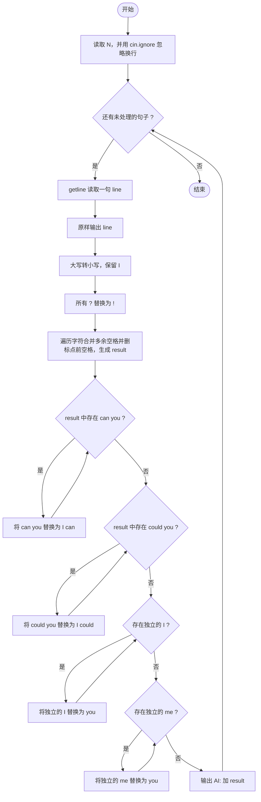
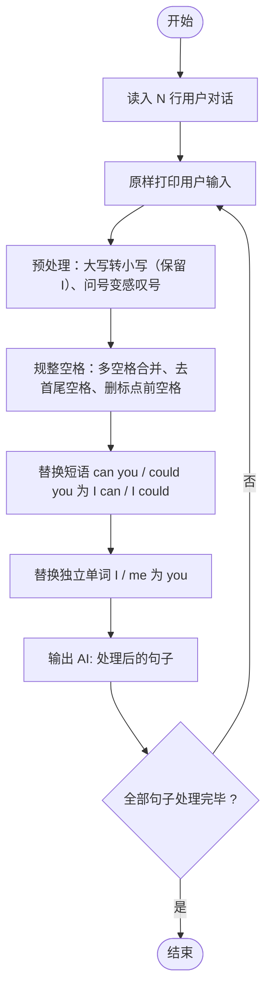

# L1-064 - 估值一亿的AI核心代码（20 分）

- **时间限制**: 400 ms
- **内存限制**: 65536 KB
- **代码长度限制**: 16 KB

---

## 题目描述


以上图片来自新浪微博。

本题要求你实现一个稍微更值钱一点的 AI 英文问答程序，规则是：

- 无论用户说什么，首先把对方说的话在一行中原样打印出来；
- 消除原文中多余空格：把相邻单词间的多个空格换成 1 个空格，把行首尾的空格全部删掉，把标点符号前面的空格删掉；
- 把原文中所有大写英文字母变成小写，除了 `I`；
- 把原文中所有独立的 `can you`、`could you` 对应地换成 `I can`、`I could`—— 这里“独立”是指被空格或标点符号分隔开的单词；
- 把原文中所有独立的 `I` 和 `me` 换成 `you`；
- 把原文中所有的问号 `?` 换成惊叹号 `!`；
- 在一行中输出替换后的句子作为 AI 的回答。

### 输入格式:

输入首先在第一行给出不超过 10 的正整数 N，随后 N 行，每行给出一句不超过 1000 个字符的、以回车结尾的用户的对话，对话为非空字符串，仅包括字母、数字、空格、可见的半角标点符号。

### 输出格式:

按题面要求输出，每个 AI 的回答前要加上 `AI:` 和一个空格。

### 输入样例:
```in
6
Hello ?
 Good to chat   with you
can   you speak Chinese?
Really?
Could you show me 5
What Is this prime? I,don 't know
```

### 输出样例:
```out
Hello ?
AI: hello!
 Good to chat   with you
AI: good to chat with you
can   you speak Chinese?
AI: I can speak chinese!
Really?
AI: really!
Could you show me 5
AI: I could show you 5
What Is this prime? I,don 't know
AI: what Is this prime! you,don't know
```

## 示例

### 示例 1

**输入:**
```
6
Hello ?
 Good to chat   with you
can   you speak Chinese?
Really?
Could you show me 5
What Is this prime? I,don 't know
```

**输出:**
```
Hello ?
AI: hello!
 Good to chat   with you
AI: good to chat with you
can   you speak Chinese?
AI: I can speak chinese!
Really?
AI: really!
Could you show me 5
AI: I could show you 5
What Is this prime? I,don 't know
AI: what Is this prime! you,don't know
```

---

## 题目详解

### 一、解题思路

本题是字符串处理的综合题，对每一行输入按以下步骤变换后输出：

1. 原样输出用户输入的句子（保留原始空格）。
2. 处理副本 `processed`：
   - 大写转小写（但独立的 `I` 保持大写，因此只对 `isupper(c)` 且 `c != 'I'` 的字符做 `tolower`）；
   - 所有 `?` 替换为 `!`。
3. 消除多余空格：遍历处理后的字符串，用 `prev_space` 标志记录上一个字符是否为空格。遇到空格只置标志；遇到非空格字符时，若前一个是空格且当前结果非空，则：若当前字符是标点（`.` `,` `!` `?` `;` `:` `'` `"`）不加空格，否则补 1 个空格，然后追加当前字符。这样同时实现"多个空格合并为 1 个、行首空格丢弃、标点前空格删除"。
4. 替换短语：用 `while` 配合 `string::find` + `replace`，把 `can you` 替换为 `I can`、`could you` 替换为 `I could`（先替换长的 `could you` 顺序上并不影响，因为 `can you` 与 `could you` 前缀不同）。
5. 替换独立单词：查找独立的 `I` 和 `me`——判断其前后相邻字符是否字母数字（`isalnum`），若前后均不是字母数字则视为独立，替换为 `you`；否则 `pos++` 跳过继续查找，避免死循环。
6. 输出 `AI: ` 前缀加处理结果。

### 二、代码流程说明

1. 读取行数 `N`，调用 `cin.ignore()` 吃掉第一行末尾的换行符，使后续 `getline` 能正确读入每句话。
2. 进入 `for` 循环（`i` 从 0 到 `N-1`）：
   - `getline(cin, line)` 读取一句原文；
   - 原样输出 `line`；
   - 复制 `line` 到 `processed`；
   - 遍历 `processed`：大写且非 `I` 的字符转为小写；
   - 再遍历一遍：把所有 `?` 改为 `!`；
   - 定义空串 `result` 和标志 `prev_space = true`（初始为 true 用于去掉行首空格），遍历 `processed`：`isspace(c)` 时置 `prev_space = true`；否则若 `prev_space` 且 `result` 非空，再判断 `c` 是否为标点——是标点则不加空格，否则补一个空格，然后 `result += c` 并置 `prev_space = false`；
   - `while` 循环把 `result` 中所有 `can you` 替换成 `I can`；
   - `while` 循环把所有 `could you` 替换成 `I could`；
   - `while` 循环处理独立 `I`：检查前后字符，独立则替换为 `you`，否则 `pos++` 向后继续；
   - `while` 循环处理独立 `me`：同理替换为 `you`；
   - 输出 `AI: ` + `result`。
3. 所有句子处理完毕，程序结束。

### 三、代码流程图



### 四、解题流程图


