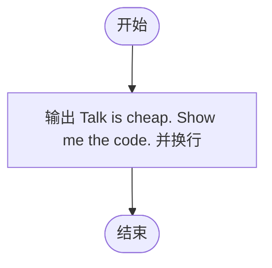
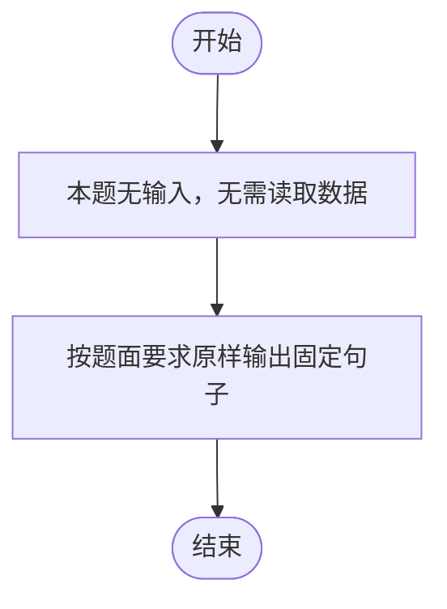

# L1-065 - 嫑废话上代码（5 分）

- **时间限制**: 400 ms
- **内存限制**: 65536 KB
- **代码长度限制**: 16 KB

---

## 题目描述

Linux 之父 Linus Torvalds 的名言是：“Talk is cheap. Show me the code.”（嫑废话，上代码）。本题就请你直接在屏幕上输出这句话。

### 输入格式:

本题没有输入。

### 输出格式:

在一行中输出 `Talk is cheap. Show me the code.`。

### 输入样例:
```in
无
```

### 输出样例:
```out
Talk is cheap. Show me the code.
```

## 示例

### 示例 1

**输入:**
```
无
```

**输出:**
```
Talk is cheap. Show me the code.
```

---

## 题目详解

### 一、解题思路

本题是最简单的纯输出题：题目没有输入，只需在一行中原样输出 Linux 之父 Linus Torvalds 的名言 `Talk is cheap. Show me the code.`，无需任何计算和判断。

解题步骤：

1. 程序直接输出目标字符串并换行。
2. 结束程序。

### 二、代码流程说明

1. 程序入口 `main()` 中没有任何输入语句（题目无输入）。
2. 直接执行 `cout << "Talk is cheap. Show me the code." << endl;`，输出目标句子并换行。
3. `return 0;` 正常结束程序。

### 三、代码流程图



### 四、解题流程图


