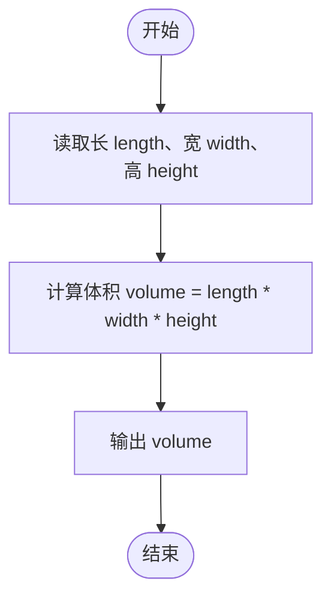
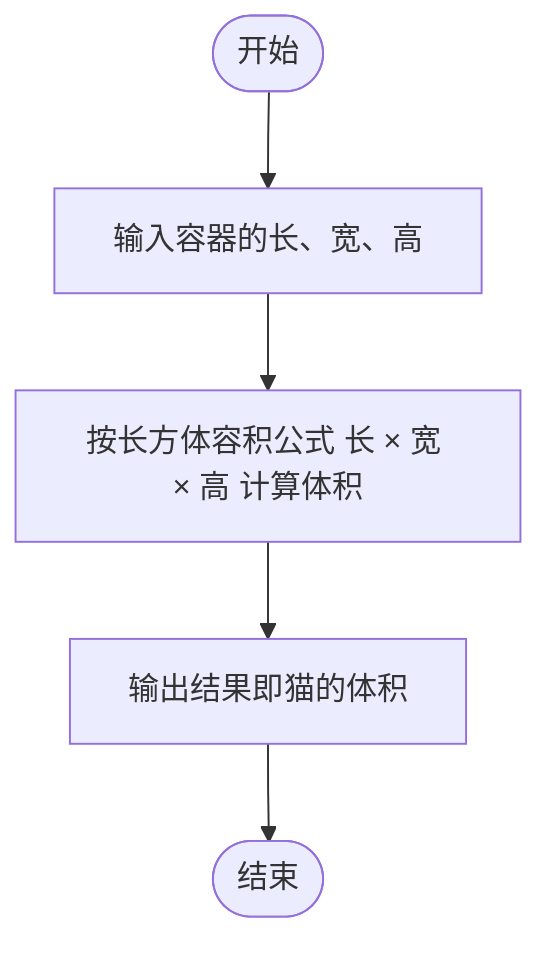

# L1-066 - 猫是液体（5 分）

- **时间限制**: 400 ms
- **内存限制**: 65536 KB
- **代码长度限制**: 16 KB

---

## 题目描述


测量一个人的体积是很难的，但猫就不一样了。因为猫是液体，所以可以很容易地通过测量一个长方体容器的容积来得到容器里猫的体积。本题就请你完成这个计算。

### 输入格式:

输入在第一行中给出 3 个不超过 100 的正整数，分别对应容器的长、宽、高。

### 输出格式:

在一行中输出猫的体积。

### 输入样例:
```in
23 15 20
```

### 输出样例:
```out
6900
```

## 示例

### 示例 1

**输入:**
```
23 15 20
```

**输出:**
```
6900
```

---

## 题目详解

### 一、解题思路

题目利用"猫是液体"的梗：既然猫是液体，猫的体积就等于所在长方体容器的容积，因此只需计算容器的容积。

解题步骤：

1. 读入容器的长、宽、高三个正整数。
2. 用长方体容积公式计算：

```
体积 = 长 × 宽 × 高
```

3. 输出计算结果。

三个数均不超过 100，乘积最大为 `100 × 100 × 100 = 1,000,000`，用 `int` 存储即可。

### 二、代码流程说明

1. 定义整型变量 `length`、`width`、`height`，用 `cin` 一次读入三个数。
2. 计算体积 `volume = length * width * height`。
3. 输出 `volume` 并换行，`return 0` 结束程序。

### 三、代码流程图



### 四、解题流程图


