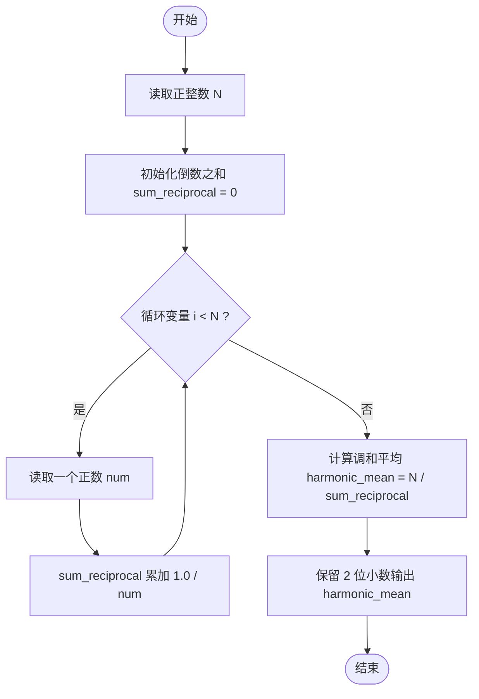
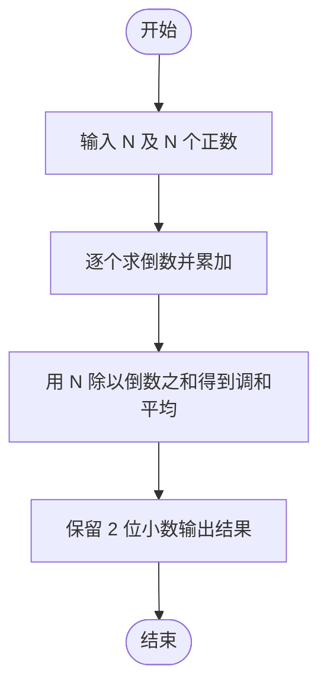

# L1-068 - 调和平均（10 分）

- **时间限制**: 400 ms
- **内存限制**: 65536 KB
- **代码长度限制**: 16 KB

---

## 题目描述

$$N$$ 个正数的**算数平均**是这些数的和除以 $$N$$，它们的**调和平均**是它们倒数的算数平均的倒数。本题就请你计算给定的一系列正数的调和平均值。

### 输入格式:

每个输入包含 1 个测试用例。每个测试用例第 1 行给出正整数 $$N$$ ($$\le 1000$$)；第 2 行给出 $$N$$ 个正数，都在区间 $$[0.1, 100]$$ 内。

### 输出格式:

在一行中输出给定数列的调和平均值，输出小数点后2位。

### 输入样例:
```in
8
10 15 12.7 0.3 4 13 1 15.6
```

### 输出样例:
```out
1.61
```

## 示例

### 示例 1

**输入:**
```
8
10 15 12.7 0.3 4 13 1 15.6
```

**输出:**
```
1.61
```

---

## 题目详解

### 一、解题思路

调和平均的定义：N 个正数的调和平均是它们倒数的算术平均的倒数，即：

```
调和平均 = N / (1/a1 + 1/a2 + ... + 1/aN)
```

解题步骤：

1. 读入正整数 `N`。
2. 依次读入 `N` 个正数，累加每个数的倒数 `1.0 / num`，得到倒数之和 `sum_reciprocal`。
3. 计算调和平均 `harmonic_mean = N / sum_reciprocal`。
4. 保留 2 位小数输出。

注意：累加倒数时必须使用浮点数（`double`），否则 `1 / num` 的整数除法结果恒为 0。

### 二、代码流程说明

1. 读取正整数 `N`。
2. 初始化 `double sum_reciprocal = 0`。
3. 进入 `for` 循环（`i` 从 0 到 `N-1`）：
   - 读取一个正数 `num`；
   - 累加其倒数：`sum_reciprocal += 1.0 / num`。
4. 计算调和平均值 `harmonic_mean = N / sum_reciprocal`。
5. 用 `cout << fixed << setprecision(2) << harmonic_mean` 保留 2 位小数输出，`return 0` 结束。

### 三、代码流程图



### 四、解题流程图


