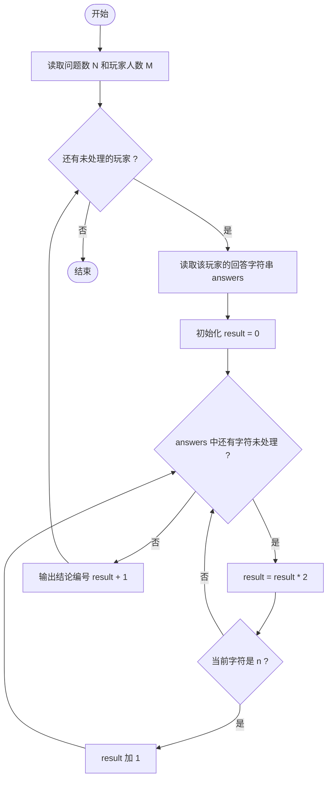
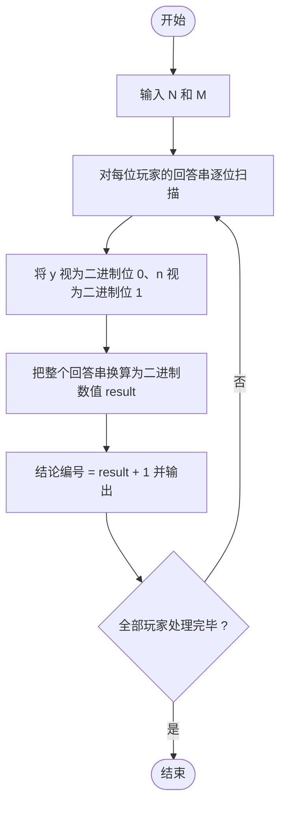

# L1-071 - 前世档案（20 分）

- **时间限制**: 400 ms
- **内存限制**: 65536 KB
- **代码长度限制**: 16 KB

---

## 题目描述


网络世界中时常会遇到这类滑稽的算命小程序，实现原理很简单，随便设计几个问题，根据玩家对每个问题的回答选择一条判断树中的路径（如下图所示），结论就是路径终点对应的那个结点。


现在我们把结论从左到右顺序编号，编号从 1 开始。这里假设回答都是简单的“是”或“否”，又假设回答“是”对应向左的路径，回答“否”对应向右的路径。给定玩家的一系列回答，请你返回其得到的结论的编号。

### 输入格式:

输入第一行给出两个正整数：$$N$$（$$\le 30$$）为玩家做一次测试要回答的问题数量；$$M$$（$$\le 100$$）为玩家人数。

随后 $$M$$ 行，每行顺次给出玩家的 $$N$$ 个回答。这里用 `y` 代表“是”，用 `n` 代表“否”。

### 输出格式:

对每个玩家，在一行中输出其对应的结论的编号。

### 输入样例:
```in
3 4
yny
nyy
nyn
yyn
```

### 输出样例:
```out
3
5
6
2
```

## 示例

### 示例 1

**输入:**
```
3 4
yny
nyy
nyn
yyn
```

**输出:**
```
3
5
6
2
```

---

## 题目详解

### 一、解题思路

N 个问题对应一棵深度为 N 的满二叉树，结论从左到右编号 1 ~ 2^N。回答 `y`（是）向左走，`n`（否）向右走，路径终点即为结论。

关键规律：把回答串看成一个 N 位二进制数——`y` 对应二进制位 0，`n` 对应二进制位 1，则**结论编号 = 二进制数值 + 1**。

验证样例（N=3）：
- `yny` → 010₂ = 2 → 编号 3 ✓
- `nyy` → 100₂ = 4 → 编号 5 ✓
- `nyn` → 101₂ = 5 → 编号 6 ✓
- `yyn` → 001₂ = 1 → 编号 2 ✓

解题步骤：

1. 读入问题数 `N` 和玩家人数 `M`。
2. 对每个玩家：读入回答串，从左到右逐位用 `result = result * 2 + (c == 'n' ? 1 : 0)` 累加出二进制数值。
3. 输出 `result + 1`。

### 二、代码流程说明

1. 读取 `N` 和 `M`。
2. 进入 `for` 循环（`i` 从 0 到 `M-1`）：
   - 读取回答字符串 `answers`；
   - 初始化 `result = 0`；
   - 用 `for (char c : answers)` 遍历每个字符：先 `result = result * 2`（整体左移一位），若 `c == 'n'` 则 `result += 1`（把当前位设为 1）；
   - 输出结论编号 `result + 1`。
3. 所有玩家处理完毕，程序结束。

### 三、代码流程图



### 四、解题流程图


