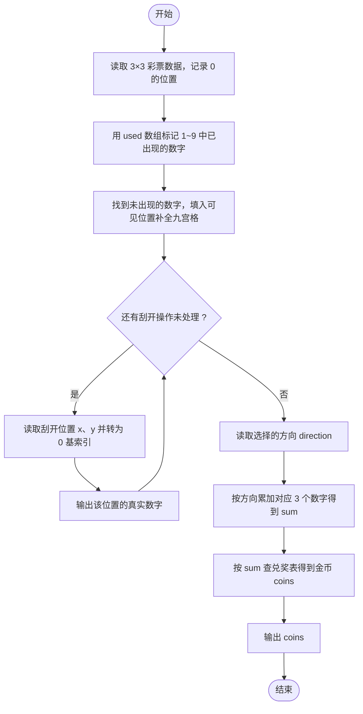
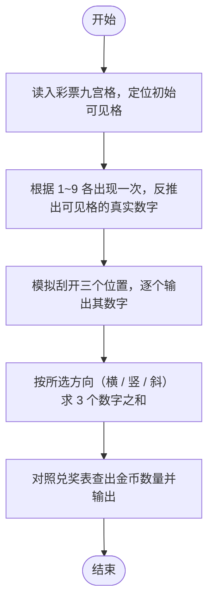

# L1-072 - 刮刮彩票（20 分）

- **时间限制**: 400 ms
- **内存限制**: 65536 KB
- **代码长度限制**: 16 KB

---

## 题目描述

“刮刮彩票”是一款网络游戏里面的一个小游戏。如图所示：


每次游戏玩家会拿到一张彩票，上面会有 9 个数字，分别为数字 1 到数字 9，数字各不重复，并以 $$3\times3$$ 的“九宫格”形式排布在彩票上。

在游戏开始时能看见一个位置上的数字，其他位置上的数字均不可见。你可以选择三个位置的数字刮开，这样玩家就能看见四个位置上的数字了。最后玩家再从 3 横、3 竖、2 斜共 8 个方向中挑选一个方向，方向上三个数字的和可根据下列表格进行兑奖，获得对应数额的金币。

| 数字合计 | 获得金币 | 数字合计 | 获得金币 |
| -------- | -------- | -------- | -------- |
| 6     | 10,000     | 16     | 72     |
| 7     | 36     | 17     | 180     |
| 8     | 720     | 18     | 119     |
| 9     | 360     | 19     | 36     |
| 10     | 80     | 20     | 306     |
| 11    | 252     | 21     | 1,080     |
| 12    | 108     | 22    | 144     |
| 13    | 72     | 23    | 1,800     |
| 14    | 54     | 24    | 3,600     |
| 15    | 180     |      ||      |

现在请你写出一个模拟程序，模拟玩家的游戏过程。

### 输入格式:

输入第一部分给出一张合法的彩票，即用 3 行 3 列给出 0 至 9 的数字。**0 表示的是这个位置上的数字初始时就能看见了**，而不是彩票上的数字为 0。

第二部给出玩家刮开的三个位置，分为三行，每行按格式 `x y` 给出玩家刮开的位置的行号和列号（题目中定义左上角的位置为第 1 行、第 1 列。）。数据保证玩家不会重复刮开已刮开的数字。

最后一部分给出玩家选择的方向，即一个整数： 1 至 3 表示选择横向的第一行、第二行、第三行，4 至 6 表示纵向的第一列、第二列、第三列，7、8分别表示左上到右下的主对角线和右上到左下的副对角线。

### 输出格式:

对于每一个刮开的操作，在一行中输出玩家能看到的数字。最后对于选择的方向，在一行中输出玩家获得的金币数量。

### 输入样例:
```in
1 2 3
4 5 6
7 8 0
1 1
2 2
2 3
7
```

### 输出样例:
```out
1
5
6
180
```

## 示例

### 示例 1

**输入:**
```
1 2 3
4 5 6
7 8 0
1 1
2 2
2 3
7
```

**输出:**
```
1
5
6
180
```

---

## 题目详解

### 一、解题思路

彩票是 3×3 九宫格，数字 1~9 各出现一次；`0` 表示该位置初始可见但真实数字未知。由于 1~9 各出现一次，九宫格中唯一缺失的那个数字就是可见位置的真实数字。

解题步骤：

1. 读入 3×3 数据，记录值为 `0` 的位置 `(visible_row, visible_col)`。
2. 用一个布尔数组标记 1~9 中已出现的数字，找到未出现的数字即为可见位置的真实数字，填回九宫格。
3. 处理 3 次刮开操作：每次读入位置（1 基索引，减 1 转 0 基），输出该位置的数字。
4. 读入选择的方向（1~8），按方向累加对应 3 个数字得到 `sum`。
5. 按 `sum` 查兑奖表得到金币数并输出。

### 二、代码流程说明

1. 定义 `int lottery[3][3]`，双重循环读入九宫格；当读到 0 时记录 `visible_row = i`、`visible_col = j`。
2. 双重循环遍历九宫格，把非 0 数字在 `bool used[10]` 中标记为已出现。
3. 循环 `i` 从 1 到 9，找到第一个 `used[i] == false` 的数字作为 `visible_value`，填入 `lottery[visible_row][visible_col]`，补全九宫格。
4. 循环 3 次处理刮开：读入 `x`、`y`，各自减 1 转为 0 基索引，输出 `lottery[x][y]`。
5. 读入方向 `direction`，用 `switch` 按 8 个方向（3 行、3 列、主/副对角线）累加对应 3 个格子到 `sum`。
6. 用 `switch (sum)` 按兑奖表（6→10000、7→36、8→720、9→360、10→80、11→252、12→108、13→72、14→54、15→180、16→72、17→180、18→119、19→36、20→306、21→1080、22→144、23→1800、24→3600）查得 `coins`，输出。

### 三、代码流程图



### 四、解题流程图


