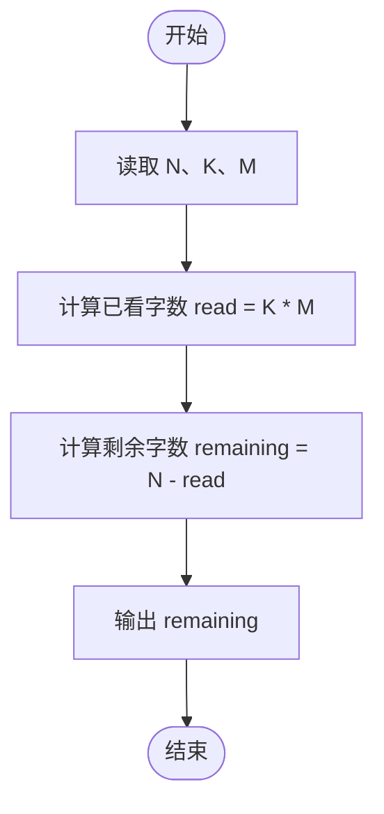
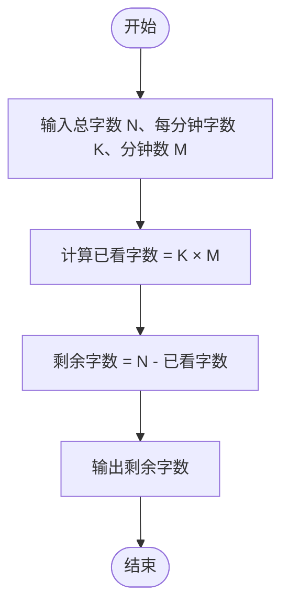

# L1-074 - 两小时学完C语言（5 分）

- **时间限制**: 400 ms
- **内存限制**: 65536 KB
- **代码长度限制**: 16 KB

---

## 题目描述


知乎上有个宝宝问：“两个小时内如何学完 C 语言？”当然，问的是“学完”并不是“学会”。

假设一本 C 语言教科书有 N 个字，这个宝宝每分钟能看 K 个字，看了 M 分钟。还剩多少字没有看？

### 输入格式:

输入在一行中给出 3 个正整数，分别是 N（不超过 400 000），教科书的总字数；K（不超过 3 000），是宝宝每分钟能看的字数；M（不超过 120），是宝宝看书的分钟数。

题目保证宝宝看完的字数不超过 N。

### 输出格式:

在一行中输出宝宝还没有看的字数。

### 输入样例:
```in
100000 1000 72
```

### 输出样例:
```out
28000
```

## 示例

### 示例 1

**输入:**
```
100000 1000 72
```

**输出:**
```
28000
```

---

## 题目详解

### 一、解题思路

题目本质是一个简单的减法运算：宝宝看书的总字数 `N` 减去已看的字数（每分钟看 `K` 个字，看了 `M` 分钟，共看 `K * M` 字），即为剩余未看的字数。

解题步骤：

1. 读入三个正整数 `N`（总字数）、`K`（每分钟看的字数）、`M`（看书分钟数）。
2. 计算已看字数 `read = K * M`。
3. 计算剩余字数 `remaining = N - read`。
4. 输出 `remaining`。

注意：题目保证 `K * M ≤ N`，所以结果不会出现负数。

### 二、代码流程说明

1. 定义整型变量 `N`、`K`、`M`，用 `cin` 在一行中读入三个数。
2. 计算已看字数 `read = K * M`。
3. 计算剩余字数 `remaining = N - read`。
4. 输出 `remaining` 并换行，`return 0` 结束程序。

### 三、代码流程图



### 四、解题流程图


