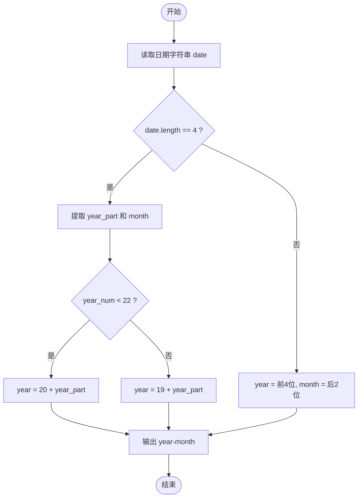
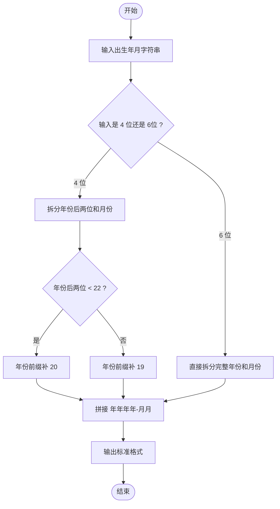

# L1-075 - 强迫症（10 分）

- **时间限制**: 400 ms
- **内存限制**: 65536 KB
- **代码长度限制**: 16 KB

---

## 题目描述

小强在统计一个小区里居民的出生年月，但是发现大家填写的生日格式不统一，例如有的人写 `199808`，有的人只写 `9808`。有强迫症的小强请你写个程序，把所有人的出生年月都整理成 `年年年年-月月` 格式。对于那些只写了年份后两位的信息，我们默认小于 `22` 都是 `20` 开头的，其他都是 `19` 开头的。

### 输入格式:

输入在一行中给出一个出生年月，为一个 6 位或者 4 位数，题目保证是 1000 年 1 月到 2021 年 12 月之间的合法年月。

### 输出格式:

在一行中按标准格式 `年年年年-月月` 将输入的信息整理输出。

### 输入样例 1：
```in
9808
```

### 输出样例 1：
```out
1998-08
```

### 输入样例 2：
```in
0510
```

### 输出样例 2：
```out
2005-10
```

### 输入样例 3：
```in
196711
```

### 输出样例 3：
```out
1967-11
```

## 示例

### 示例 1

**输入:**
```
9808
```

**输出:**
```
1998-08
```

### 示例 2

**输入:**
```
0510
```

**输出:**
```
2005-10
```

### 示例 3

**输入:**
```
196711
```

**输出:**
```
1967-11
```

---

## 题目详解

### 一、解题思路

本题将输入的出生年月（4 位或 6 位数字字符串）整理为标准格式 `年年年年-月月`。

对于 4 位输入（年份后两位 + 月份）：
- 提取前 2 位作为年份后两位，若其数值 `< 22`，则前缀补 `20`；否则前缀补 `19`。
- 后 2 位为月份。

对于 6 位输入（完整年份 + 月份）：
- 前 4 位直接作为年份，后 2 位作为月份。

解题步骤：

1. 读入日期字符串 `date`。
2. 若长度为 4：提取 `year_part = date.substr(0, 2)` 和 `month = date.substr(2, 2)`，将 `year_part` 转为整数，`< 22` 则 `year = "20" + year_part`，否则 `year = "19" + year_part`。
3. 若长度为 6：`year = date.substr(0, 4)`，`month = date.substr(4, 2)`。
4. 输出 `year << "-" << month`。

### 二、代码流程说明

1. 定义字符串 `date`，用 `cin` 读入出生年月。
2. 判断 `date.length() == 4`：
   - 是：取 `year_part = date.substr(0, 2)`，`month = date.substr(2, 2)`；用 `stoi` 将 `year_part` 转为整数 `year_num`；若 `year_num < 22` 则 `year = "20" + year_part`，否则 `year = "19" + year_part`。
   - 否（6 位）：`year = date.substr(0, 4)`，`month = date.substr(4, 2)`。
3. 输出 `year << "-" << month` 并换行，`return 0` 结束程序。

### 三、代码流程图



### 四、解题流程图


