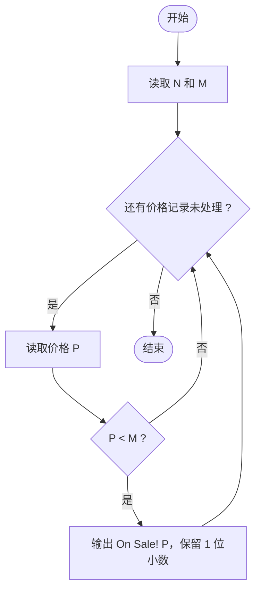
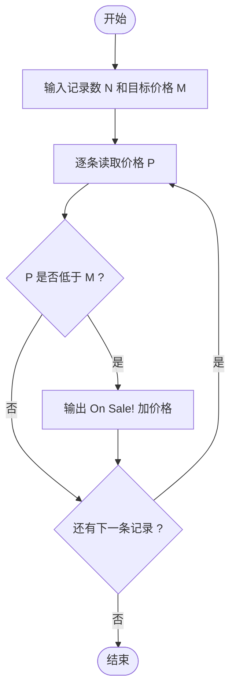

# L1-076 - 降价提醒机器人（10 分）

- **时间限制**: 400 ms
- **内存限制**: 65536 KB
- **代码长度限制**: 16 KB

---

## 题目描述

小 T 想买一个玩具很久了，但价格有些高，他打算等便宜些再买。但天天盯着购物网站很麻烦，请你帮小 T 写一个降价提醒机器人，当玩具的当前价格比他设定的价格便宜时发出提醒。

### 输入格式:

输入第一行是两个正整数 $$N$$ 和 $$M$$ ($$1 \le N \le 100, 0 \le M \le 1000$$)，表示有 $$N$$ 条价格记录，小 T 设置的价格为 $$M$$。

接下来 $$N$$ 行，每行有一个实数 $$P_i$$（$$-1000.0 < P_i < 1000.0$$），表示一条价格记录。

### 输出格式:

对每一条比设定价格 $$M$$ 便宜的价格记录 `P`，在一行中输出 `On Sale! P`，其中 `P` 输出到小数点后 1 位。

### 输入样例:
```in
4 99
98.0
97.0
100.2
98.9
```

### 输出样例:
```out
On Sale! 98.0
On Sale! 97.0
On Sale! 98.9
```

## 示例

### 示例 1

**输入:**
```
4 99
98.0
97.0
100.2
98.9
```

**输出:**
```
On Sale! 98.0
On Sale! 97.0
On Sale! 98.9
```

---

## 题目详解

### 一、解题思路

逐条检查价格记录，若价格 `P` 低于设定价格 `M`，则发出降价提醒 `On Sale! P`。

解题步骤：

1. 读入价格记录数 `N` 和设定价格 `M`。
2. 对每条价格记录：读入价格 `P`，若 `P < M` 则输出 `On Sale! P`，`P` 保留 1 位小数。
3. 所有记录处理完毕后程序结束。

### 二、代码流程说明

1. 定义整型 `N` 和浮点型 `M`，用 `cin` 读入。
2. 进入 `for` 循环（`i` 从 0 到 `N-1`）：
   - 读入价格 `P`（`double`）；
   - 用 `if (P < M)` 判断：若低于设定价格，用 `cout << fixed << setprecision(1) << "On Sale! " << P << endl` 输出提醒（保留 1 位小数）。
3. 循环结束后 `return 0`。

### 三、代码流程图



### 四、解题流程图


