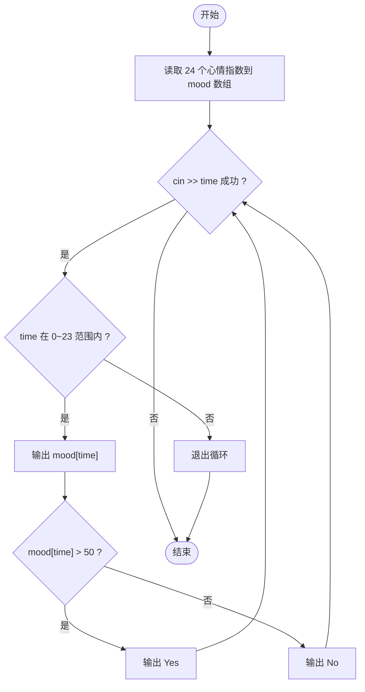
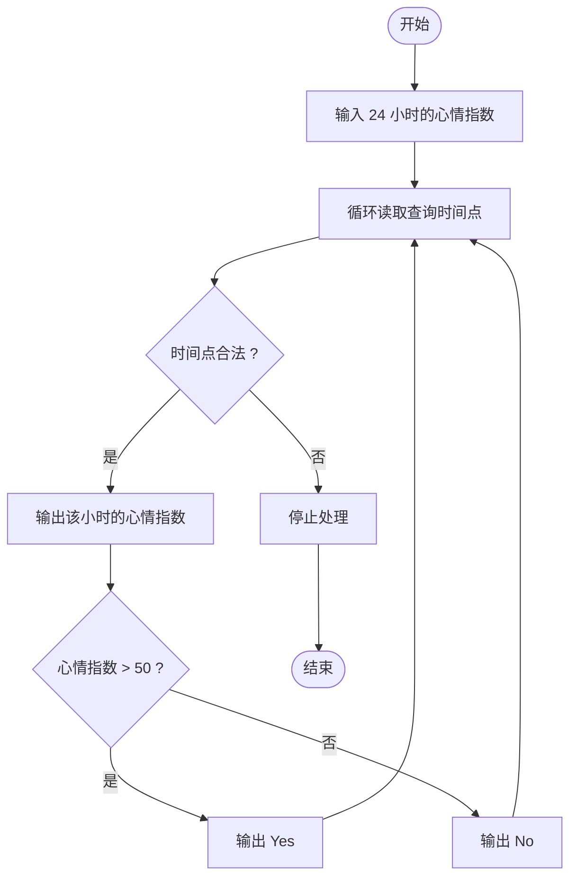

# L1-077 - 大笨钟的心情（15 分）

- **时间限制**: 400 ms
- **内存限制**: 65536 KB
- **代码长度限制**: 16 KB

---

## 题目描述


有网友问：未来还会有更多大笨钟题吗？笨钟回复说：看心情……

本题就请你替大笨钟写一个程序，根据心情自动输出回答。

### 输入格式:

输入在一行中给出 24 个 [0, 100] 区间内的整数，依次代表大笨钟在一天 24 小时中，每个小时的心情指数。

随后若干行，每行给出一个 [0, 23] 之间的整数，代表网友询问笨钟这个问题的时间点。当出现非法的时间点时，表示输入结束，这个非法输入不要处理。题目保证至少有 1 次询问。

### 输出格式:

对每一次提问，如果当时笨钟的心情指数大于 50，就在一行中输出 `心情指数 Yes`，否则输出 `心情指数 No`。

### 输入样例:
```in
80 75 60 50 20 20 20 20 55 62 66 51 42 33 47 58 67 52 41 20 35 49 50 63
17
7
3
15
-1
```

### 输出样例:
```out
52 Yes
20 No
50 No
58 Yes
```

## 示例

### 示例 1

**输入:**
```
80 75 60 50 20 20 20 20 55 62 66 51 42 33 47 58 67 52 41 20 35 49 50 63
17
7
3
15
-1
```

**输出:**
```
52 Yes
20 No
50 No
58 Yes
```

---

## 题目详解

### 一、解题思路

先读入大笨钟 24 小时的心情指数，然后对每个查询时间点输出该小时的心情指数及心情状态：指数大于 50 输出 `Yes`，否则输出 `No`。当输入非法时间点（不在 0~23 范围内）时停止处理。

解题步骤：

1. 读入 24 个心情指数存入数组 `mood[24]`。
2. 循环读入查询时间点 `time`：
   - 若 `time < 0` 或 `time >= 24`，退出循环；
   - 否则输出 `mood[time]`，若 `mood[time] > 50` 输出 `Yes`，否则输出 `No`。
3. 程序结束。

### 二、代码流程说明

1. 定义数组 `int mood[24]`，用 `for` 循环读入 24 个心情指数。
2. 定义变量 `int time`，用 `while (cin >> time)` 循环读入查询时间：
   - 若 `time < 0 || time >= 24`，`break` 退出循环；
   - 输出 `mood[time] << " "`；
   - 若 `mood[time] > 50` 输出 `Yes`，否则输出 `No`。
3. `return 0` 结束程序。

### 三、代码流程图



### 四、解题流程图


