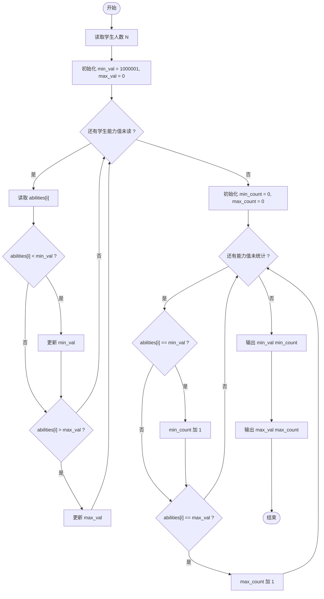
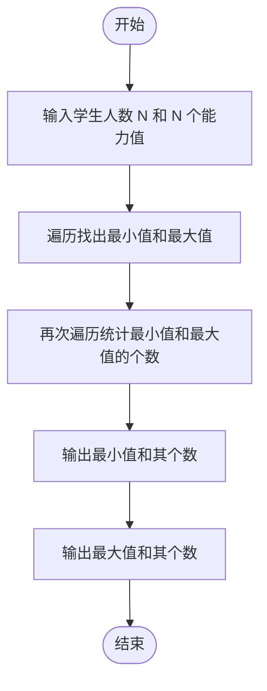

# L1-079 - 天梯赛的善良（20 分）

- **时间限制**: 200 ms
- **内存限制**: 65536 KB
- **代码长度限制**: 16 KB

---

## 题目描述

天梯赛是个善良的比赛。善良的命题组希望将题目难度控制在一个范围内，使得每个参赛的学生都有能做出来的题目，并且最厉害的学生也要非常努力才有可能得到高分。

于是命题组首先将编程能力划分成了 $$10^6$$ 个等级（太疯狂了，这是假的），然后调查了每个参赛学生的编程能力。现在请你写个程序找出所有参赛学生的最小和最大能力值，给命题组作为出题的参考。

### 输入格式:

输入在第一行中给出一个正整数 $$N$$（$$\le 2\times 10^4$$），即参赛学生的总数。随后一行给出 $$N$$ 个不超过 $$10^6$$ 的正整数，是参赛学生的能力值。

### 输出格式:

第一行输出所有参赛学生的最小能力值，以及具有这个能力值的学生人数。第二行输出所有参赛学生的最大能力值，以及具有这个能力值的学生人数。同行数字间以 1 个空格分隔，行首尾不得有多余空格。

### 输入样例:
```in
10
86 75 233 888 666 75 886 888 75 666
```

### 输出样例:
```out
75 3
888 2
```

## 示例

### 示例 1

**输入:**
```
10
86 75 233 888 666 75 886 888 75 666
```

**输出:**
```
75 3
888 2
```

---

## 题目详解

### 一、解题思路

找出所有参赛学生能力值中的最小值和最大值，并统计它们各自的人数。

解题步骤：

1. 读入学生人数 `N`。
2. 读入 `N` 个能力值，同时遍历找出最小值 `min_val` 和最大值 `max_val`。
3. 再次遍历数组，统计 `min_val` 出现的次数 `min_count` 和 `max_val` 出现的次数 `max_count`。
4. 输出 `min_val` 和 `min_count`（空格分隔），再输出 `max_val` 和 `max_count`（空格分隔）。

注意：初始化 `min_val = 1000001`（大于题目最大值 10^6），`max_val = 0`（小于题目最小值 1），确保首次比较能正确更新。

### 二、代码流程说明

1. 读取正整数 `N`。
2. 定义数组 `int abilities[20000]`，初始化 `min_val = 1000001`、`max_val = 0`。
3. 进入 `for` 循环（`i` 从 0 到 `N-1`）：读入 `abilities[i]`，若 `abilities[i] < min_val` 则更新 `min_val`，若 `abilities[i] > max_val` 则更新 `max_val`。
4. 初始化 `min_count = 0`、`max_count = 0`，再次遍历数组：若 `abilities[i] == min_val` 则 `min_count++`，若 `abilities[i] == max_val` 则 `max_count++`。
5. 输出 `min_val << " " << min_count` 和 `max_val << " " << max_count`，`return 0` 结束。

### 三、代码流程图



### 四、解题流程图


