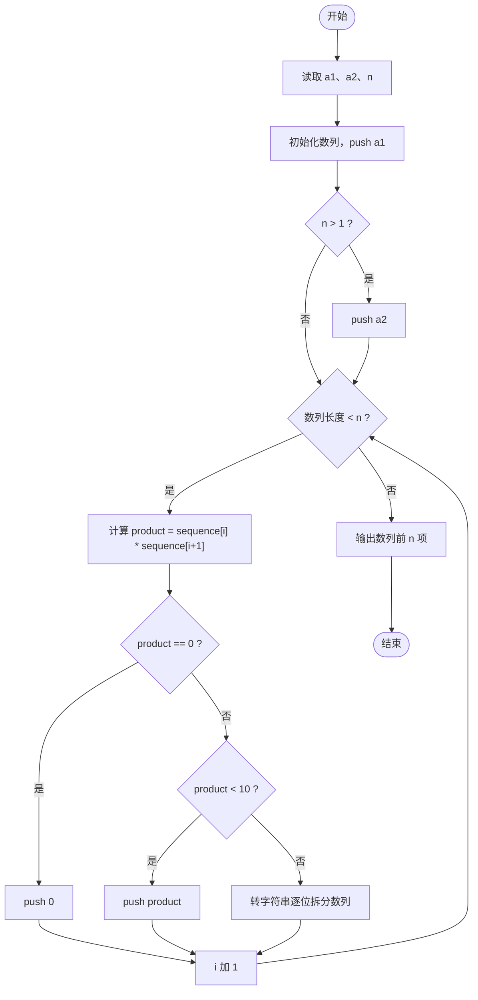
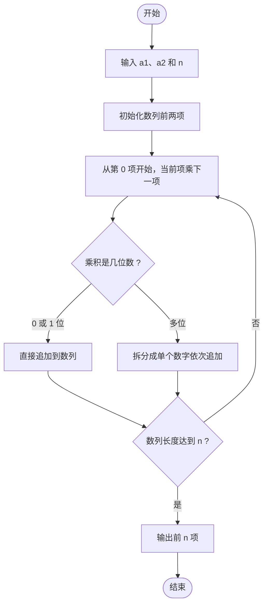

# L1-080 - 乘法口诀数列（20 分）

- **时间限制**: 400 ms
- **内存限制**: 65536 KB
- **代码长度限制**: 16 KB

---

## 题目描述

本题要求你从任意给定的两个 1 位数字 $$a_1$$ 和 $$a_2$$ 开始，用乘法口诀生成一个数列 {$$a_n$$}，规则为从 $$a_1$$ 开始顺次进行，每次将当前数字与后面一个数字相乘，将结果贴在数列末尾。如果结果不是 1 位数，则其每一位都应成为数列的一项。

### 输入格式:

输入在一行中给出 3 个整数，依次为 $$a_1$$、$$a_2$$ 和 $$n$$，满足 $$0\le a_1,a_2\le 9$$，$$0<n\le 10^3$$。

### 输出格式:

在一行中输出数列的前 $$n$$ 项。数字间以 1 个空格分隔，行首尾不得有多余空格。

### 输入样例:
```in
2 3 10
```

### 输出样例:
```out
2 3 6 1 8 6 8 4 8 4
```

## 示例

### 示例 1

**输入:**
```
2 3 10
```

**输出:**
```
2 3 6 1 8 6 8 4 8 4
```

---

## 题目详解

### 一、解题思路

从初始两项 `a1`、`a2` 开始生成数列。每次取当前项 `sequence[i]` 与下一项 `sequence[i+1]` 相乘，将乘积的每一位数字依次追加到数列末尾，直到数列长度达到 `n`。

解题步骤：

1. 读入 `a1`、`a2`、`n`。
2. 初始化数列，先放入 `a1`，若 `n > 1` 再放入 `a2`。
3. 从 `i = 0` 开始循环：计算 `product = sequence[i] * sequence[i+1]`：
   - 若 `product == 0`：追加 `0`；
   - 若 `product < 10`：直接追加该数字；
   - 否则：将乘积转为字符串，逐位拆开追加。
   - `i` 加 1，重复直到数列长度达到 `n`。
4. 输出数列前 `n` 项，数字间用空格分隔。

### 二、代码流程说明

1. 读取 `a1`、`a2`、`n`。
2. 定义 `vector<int> sequence`，`push_back(a1)`；若 `n > 1` 再 `push_back(a2)`。
3. 初始化 `i = 0`，`while (sequence.size() < n)` 循环：
   - `product = sequence[i] * sequence[i+1]`；
   - `product == 0`：`sequence.push_back(0)`；
   - `product < 10`：`sequence.push_back(product)`；
   - 否则：用 `to_string(product)` 转字符串，逐字符 `c - '0'` 拆位追加，追加过程中若 `sequence.size() >= n` 则 `break`；
   - `i++`。
4. 用 `for` 循环输出前 `n` 项，除第一项外每项前输出空格，末尾换行。

### 三、代码流程图



### 四、解题流程图


