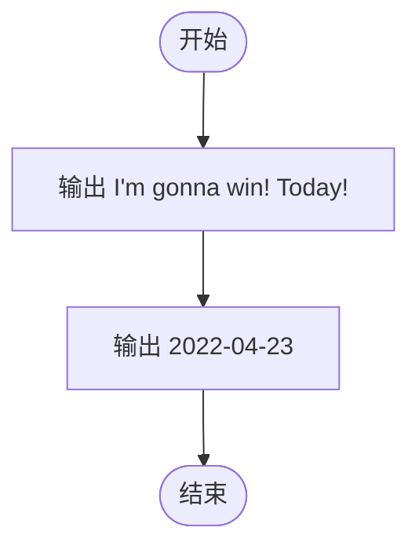
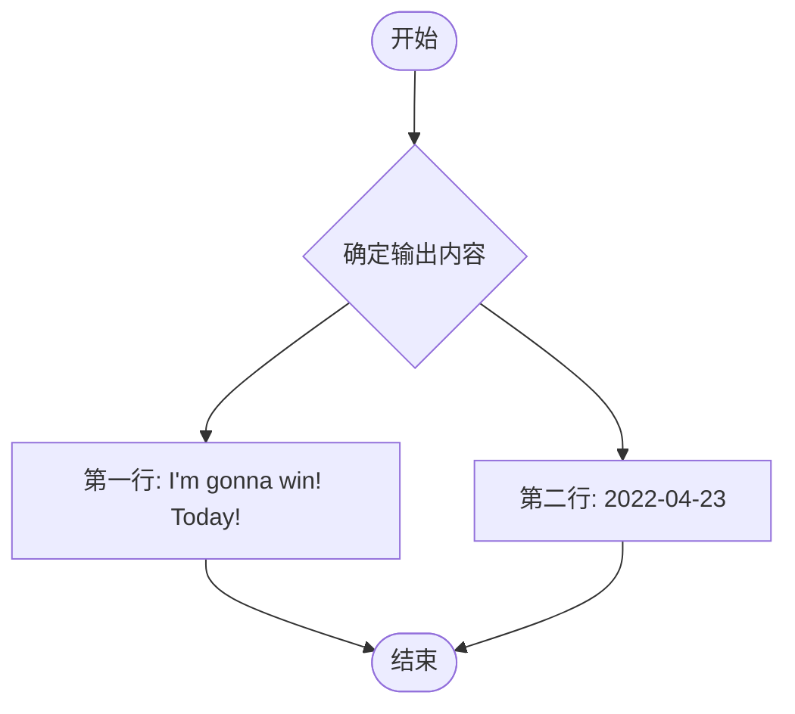

# L1-081 - 今天我要赢（5 分）

- **时间限制**: 400 ms
- **内存限制**: 65536 KB
- **代码长度限制**: 16 KB

---

## 题目描述

2018 年我们曾经出过一题，是输出“2018 我们要赢”。今年是 2022 年，你要输出的句子变成了“我要赢！就在今天！”然后以比赛当天的日期落款。

### 输入格式:

本题没有输入。

### 输出格式:

输出分 2 行。在第一行中输出 `I'm gonna win! Today!`，在第二行中用 `年年年年-月月-日日` 的格式输出比赛当天的日期。已知比赛的前一天是 `2022-04-22`。

### 输入样例:
```in
无
```

### 输出样例:
```out
I'm gonna win! Today!
这一行的内容我不告诉你…… 你要自己输出正确的日期呀~
```

## 示例

### 示例 1

**输入:**
```
无
```

**输出:**
```
I'm gonna win! Today!
这一行的内容我不告诉你…… 你要自己输出正确的日期呀~
```

---

## 题目详解

### 一、解题思路

本题是一道简单的输出题。根据题意，比赛前一天是 2022-04-22，因此比赛当天为 2022-04-23。程序无需读取任何输入，直接输出两行固定内容即可：第一行输出字符串 `I'm gonna win! Today!`，第二行输出日期 `2022-04-23`。

### 二、代码流程说明

1. 程序入口 `main()`，无需读取输入
2. 调用 `cout` 输出第一行字符串 `I'm gonna win! Today!`，并换行
3. 调用 `cout` 输出第二行日期 `2022-04-23`，并换行
4. 返回 0，程序结束

### 三、代码流程图



### 四、解题流程图


