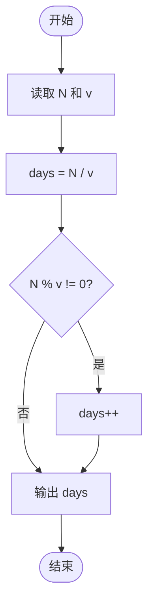
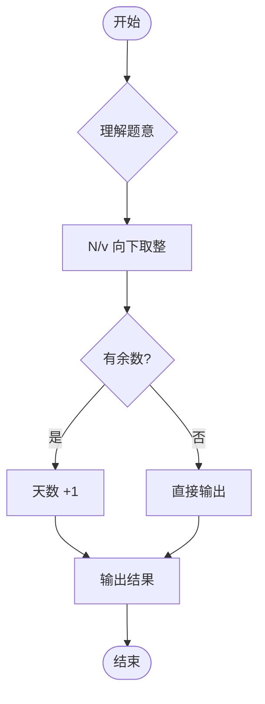

# L1-082 - 种钻石（5 分）

- **时间限制**: 400 ms
- **内存限制**: 65536 KB
- **代码长度限制**: 16 KB

---

## 题目描述


2019年10月29日，中央电视台专题报道，中国科学院在培育钻石领域，取得科技突破。科学家们用金刚石的籽晶片作为种子，利用甲烷气体在能量作用下形成碳的等离子体，慢慢地沉积到钻石种子上，一周“种”出了一颗 1 克拉大小的钻石。

本题给出钻石的需求量和人工培育钻石的速度，请你计算出货需要的时间。

### 输入格式:

输入在一行中给出钻石的需求量 $$N$$（不超过 $$10^7$$ 的正整数，以`微克拉`为单位）和人工培育钻石的速度 $$v$$（$$1\le v \le 200$$，以`微克拉/天`为单位的整数）。

### 输出格式:

在一行中输出培育 $$N$$ 微克拉钻石需要的整数天数。不到一天的时间不算在内。

### 输入样例:
```in
102000 130
```

### 输出样例:
```out
784
```

## 示例

### 示例 1

**输入:**
```
102000 130
```

**输出:**
```
784
```

---

## 题目详解

### 一、解题思路

本题要求计算培育钻石所需的天数。输入钻石需求量 N（微克拉）和培育速度 v（微克拉/天），输出所需整数天数。核心逻辑为向上取整的除法运算：`days = ceil(N/v)`。代码中使用整数除法 `N / v`，若存在余数（`N % v != 0`）则天数加 1，等效于 `(N + v - 1) / v`。

### 二、代码流程说明

1. 读取两个整数 N（需求量）和 v（速度）
2. 用整数除法 `N / v` 得到基础天数 `days`
3. 判断 `N % v != 0` 是否有余数
   - 是：`days++`，向上取整
   - 否：天数不变
4. 输出 `days`

### 三、代码流程图



### 四、解题流程图


