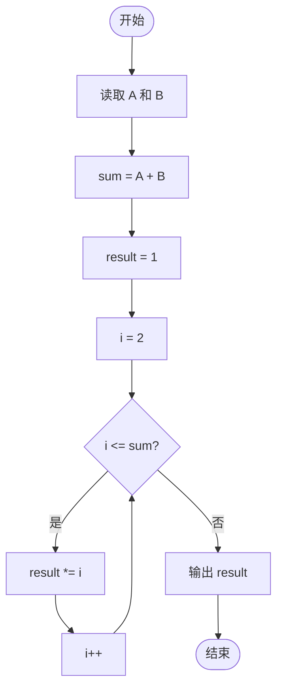
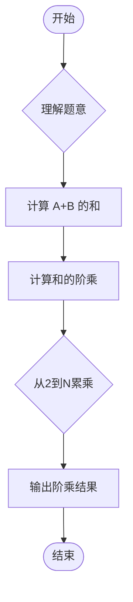

# L1-084 - 拯救外星人（10 分）

- **时间限制**: 400 ms
- **内存限制**: 65536 KB
- **代码长度限制**: 16 KB

---

## 题目描述


你的外星人朋友不认得地球上的加减乘除符号，但是会算阶乘 —— 正整数 N 的阶乘记为 “N!”，是从 1 到 N 的连乘积。所以当他不知道“5+7”等于多少时，如果你告诉他等于“12!”，他就写出了“479001600”这个答案。

本题就请你写程序模仿外星人的行为。

### 输入格式:

输入在一行中给出两个正整数 A 和 B。

### 输出格式:

在一行中输出 (A+B) 的阶乘。题目保证 (A+B) 的值小于 12。

### 输入样例:
```in
3 6
```

### 输出样例:
```out
362880
```

## 示例

### 示例 1

**输入:**
```
3 6
```

**输出:**
```
362880
```

---

## 题目详解

### 一、解题思路

本题模拟外星人的计算方式——将加法结果用阶乘表示。输入两个正整数 A 和 B，计算 `(A+B)` 的阶乘。阶乘定义为从 1 到 N 的连乘积，即 `N! = 1 × 2 × ... × N`。题目保证 `A+B < 12`，因此结果不会超出整数范围。

### 二、代码流程说明

1. 读取两个正整数 A 和 B
2. 计算 `sum = A + B`
3. 初始化 `result = 1`
4. 使用 for 循环从 2 到 sum 累乘：`result *= i`
5. 输出 `result`

### 三、代码流程图



### 四、解题流程图


