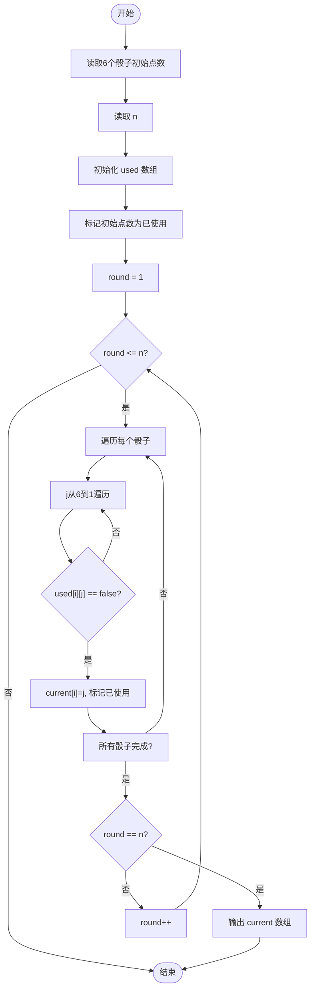
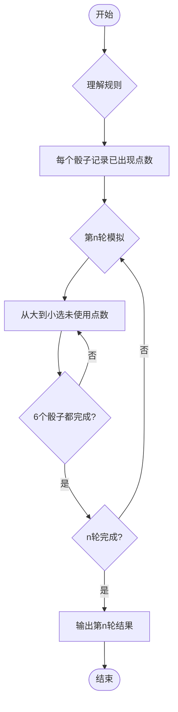

# L1-085 - 试试手气（15 分）

- **时间限制**: 400 ms
- **内存限制**: 65536 KB
- **代码长度限制**: 16 KB

---

## 题目描述


我们知道一个骰子有 6 个面，分别刻了 1 到 6 个点。下面给你 6 个骰子的初始状态，即它们朝上一面的点数，让你一把抓起摇出另一套结果。假设你摇骰子的手段特别精妙，每次摇出的结果都满足以下两个条件：

- 1、每个骰子摇出的点数都跟它之前任何一次出现的点数不同；
- 2、在满足条件 1 的前提下，每次都能让每个骰子得到可能得到的最大点数。

那么你应该可以预知自己第 $$n$$ 次（$$1\le n\le 5$$）摇出的结果。

### 输入格式:

输入第一行给出 6 个骰子的初始点数，即 [1,6] 之间的整数，数字间以空格分隔；第二行给出摇的次数 $$n$$（$$1\le n\le 5$$）。

### 输出格式:

在一行中顺序列出第 $$n$$ 次摇出的每个骰子的点数。数字间必须以 1 个空格分隔，行首位不得有多余空格。

### 输入样例:
```in
3 6 5 4 1 4
3
```

### 输出样例:
```out
4 3 3 3 4 3
```

## 示例

### 示例 1

**输入:**
```
3 6 5 4 1 4
3
```

**输出:**
```
4 3 3 3 4 3
```

---

## 题目详解

### 一、解题思路

本题模拟摇骰子过程。给定 6 个骰子的初始点数，每次摇动时每个骰子必须满足两个条件：1）摇出的点数与之前任何一次出现的点数都不同；2）在条件 1 满足的前提下，每次都选最大的可能点数。核心思路是用 `used[6][7]` 数组记录每个骰子已经使用过的点数，每次摇动从大到小（6→1）查找第一个未使用过的点数作为该骰子本次的结果。

### 二、代码流程说明

1. 读取 6 个骰子的初始点数存入 `dice[6]`
2. 读取摇的次数 `n`
3. 初始化 `used[6][7]` 数组，将每个骰子的初始点数标记为已使用
4. 从第 1 轮到第 n 轮模拟摇动：
   - 对每个骰子 i，从大到小（6→1）遍历 `used[i][j]`，找到第一个未使用的点数
   - 将该点数记入 `current[i]`，并标记 `used[i][j] = true`
5. 当轮数等于 n 时，输出 `current[0..5]` 即第 n 次的结果

### 三、代码流程图



### 四、解题流程图


