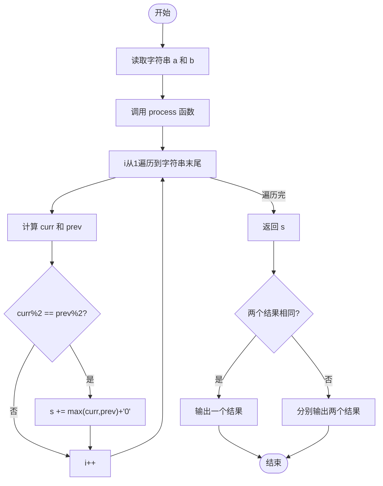
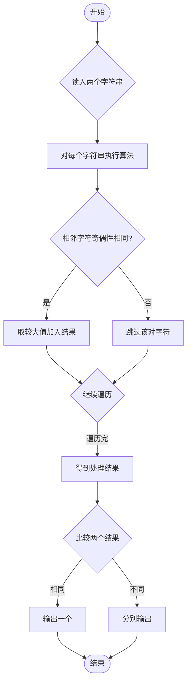

# L1-086 - 斯德哥尔摩火车上的题（15 分）

- **时间限制**: 400 ms
- **内存限制**: 65536 KB
- **代码长度限制**: 16 KB

---

## 题目描述


上图是新浪微博上的一则趣闻，是瑞典斯德哥尔摩火车上的一道题，看上去是段伪代码：

```
s = ''
a = '1112031584'
for (i = 1; i < length(a); i++) {
  if (a[i] % 2 == a[i-1] % 2) {
    s += max(a[i], a[i-1])
  }
}
goto_url('www.multisoft.se/' + s)
```

其中字符串的 `+` 操作是连接两个字符串的意思。所以这道题其实是让大家访问网站 `www.multisoft.se/112358`（**注意：比赛中千万不要访问这个网址！！！**）。

当然，能通过上述算法得到 `112358` 的原始字符串 `a` 是不唯一的。本题就请你判断，两个给定的原始字符串，能否通过上述算法得到相同的输出？

### 输入格式:

输入为两行仅由数字组成的非空字符串，长度均不超过 $$10^4$$，以回车结束。

### 输出格式:

对两个字符串分别采用上述斯德哥尔摩火车上的算法进行处理。如果两个结果是一样的，则在一行中输出那个结果；否则分别输出各自对应的处理结果，每个占一行。题目保证输出结果不为空。

### 输入样例 1：
```in
1112031584
011102315849
```

### 输出样例 1：
```out
112358
```

### 输入样例 2：
```in
111203158412334
12341112031584
```

### 输出样例 2：
```out
1123583
112358
```

## 示例

### 示例 1

**输入:**
```
1112031584
011102315849
```

**输出:**
```
112358
```

### 示例 2

**输入:**
```
111203158412334
12341112031584
```

**输出:**
```
1123583
112358
```

---

## 题目详解

### 一、解题思路

实现斯德哥尔摩火车上的字符串处理算法：对字符串从左到右遍历相邻两个字符，如果两数字的奇偶性相同（`a[i] % 2 == a[i-1] % 2`），则将较大的数字追加到结果字符串中。最后比较两个输入字符串的处理结果，若相同则输出一个，否则分别输出。

### 二、代码流程说明

1. 定义 `process(string a)` 函数：遍历字符串 `a` 从下标 1 开始的每个字符
   - 计算当前字符 `curr = a[i] - '0'` 和前一个字符 `prev = a[i-1] - '0'` 的数字值
   - 判断 `curr % 2 == prev % 2`（奇偶性相同）
   - 若相同，将 `max(curr, prev)` 转为字符追加到结果字符串 `s`
   - 返回结果字符串 `s`
2. `main()` 中读取两个字符串 `a`、`b`
3. 分别调用 `process()` 得到 `s1` 和 `s2`
4. 若 `s1 == s2`，输出 `s1`；否则分别输出 `s1` 和 `s2`

### 三、代码流程图



### 四、解题流程图


