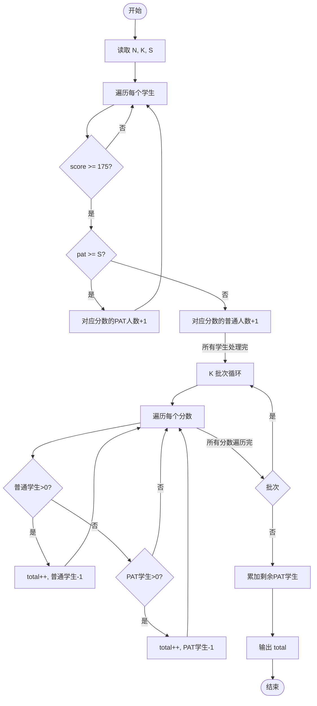
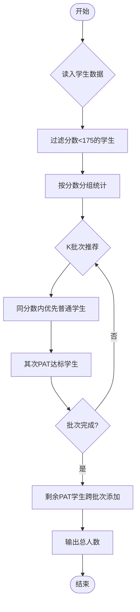

# L1-088 - 静静的推荐（20 分）

- **时间限制**: 200 ms
- **内存限制**: 65536 KB
- **代码长度限制**: 16 KB

---

## 题目描述

天梯赛结束后，某企业的人力资源部希望组委会能推荐一批优秀的学生，这个整理推荐名单的任务就由静静姐负责。企业接受推荐的流程是这样的：

- 只考虑得分不低于 175 分的学生；
- 一共接受 $$K$$ 批次的推荐名单；
- 同一批推荐名单上的学生的成绩原则上应严格递增；
- 如果有的学生天梯赛成绩虽然与前一个人相同，但其参加过 PAT 考试，且成绩达到了该企业的面试分数线，则也可以接受。

给定全体参赛学生的成绩和他们的 PAT 考试成绩，请你帮静静姐算一算，她最多能向企业推荐多少学生？

### 输入格式:

输入第一行给出 3 个正整数：$$N$$（$$\le 10^5$$）为参赛学生人数，$$K$$（$$\le 5\times 10^3$$）为企业接受的推荐批次，$$S$$（$$\le 100$$）为该企业的 PAT 面试分数线。

随后 $$N$$ 行，每行给出两个分数，依次为一位学生的天梯赛分数（最高分 290）和 PAT 分数（最高分 100）。

### 输出格式:

在一行中输出静静姐最多能向企业推荐的学生人数。

### 输入样例:
```in
10 2 90
203 0
169 91
175 88
175 0
175 90
189 0
189 0
189 95
189 89
256 100
```

### 输出样例:
```out
8
```

## 示例

### 示例 1

**输入:**
```
10 2 90
203 0
169 91
175 88
175 0
175 90
189 0
189 0
189 95
189 89
256 100
```

**输出:**
```
8
```

---

## 题目详解

### 一、解题思路

本题计算静静姐最多能推荐多少学生。规则：1）只考虑天梯赛分数不低于 175 分的学生；2）K 批次推荐，同一批成绩严格递增；3）分数相同但 PAT 达线的学生也可接受。

核心思路：用 `unordered_map<int, pair<int,int>>` 按分数分组，pair 中记录普通学生数和 PAT 达标学生数。每批次遍历时优先选取普通学生（满足严格递增），选完后再选 PAT 达标学生（可同分）。K 批次结束后，剩余 PAT 达标学生可跨批次添加。

### 二、代码流程说明

1. 读取 N（学生数）、K（批次数）、S（PAT 分数线）
2. 遍历 N 个学生，过滤掉天梯赛分数 < 175 的学生
3. 将合格学生按分数分组存入 `students`，每组记录普通人数和 PAT 达标人数
4. 模拟 K 批次推荐：对每个分数，优先选普通学生（`counts.first--`），再选 PAT 达标学生（`counts.second--`）
5. 处理剩余 PAT 达标学生（可跨批次添加），累加到 `total`
6. 输出 `total`

### 三、代码流程图



### 四、解题流程图


