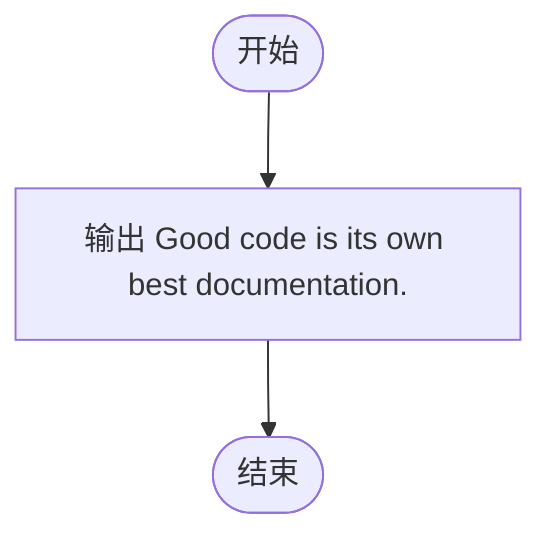
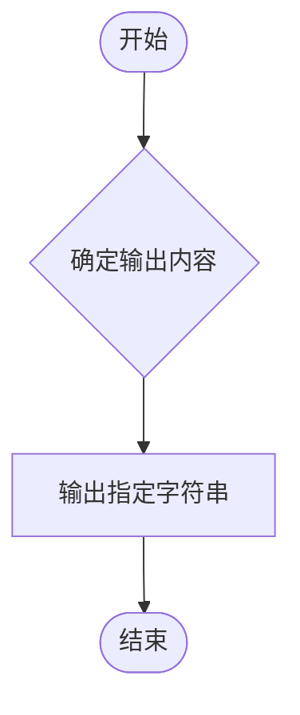

# L1-089 - 最好的文档（5 分）

- **时间限制**: 400 ms
- **内存限制**: 65536 KB
- **代码长度限制**: 16 KB

---

## 题目描述

有一位软件工程师说过一句很有道理的话：“Good code is its own best documentation.”（好代码本身就是最好的文档）。本题就请你直接在屏幕上输出这句话。

### 输入格式:

本题没有输入。

### 输出格式:

在一行中输出 `Good code is its own best documentation.`。

### 输入样例:
```in
无
```

### 输出样例:
```out
Good code is its own best documentation.
```

## 示例

### 示例 1

**输入:**
```
无
```

**输出:**
```
Good code is its own best documentation.
```

---

## 题目详解

### 一、解题思路

本题是最简单的输出题。根据题意，直接输出固定字符串 `Good code is its own best documentation.` 即可。无需读取任何输入。

### 二、代码流程说明

1. 程序入口 `main()`，无需读取输入
2. 调用 `cout` 输出字符串 `Good code is its own best documentation.`
3. 返回 0，程序结束

### 三、代码流程图



### 四、解题流程图


