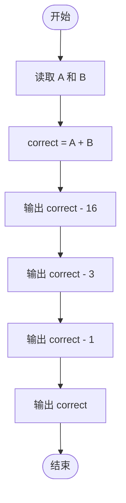
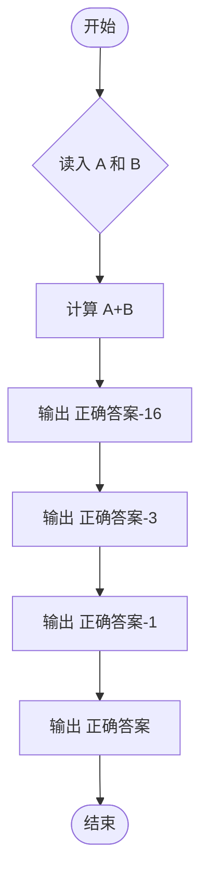

# L1-090 - 什么是机器学习（5 分）

- **时间限制**: 400 ms
- **内存限制**: 65536 KB
- **代码长度限制**: 16 KB

---

## 题目描述


什么是机器学习？上图展示了一段面试官与“机器学习程序”的对话：
```
面试官：9 + 10 等于多少？
答：3
面试官：差远了，是19。
答：16
面试官：错了，是19。
答：18
面试官：不，是19。
答：19
```
本题就请你模仿这个“机器学习程序”的行为。

### 输入格式:

输入在一行中给出两个整数，绝对值都不超过 100，中间用一个空格分开，分别表示面试官给出的两个数字 A 和 B。

### 输出格式:

要求你输出 4 行，每行一个数字。第 1 行比正确结果少 16，第 2 行少 3，第 3 行少 1，最后一行才输出 A+B 的正确结果。

### 输入样例:
```in
9 10
```

### 输出样例:
```out
3
16
18
19
```

## 示例

### 示例 1

**输入:**
```
9 10
```

**输出:**
```
3
16
18
19
```

---

## 题目详解

### 一、解题思路

本题模拟"机器学习程序"的对话行为。输入两个整数 A 和 B，正确答案为 `A + B`。程序依次输出 4 行：第 1 行输出 `correct - 16`（比正确答案少 16），第 2 行输出 `correct - 3`（比正确答案少 3），第 3 行输出 `correct - 1`（比正确答案少 1），第 4 行输出 `correct`（正确答案）。

### 二、代码流程说明

1. 读取两个整数 A 和 B
2. 计算 `correct = A + B`
3. 输出 `correct - 16`，换行
4. 输出 `correct - 3`，换行
5. 输出 `correct - 1`，换行
6. 输出 `correct`，换行
7. 程序结束

### 三、代码流程图



### 四、解题流程图


