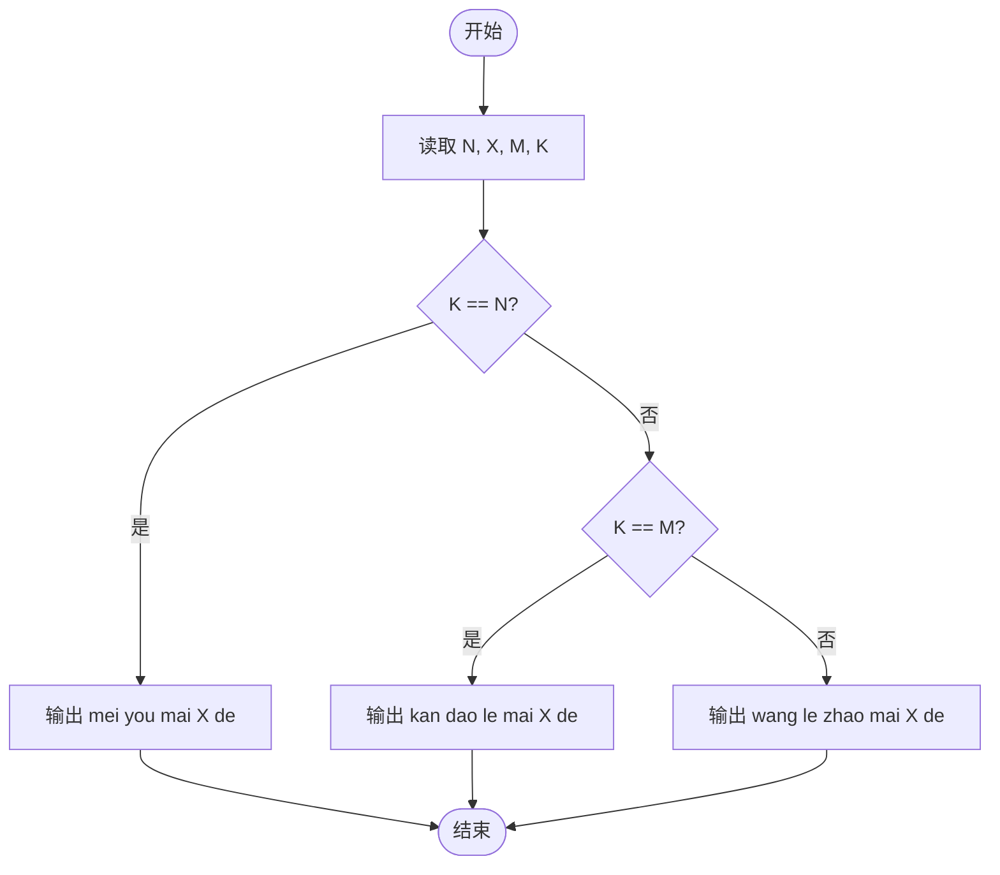
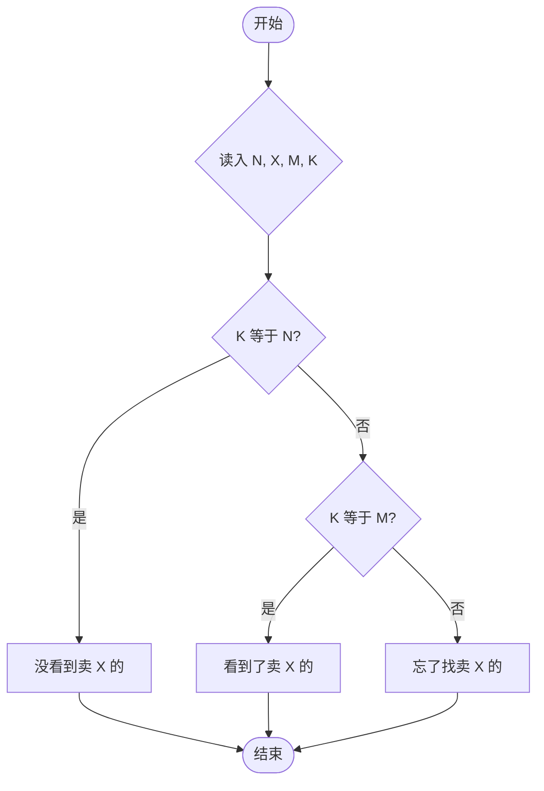

# L1-091 - 程序员买包子（10 分）

- **时间限制**: 400 ms
- **内存限制**: 65536 KB
- **代码长度限制**: 16 KB

---

## 题目描述


这是一条检测真正程序员的段子：假如你被家人要求下班顺路买十只包子，如果看到卖西瓜的，买一只。那么你会在什么情况下只买一只包子回家？
本题要求你考虑这个段子的通用版：假如你被要求下班顺路买 $$N$$ 只包子，如果看到卖 $$X$$ 的，买 $$M$$ 只。那么如果你最后买了 $$K$$ 只包子回家，说明你看到卖 $$X$$ 的没有呢？

### 输入格式:

输入在一行中顺序给出题面中的 $$N$$、$$X$$、$$M$$、$$K$$，以空格分隔。其中 $$N$$、$$M$$ 和 $$K$$ 为不超过 1000 的正整数，$$X$$ 是一个长度不超过 10 的、仅由小写英文字母组成的字符串。题目保证 $$N\neq M$$。

### 输出格式:

在一行中输出结论，格式为：
- 如果 $$K=N$$，输出 `mei you mai X de`；
- 如果 $$K=M$$，输出 `kan dao le mai X de`；
- 否则输出 `wang le zhao mai X de`.
其中 `X` 是输入中给定的字符串 $$X$$。

### 输入样例 1：
```in
10 xigua 1 10
```

### 输出样例 1：
```out
mei you mai xigua de
```

### 输入样例 2：
```in
10 huanggua 1 1
```

### 输出样例 2：
```out
kan dao le mai huanggua de
```

### 输入样例 3：
```in
10 shagua 1 250
```

### 输出样例 3：
```out
wang le zhao mai shagua de
```

## 示例

### 示例 1

**输入:**
```
10 xigua 1 10
```

**输出:**
```
mei you mai xigua de
```

### 示例 2

**输入:**
```
10 huanggua 1 1
```

**输出:**
```
kan dao le mai huanggua de
```

### 示例 3

**输入:**
```
10 shagua 1 250
```

**输出:**
```
wang le zhao mai shagua de
```

---

## 题目详解

### 一、解题思路

本题模拟"程序员买包子"的段子。给定 N（要买的包子数）、X（看到的东西）、M（看到 X 后买的数量）、K（实际买的数量），根据 K 判断是否看到了卖 X 的：若 `K == N` 说明没看到（正常买了 N 个包子）；若 `K == M` 说明看到了（买了 M 个）；否则说明忘了找。

### 二、代码流程说明

1. 读取 N（包子数）、X（字符串）、M（看见后买的数量）、K（实际买的数量）
2. 判断 `K == N`：是则输出 `mei you mai X de`
3. 否则判断 `K == M`：是则输出 `kan dao le mai X de`
4. 否则输出 `wang le zhao mai X de`

### 三、代码流程图



### 四、解题流程图


