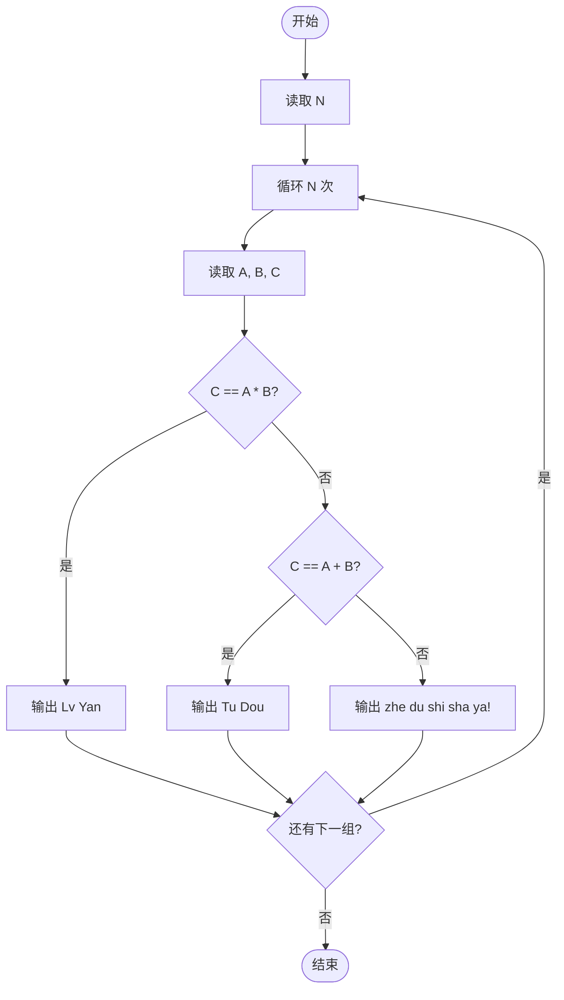
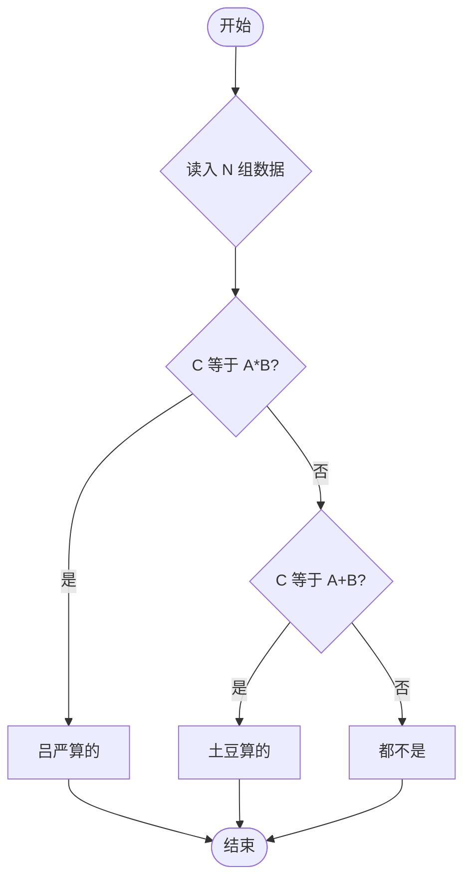

# L1-092 - 进化论（10 分）

- **时间限制**: 400 ms
- **内存限制**: 65536 KB
- **代码长度限制**: 16 KB

---

## 题目描述


在“一年一度喜剧大赛”上有一部作品《进化论》，讲的是动物园两只猩猩进化的故事。猩猩吕严说自己已经进化了 9 年了，因为“三年又三年”。猩猩土豆指出“三年又三年是六年呐”……
本题给定两个数字，以及用这两个数字计算的结果，要求你根据结果判断，这是吕严算出来的，还是土豆算出来的。

### 输入格式:

输入第一行给出一个正整数 $$N$$，随后 $$N$$ 行，每行给出三个正整数 $$A$$、$$B$$ 和 $$C$$。其中 $$C$$ 不超过 10000，其他三个数字都不超过 100。

### 输出格式:

对每一行给出的三个数，如果 $$C$$ 是 $$A\times B$$，就在一行中输出 `Lv Yan`；如果是 $$A+B$$，就在一行中输出 `Tu Dou`；如果都不是，就在一行中输出 `zhe du shi sha ya!`。

### 输入样例:
```in
3
3 3 9
3 3 6
3 3 12
```

### 输出样例:
```out
Lv Yan
Tu Dou
zhe du shi sha ya!
```

## 示例

### 示例 1

**输入:**
```
3
3 3 9
3 3 6
3 3 12
```

**输出:**
```
Lv Yan
Tu Dou
zhe du shi sha ya!
```

---

## 题目详解

### 一、解题思路

本题根据 C 与 A、B 的关系判断结果来源：如果 `C == A * B`，说明是吕严算的（乘法思维）；如果 `C == A + B`，说明是土豆算的（加法思维）；否则两者都不是。核心是对每组数据进行简单的条件判断。

### 二、代码流程说明

1. 读取正整数 N，表示有 N 组数据
2. 循环处理每组数据：
   - 读取三个正整数 A、B、C
   - 判断 `C == A * B`：是则输出 `Lv Yan`
   - 否则判断 `C == A + B`：是则输出 `Tu Dou`
   - 否则输出 `zhe du shi sha ya!`
3. 所有数据处理完毕，程序结束

### 三、代码流程图



### 四、解题流程图


