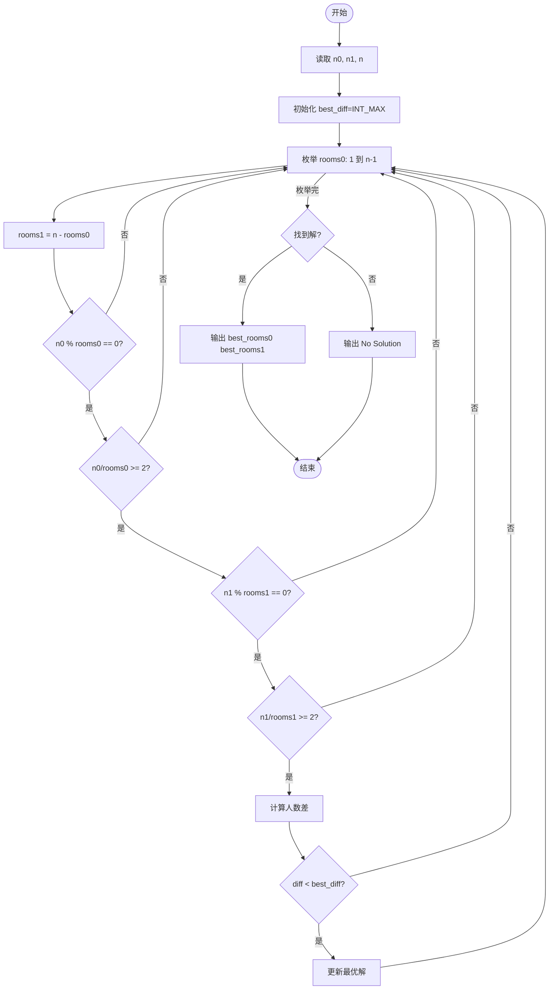
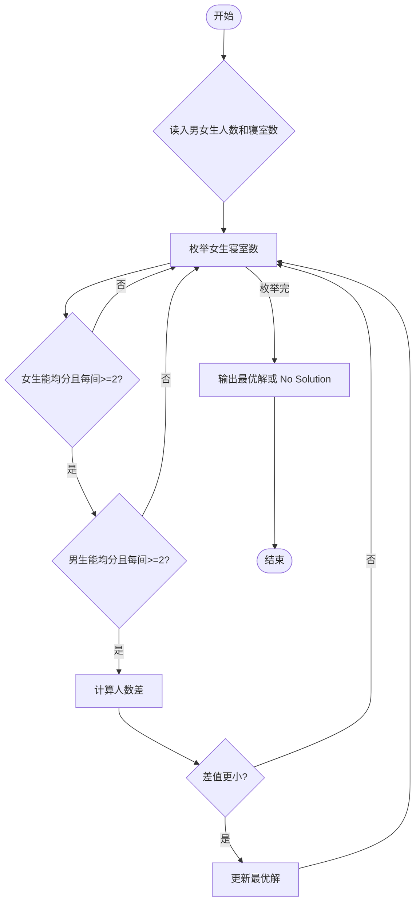

# L1-095 - 分寝室（20 分）

- **时间限制**: 400 ms
- **内存限制**: 65536 KB
- **代码长度限制**: 16 KB

---

## 题目描述

学校新建了宿舍楼，共有 $n$ 间寝室。等待分配的学生中，有女生 $n_0$ 位、男生 $n_1$ 位。所有待分配的学生都必须分到一间寝室。所有的寝室都要分出去，最后不能有寝室留空。\
现请你写程序完成寝室的自动分配。分配规则如下：

* 男女生不能混住；
* 不允许单人住一间寝室；
* 对每种性别的学生，每间寝室入住的人数都必须相同；例如不能出现一部分寝室住 2 位女生，一部分寝室住 3 位女生的情况。但女生寝室都是 2 人一间，男生寝室都是 3 人一间，则是允许的；
* 在有多种分配方案满足前面三项要求的情况下，要求两种性别每间寝室入住的人数差最小。

### 输入格式:

输入在一行中给出 3 个正整数 $n_0$、$n_1$、$n$，分别对应女生人数、男生人数、寝室数。数字间以空格分隔，均不超过 $10^5$。

### 输出格式:

在一行中顺序输出女生和男生被分配的寝室数量，其间以 1 个空格分隔。行首尾不得有多余空格。\
如果有解，题目保证解是唯一的。如果无解，则在一行中输出 `No Solution`。

### 输入样例 1：
```in
24 60 10
```

### 输出样例 1：
```out
4 6
```

### 输入样例 2：
```in
29 30 10
```

### 输出样例 2：
```out
No Solution
```

## 示例

### 示例 1

**输入:**
```
24 60 10
```

**输出:**
```
4 6
```

### 示例 2

**输入:**
```
29 30 10
```

**输出:**
```
No Solution
```

---

## 题目详解

### 一、解题思路

本题分配寝室，要求：1）男女生不能混住；2）不允许单人住一间；3）每种性别的每间寝室人数必须相同；4）在满足前三项的情况下，两种性别每间寝室人数差最小。采用枚举法：遍历女生寝室数 `rooms0`（从 1 到 n-1），计算男生寝室数 `rooms1 = n - rooms0`，检查女生人数 `n0` 能被 `rooms0` 整除且每间不少于 2 人，男生同理。记录满足条件的方案中人数差最小的解。

### 二、代码流程说明

1. 读取 n0（女生人数）、n1（男生人数）、n（寝室总数）
2. 初始化 `best_diff = INT_MAX`，`best_rooms0 = -1`，`best_rooms1 = -1`
3. 枚举 `rooms0` 从 1 到 n-1：
   - 计算 `rooms1 = n - rooms0`
   - 检查女生：`n0 % rooms0 == 0` 且 `n0/rooms0 >= 2`
   - 检查男生：`n1 % rooms1 == 0` 且 `n1/rooms1 >= 2`
   - 若都满足，计算人数差 `abs(people0 - people1)`，更新最优解
4. 若 `best_rooms0 == -1`，输出 `No Solution`；否则输出 `best_rooms0 best_rooms1`

### 三、代码流程图



### 四、解题流程图


