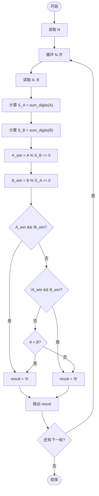
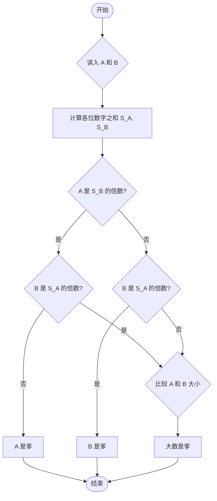

# L1-096 - 谁管谁叫爹（20 分）

- **时间限制**: 400 ms
- **内存限制**: 65536 KB
- **代码长度限制**: 16 KB

---

## 题目描述


《咱俩谁管谁叫爹》是网上一首搞笑饶舌歌曲，来源于东北酒桌上的助兴游戏。现在我们把这个游戏的难度拔高一点，多耗一些智商。
不妨设游戏中的两个人为 A 和 B。游戏开始后，两人同时报出两个整数 $$N_A$$ 和 $$N_B$$。判断谁是爹的标准如下：
- 将两个整数的各位数字分别相加，得到两个和 $$S_A$$ 和 $$S_B$$。如果 $$N_A$$ 正好是 $$S_B$$ 的整数倍，则 A 是爹；如果 $$N_B$$ 正好是 $$S_A$$ 的整数倍，则 B 是爹；
- 如果两人同时满足、或同时不满足上述判定条件，则原始数字大的那个是爹。
本题就请你写一个自动裁判程序，判定谁是爹。

### 输入格式:

输入第一行给出一个正整数 $$N$$（$$\le 100$$），为游戏的次数。以下 $$N$$ 行，每行给出一对不超过 9 位数的正整数，对应 A 和 B 给出的原始数字。题目保证两个数字不相等。

### 输出格式:

对每一轮游戏，在一行中给出赢得“爹”称号的玩家（`A` 或 `B`）。

### 输入样例:
```in
4
999999999 891
78250 3859
267537 52654299
6666 120
```

### 输出样例:
```out
B
A
B
A
```

## 示例

### 示例 1

**输入:**
```
4
999999999 891
78250 3859
267537 52654299
6666 120
```

**输出:**
```
B
A
B
A
```

---

## 题目详解

### 一、解题思路

本题模拟"谁管谁叫爹"游戏。规则：计算两个整数各位数字之和 S_A 和 S_B，若 `N_A` 是 `S_B` 的整数倍则 A 是爹；若 `N_B` 是 `S_A` 的整数倍则 B 是爹；若同时满足或同时不满足，则数字大的是爹。核心是实现 `sum_digits()` 函数求各位数字之和。

### 二、代码流程说明

1. 定义 `sum_digits(long long num)`：循环取 `num % 10` 累加各位数字，直到 `num == 0`
2. 读取 N（游戏次数）
3. 对每组数据：
   - 读取 A 和 B
   - 计算 `S_A = sum_digits(A)`、`S_B = sum_digits(B)`
   - 判断 `A_win = (A % S_B == 0)`、`B_win = (B % S_A == 0)`
   - 若 `A_win && !B_win`，A 赢；若 `!A_win && B_win`，B 赢；否则 `A > B` 则 A 赢，B 赢
   - 输出结果

### 三、代码流程图



### 四、解题流程图


