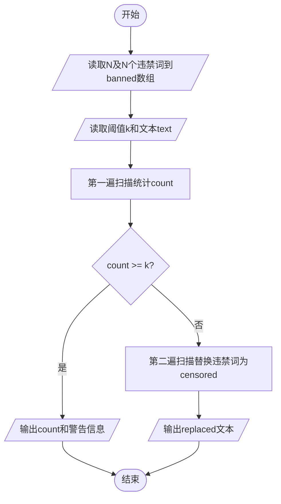

# L1-101 - 别再来这么多猫娘了！（15 分）

- **时间限制**: 400 ms
- **内存限制**: 65536 KB
- **代码长度限制**: 16 KB

---

## 题目描述

以 GPT 技术为核心的人工智能系统出现后迅速引领了行业的变革，不仅用于大量的语言工作（如邮件编写或文章生成等工作），还被应用在一些较特殊的领域——例如去年就有同学尝试使用 ChatGPT 作弊并被当场逮捕（全校被取消成绩）。相信聪明的你一定不会犯一样的错误！

言归正传，对于 GPT 类的 AI，一个使用方式受到不少年轻用户的欢迎——将 AI 变成猫娘：

<br/>


*部分公司使用 AI 进行网络营销，网友同样乐于使用“变猫娘”的方式进行反击。注意：图中内容与题目无关，如无法看到图片不影响解题。*

<br/>

当然，由于训练数据里并不区分道德或伦理倾向，因此如果不加审查，AI 会生成大量的、不一定符合社会公序良俗的内容。尽管关于这个问题仍有争论，但至少在比赛中，我们还是期望 AI 能用于对人类更有帮助的方向上，少来一点猫娘。

因此你的工作是实现一个审查内容的代码，用于对 AI 生成的内容的初步审定。更具体地说，你会得到一段由大小写字母、数字、空格及 ASCII 码范围内的标点符号的文字，以及若干个违禁词以及警告阈值，你需要首先检查内容里有多少违禁词，如果少于阈值个，则简单地将违禁词替换为```<censored>```；如果大于等于阈值个，则直接输出一段警告并输出有几个违禁词。

### 输入格式:

输入第一行是一个正整数 $N$ ($1 \le N \le 100$)，表示违禁词的数量。接下来的 $N$ 行，每行一个长度不超过 10 的、只包含大小写字母、数字及 ASCII 码范围内的标点符号的单词，表示应当屏蔽的违禁词。
然后的一行是一个非负整数 $k$ ($0 \le k \le 100$)，表示违禁词的阈值。
最后是一行不超过 5000 个字符的字符串，表示需要检查的文字。
从左到右处理文本，违禁词则按照输入顺序依次处理；对于有重叠的情况，无论计数还是替换，查找完成后从违禁词末尾继续处理。

### 输出格式:

如果违禁词数量小于阈值，则输出替换后的文本；否则先输出一行一个数字，表示违禁词的数量，然后输出```He Xie Ni Quan Jia!```。

### 输入样例 1：
```in
5
MaoNiang
SeQing
BaoLi
WeiGui
BuHeShi
4
BianCheng MaoNiang ba! WeiGui De Hua Ye Keyi Shuo! BuYao BaoLi NeiRong.
```

### 输出样例 1：
```out
BianCheng <censored> ba! <censored> De Hua Ye Keyi Shuo! BuYao <censored> NeiRong.
```

### 输入样例 2：
```in
5
MaoNiang
SeQing
BaoLi
WeiGui
BuHeShi
3
BianCheng MaoNiang ba! WeiGui De Hua Ye Keyi Shuo! BuYao BaoLi NeiRong.
```

### 输出样例 2：
```out
3
He Xie Ni Quan Jia!
```

### 输入样例 3：
```in
2
AA
BB
3
AAABBB
```

### 输出样例 3：
```out
<censored>A<censored>B
```

### 输入样例 4：
```in
2
AB
BB
3
AAABBB
```

### 输出样例 4：
```out
AA<censored><censored>
```

### 输入样例 5：
```in
2
BB
AB
3
AAABBB
```

### 输出样例 5：
```out
AAA<censored>B
```

## 示例

### 示例 1

**输入:**
```
5
MaoNiang
SeQing
BaoLi
WeiGui
BuHeShi
4
BianCheng MaoNiang ba! WeiGui De Hua Ye Keyi Shuo! BuYao BaoLi NeiRong.
```

**输出:**
```
BianCheng <censored> ba! <censored> De Hua Ye Keyi Shuo! BuYao <censored> NeiRong.
```

### 示例 2

**输入:**
```
5
MaoNiang
SeQing
BaoLi
WeiGui
BuHeShi
3
BianCheng MaoNiang ba! WeiGui De Hua Ye Keyi Shuo! BuYao BaoLi NeiRong.
```

**输出:**
```
3
He Xie Ni Quan Jia!
```

### 示例 3

**输入:**
```
2
AA
BB
3
AAABBB
```

**输出:**
```
<censored>A<censored>B
```

### 示例 4

**输入:**
```
2
AB
BB
3
AAABBB
```

**输出:**
```
AA<censored><censored>
```

### 示例 5

**输入:**
```
2
BB
AB
3
AAABBB
```

**输出:**
```
AAA<censored>B
```

---

## 题目详解

### 一、解题思路

本题核心是实现文本违禁词审查系统，分为统计和替换两个阶段：

1. **数据存储**：使用 `vector<string> banned` 数组按输入顺序存储 N 个违禁词
2. **第一遍扫描统计**：从左到右逐位扫描文本 `text`，每个位置依次按 `banned` 数组顺序尝试匹配违禁词。匹配成功则 `count++` 并跳过该违禁词长度，匹配失败则移动到下一字符
3. **阈值判断**：若 `count >= k`，输出数量和警告信息；否则进入替换阶段
4. **第二遍扫描替换**：重新遍历文本，将所有命中的违禁词替换为 `<censored>`，累加到 `replaced` 字符串中

### 二、代码流程说明

1. 读取违禁词数量 `N`，然后逐行读取 N 个违禁词存入 `banned` 数组
2. 读取阈值 `k` 和待审查文本 `text`
3. 初始化计数器 `count = 0`，复制文本到 `temp` 用于扫描
4. 第一遍扫描：`pos` 从 0 开始遍历 `temp`，对每个位置按 `banned` 顺序逐一尝试匹配，统计违禁词数量
5. 判断 `count >= k`：是 → 输出 `count` 和 `He Xie Ni Quan Jia!`，程序结束；否 → 继续
6. 第二遍扫描：重新遍历 `text`，命中违禁词时追加 `<censored>` 到 `replaced`，否则追加原字符
7. 输出替换后的 `replaced` 文本

### 三、代码流程图



### 四、解题流程图

```mermaid
flowchart TD
    A([开始]) --> B[按输入顺序存储违禁词]
    B --> C[从左到右扫描文本]
    C --> D{当前位置匹配违禁词?}
    D -- 是 --> E[count加1 跳过违禁词长度]
    D -- 否 --> F[移动到下一字符]
    E --> G{扫描完成?}
    F --> G
    G -- 否 --> C
    G -- 是 --> H{count >= k?}
    H -- 是 --> I[输出数量和警告]
    H -- 否 --> J[重新扫描替换违禁词]
    J --> K[输出替换后文本]
    I --> L([结束])
    K --> L
