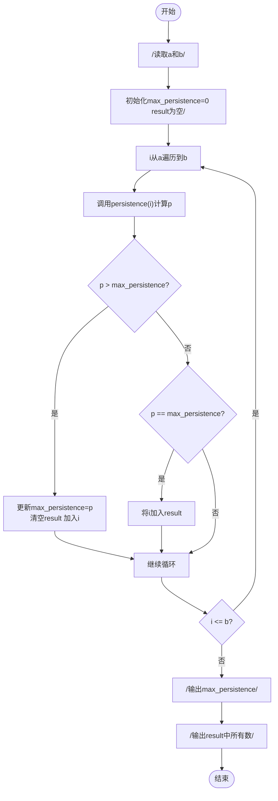

# L1-103 - 整数的持续性（20 分）

- **时间限制**: 400 ms
- **内存限制**: 65536 KB
- **代码长度限制**: 16 KB

---

## 题目描述

从任一给定的正整数 $n$ 出发，将其每一位数字相乘，记得到的乘积为 $n_1$。以此类推，令 $n_{i+1}$ 为 $n_i$ 的各位数字的乘积，直到最后得到一个个位数 $n_m$，则 $m$ 就称为 $n$ 的**持续性**。例如 $679$ 的持续性就是 5，因为我们从 $679$ 开始，得到 $6\times 7\times 9 = 378$，随后得到 $3\times 7\times 8 = 168$、$1\times 6\times 8 = 48$、$4\times 8 = 32$，最后得到 $3\times 2 = 6$，一共用了 5 步。
本题就请你编写程序，找出任一给定区间内持续性最长的整数。

### 输入格式:

输入在一行中给出两个正整数 $a$ 和 $b$（$1\le a \le b \le 10^9$ 且 $(b-a)<10^3$），为给定区间的两个端点。

### 输出格式:

首先在第一行输出区间 $[a, b]$ 内整数最长的持续性。随后在第二行中输出持续性最长的整数。如果这样的整数不唯一，则按照递增序输出，数字间以 1 个空格分隔，行首尾不得有多余空格。

### 输入样例:
```in
500 700
```

### 输出样例:
```out
5
679 688 697
```

## 示例

### 示例 1

**输入:**
```
500 700
```

**输出:**
```
5
679 688 697
```

---

## 题目详解

### 一、解题思路

本题计算整数的"持续性"——将整数的各位数字反复相乘直到得到个位数所需的步数：

1. **持续性计算函数 `persistence`**：对输入的 `n`，循环取出每一位数字相乘，得到新的 `n`，步数 `steps` 加 1，直到 `n < 10` 为止
2. **遍历区间**：从 `a` 到 `b` 依次计算每个整数的持续性
3. **找最大值**：维护 `max_persistence` 和 `result` 向量。若当前持续性更大，则清空 `result` 并加入当前数；若相等，则直接加入 `result`
4. **输出结果**：先输出最大持续性，再递增序输出所有对应的整数

### 二、代码流程说明

1. 读取区间端点 `a` 和 `b`
2. 初始化 `max_persistence = 0`，`result` 为空向量
3. 从 `i = a` 遍历到 `b`：调用 `persistence(i)` 计算持续性 `p`
4. 若 `p > max_persistence`：更新 `max_persistence = p`，清空 `result`，将 `i` 加入
5. 若 `p == max_persistence`：直接将 `i` 加入 `result`
6. 输出 `max_persistence`
7. 遍历 `result` 向量，用空格分隔输出所有持续性最大的整数

### 三、代码流程图



### 四、解题流程图

```mermaid
flowchart TD
    A([开始]) --> B[遍历区间a到b的每个整数]
    B --> C[计算该整数的持续性]
    C --> D{持续性计算<br>n >= 10?}
    D -- 是 --> E[提取n的每一位数字相乘]
    E --> F[n = 乘积 steps++]
    F --> D
    D -- 否 --> G[返回steps作为持续性]
    G --> H{与当前最大值比较?}
    H -- 更大 --> I[更新最大值和结果列表]
    H -- 相等 --> J[加入结果列表]
    H -- 更小 --> K[跳过]
    I --> L{遍历完成?}
    J --> L
    K --> L
    L -- 否 --> B
    L -- 是 --> M[输出最大持续性和对应整数]
    M --> N([结束])
