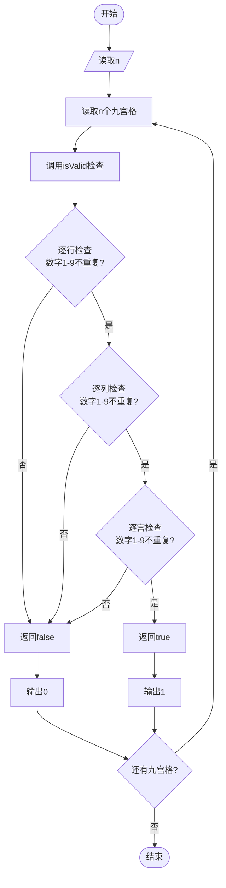

# L1-104 - 九宫格（20 分）

- **时间限制**: 400 ms
- **内存限制**: 65536 KB
- **代码长度限制**: 16 KB

---

## 题目描述


九宫格是一款数字游戏，传说起源于河图洛书，现代数学中称之为三阶幻方。游戏规则是：将一个 $9\times 9$ 的正方形区域划分为 9 个 $3\times 3$ 的正方形宫位，要求 1 到 9 这九个数字中的每个数字在每一行、每一列、每个宫位中都只能出现一次。
本题并不要求你写程序解决这个问题，只是对每个填好数字的九宫格，判断其是否满足游戏规则的要求。

### 输入格式:

输入首先在第一行给出一个正整数 $n$（$\le 10$），随后给出 $n$ 个填好数字的九宫格。每个九宫格分 9 行给出，每行给出 9 个数字，其间以空格分隔。

### 输出格式:

对每个给定的九宫格，判断其中的数字是否满足游戏规则的要求。满足则在一行中输出 1，否则输出 0。

### 输入样例:
```in
3
5 1 9 2 8 3 4 6 7
7 2 8 9 6 4 3 5 1
3 4 6 5 7 1 9 2 8
8 9 2 1 4 5 7 3 6
4 7 3 6 2 8 1 9 5
6 5 1 7 3 9 2 8 4
9 3 4 8 1 6 5 7 2
1 6 7 3 5 2 8 4 9
2 8 5 4 9 7 6 1 3
8 2 5 4 9 7 1 3 6
7 9 6 5 1 3 8 2 4
3 4 1 6 8 2 7 9 5
6 8 4 2 7 1 3 5 9
9 1 2 8 3 5 6 4 7
5 3 7 9 6 4 2 1 8
2 7 9 1 5 8 4 6 3
4 5 8 3 2 6 9 7 1
1 6 3 7 4 9 5 8 3
81 2 5 4 9 7 1 3 6
7 9 6 5 1 3 8 2 4
3 4 1 6 8 2 7 9 5
6 8 4 2 7 1 3 5 9
9 1 2 8 3 5 6 4 7
5 3 7 9 6 4 2 1 8
2 7 9 1 5 8 4 6 3
4 5 8 3 2 6 9 7 1
1 6 3 7 4 9 5 8 2
```

### 输出样例:
```out
1
0
0
```

## 示例

### 示例 1

**输入:**
```
3
5 1 9 2 8 3 4 6 7
7 2 8 9 6 4 3 5 1
3 4 6 5 7 1 9 2 8
8 9 2 1 4 5 7 3 6
4 7 3 6 2 8 1 9 5
6 5 1 7 3 9 2 8 4
9 3 4 8 1 6 5 7 2
1 6 7 3 5 2 8 4 9
2 8 5 4 9 7 6 1 3
8 2 5 4 9 7 1 3 6
7 9 6 5 1 3 8 2 4
3 4 1 6 8 2 7 9 5
6 8 4 2 7 1 3 5 9
9 1 2 8 3 5 6 4 7
5 3 7 9 6 4 2 1 8
2 7 9 1 5 8 4 6 3
4 5 8 3 2 6 9 7 1
1 6 3 7 4 9 5 8 3
81 2 5 4 9 7 1 3 6
7 9 6 5 1 3 8 2 4
3 4 1 6 8 2 7 9 5
6 8 4 2 7 1 3 5 9
9 1 2 8 3 5 6 4 7
5 3 7 9 6 4 2 1 8
2 7 9 1 5 8 4 6 3
4 5 8 3 2 6 9 7 1
1 6 3 7 4 9 5 8 2
```

**输出:**
```
1
0
0
```

---

## 题目详解

### 一、解题思路

本题验证数独九宫格的合法性，需满足四个条件：每行、每列、每个 3×3 宫位内数字 1-9 不重复，且所有数字在 1-9 范围内。

1. **使用 set 集合判重**：`isValid` 函数中，对每行、每列、每个宫位分别使用 `set<int>` 存储已出现的数字，利用 `count()` 方法检查重复
2. **逐行检查**：遍历 9 行，每行用 `row` 集合检查，同时验证数字范围 `num < 1 || num > 9`
3. **逐列检查**：遍历 9 列，每列用 `col` 集合检查
4. **逐宫检查**：遍历 9 个宫位（`block` 从 0 到 8），计算起始行 `(block/3)*3` 和起始列 `(block%3)*3`，用 `cell` 集合检查
5. **返回结果**：所有检查通过返回 `true`，任一检查失败返回 `false`

### 二、代码流程说明

1. 读取九宫格数量 `n`
2. 对每个九宫格：读取 9×9 矩阵存入 `grid[9][9]`
3. 调用 `isValid(grid)` 检查合法性
4. `isValid` 内部：
   - 逐行检查：对每行用 `set` 判重，同时验证数字在 1-9 范围
   - 逐列检查：对每列用 `set` 判重
   - 逐宫检查：对 9 个 3×3 宫位用 `set` 判重
5. 输出结果：合法输出 `1`，非法输出 `0`

### 三、代码流程图



### 四、解题流程图

```mermaid
flowchart TD
    A([开始]) --> B[读取待检查的九宫格]
    B --> C[检查每行数字1-9不重复]
    C --> D{行检查通过?}
    D -- 否 --> E[不合法 输出0]
    D -- 是 --> F[检查每列数字1-9不重复]
    F --> G{列检查通过?}
    G -- 否 --> E
    G -- 是 --> H[检查每个3x3宫位<br>数字1-9不重复]
    H --> I{宫位检查通过?}
    I -- 否 --> E
    I -- 是 --> J[所有检查通过 输出1]
    E --> K([结束])
    J --> K