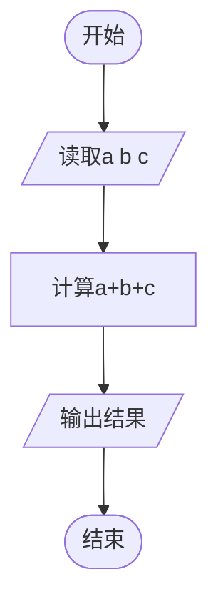

# L1-106 - 偷感好重（5 分）

- **时间限制**: 400 ms
- **内存限制**: 65536 KB
- **代码长度限制**: 16 KB

---

## 题目描述


以上图片截自新浪微博“iPanda 熊猫频道”，说“大熊猫吃苹果边吃边拿偷感好重。滚滚嘴里含 2 块，右手拿 1 块，左手捂 3 块…… 请问，它一共得到了多少块小苹果？”本题就请你计算一下这个问题的答案。

### 输入格式:

输入在一行中给出 3 个不超过 100 的正整数，分别为熊猫嘴里含的、右手拿的、左手捂的小苹果块数。同行数字间以空格分隔。

### 输出格式:

在一行中输出熊猫一共得到的小苹果块数。

### 输入样例:
```in
2 1 3
```

### 输出样例:
```out
6
```

## 示例

### 示例 1

**输入:**
```
2 1 3
```

**输出:**
```
6
```

---

## 题目详解

### 一、解题思路

本题是一道最简单的加法运算题，读取三个整数 `a`、`b`、`c`，直接输出它们的和即可。不需要任何复杂的算法逻辑。

### 二、代码流程说明

1. 读取三个整数 `a`、`b`、`c`
2. 计算 `a + b + c` 并输出

### 三、代码流程图



### 四、解题流程图

```mermaid
flowchart TD
    A([开始]) --> B[读取三个整数]
    B --> C[求和并输出]
    C --> D([结束])