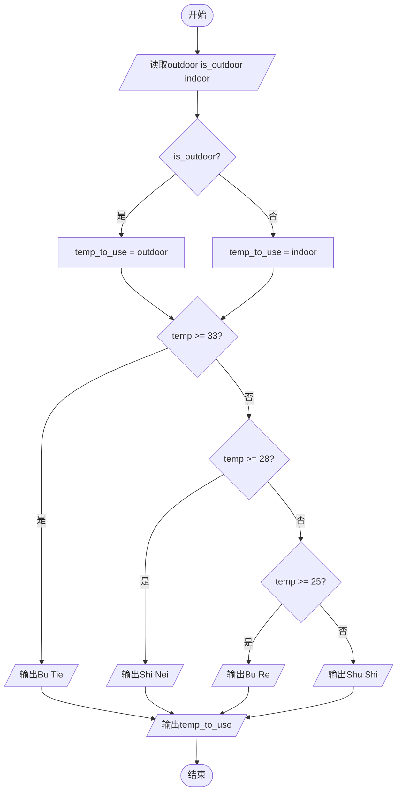

# L1-107 - 高温补贴（10 分）

- **时间限制**: 400 ms
- **内存限制**: 65536 KB
- **代码长度限制**: 16 KB

---

## 题目描述

高温补贴是为保证炎夏季节高温条件下经济建设和企业生产经营活动的正常进行，保障企业职工在劳动生产过程中的安全和身体健康进行的补贴。国家规定，用人单位安排劳动者在高温天气下（日最高气温达到 35° 以上），露天工作，以及不能采取有效措施将工作场所温度降低到 33° 以下的，应当向劳动者支付高温补贴。
给定当日最高气温、以及某用人单位的工作条件，请你写个程序判断，该单位员工能否获得高温补贴。

### 输入格式:

输入在一行中给出 3 个整数，即当日最高气温 $T$、工作场所状态 $S$、工作场所温度 $t$。其中温度为 $[-40, 50]$ 区间内的整数；工作场所状态为 1 表示露天，0 表示室内。

### 输出格式:

根据输入情况，如果可以获得高温补贴，则在一行中输出 `Bu Tie`（补贴），第二行输出 $T$ 的值；否则输出不补贴的原因：如果室内外温度都超标，仅仅是因为室内工作就不补贴，则输出 `Shi Nei`（室内），第二行输出 $T$ 的值；如果在室外工作但天气不热、或工作场所温度不高，则输出 `Bu Re`（不热），第二行输出 $t$ 的值；如果天气不热、或工作场所温度不高，且在室内工作，则输出 `Shu Shi`（舒适），第二行输出 $t$ 的值。

### 输入样例 1：
```in
36 1 33
```

### 输出样例 1：
```out
Bu Tie
36
```

### 输入样例 2：
```in
36 0 33
```

### 输出样例 2：
```out
Shi Nei
36
```

### 输入样例 3：
```in
36 1 27
```

### 输出样例 3：
```out
Bu Re
27
```

### 输入样例 4：
```in
36 0 24
```

### 输出样例 4：
```out
Shu Shi
24
```

## 示例

### 示例 1

**输入:**
```
36 1 33
```

**输出:**
```
Bu Tie
36
```

### 示例 2

**输入:**
```
36 0 33
```

**输出:**
```
Shi Nei
36
```

### 示例 3

**输入:**
```
36 1 27
```

**输出:**
```
Bu Re
27
```

### 示例 4

**输入:**
```
36 0 24
```

**输出:**
```
Shu Shi
24
```

---

## 题目详解

### 一、解题思路

本题根据工作环境和温度判断高温补贴类别：

1. **选择温度**：根据 `is_outdoor` 标志决定使用室外温度 `outdoor` 还是室内温度 `indoor`，存入 `temp_to_use`
2. **温度分级**：将温度按阈值分为四档：
   - `temp_to_use >= 33`：Bu Tie（补贴）
   - `temp_to_use >= 28`：Shi Nei（室内）
   - `temp_to_use >= 25`：Bu Re（不热）
   - 否则：Shu Shi（舒适）
3. **输出结果**：先输出类别名称，再输出使用的温度值

### 二、代码流程说明

1. 读取室外温度 `outdoor`、工作环境标志 `is_outdoor`（1=室外，0=室内）、室内温度 `indoor`
2. 三元运算符选择温度：`is_outdoor ? outdoor : indoor`，赋值给 `temp_to_use`
3. 按 `temp_to_use` 值判断输出：
   - `>= 33` → 输出 `Bu Tie`
   - `>= 28` → 输出 `Shi Nei`
   - `>= 25` → 输出 `Bu Re`
   - 否则 → 输出 `Shu Shi`
4. 换行输出 `temp_to_use` 的值

### 三、代码流程图



### 四、解题流程图

```mermaid
flowchart TD
    A([开始]) --> B[读取室外温度 工作环境 室内温度]
    B --> C{工作环境是室外?}
    C -- 是 --> D[使用室外温度]
    C -- 否 --> E[使用室内温度]
    D --> F{温度 >= 33?}
    E --> F
    F -- 是 --> G[输出Bu Tie和温度]
    F -- 否 --> H{温度 >= 28?}
    H -- 是 --> I[输出Shi Nei和温度]
    H -- 否 --> J{温度 >= 25?}
    J -- 是 --> K[输出Bu Re和温度]
    J -- 否 --> L[输出Shu Shi和温度]
    G --> M([结束])
    I --> M
    K --> M
    L --> M