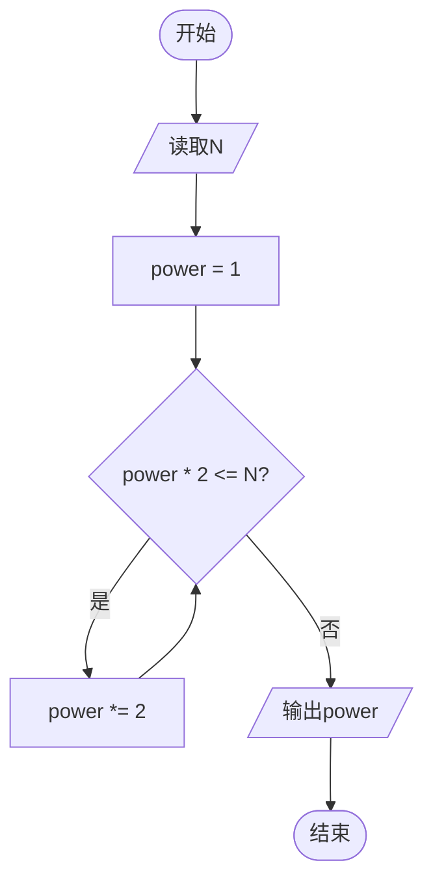

# L1-108 - 零头就抹了吧（10 分）

- **时间限制**: 400 ms
- **内存限制**: 65536 KB
- **代码长度限制**: 16 KB

---

## 题目描述


这是知乎上看到的：前几天去肉店灌香肠，结账一共258元。我说：“都是老顾客了，零头就抹了吧。”老板也很爽快：“行，凑个整，你给256块吧。”我顿时肃然起敬：“您以前当过程序员吧？在哪个公司啊？”老板看了看我，有点不好意思地说：“XX”。

本题就请你写个程序，帮老板计算他怎么抹零头。

### 输入格式:

输入在一行中给出一个正整数 $$N$$（$$\le 10^9$$），为客人应该付的钱。

### 输出格式:

在一行中输出老板抹掉零头后应收的钱。

### 输入样例:
```in
258
```

### 输出样例:
```out
256
```

## 示例

### 示例 1

**输入:**
```
258
```

**输出:**
```
256
```

---

## 题目详解

### 一、解题思路

本题本质是求小于等于给定整数 N 的最大 2 的幂次。从 `power = 1` 开始，不断将 `power` 乘以 2，直到 `power * 2 > N` 时停止，此时的 `power` 即为所求。算法利用了 2 的幂次的指数增长特性，时间复杂度为 O(log N)。

### 二、代码流程说明

1. 读取整数 `N`
2. 初始化 `power = 1`（2 的 0 次方）
3. 循环：当 `power * 2 <= N` 时，将 `power` 乘以 2
4. 循环结束后 `power` 即为不超过 N 的最大 2 的幂
5. 输出 `power`

### 三、代码流程图



### 四、解题流程图

```mermaid
flowchart TD
    A([开始]) --> B[读取整数N]
    B --> C[从1开始不断乘以2]
    C --> D[找到不超过N的最大2的幂]
    D --> E[输出结果]
    E --> F([结束])