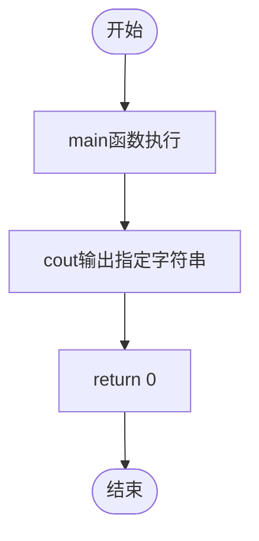

# L1-113 - 一行代码（5 分）

- **时间限制**: 400 ms
- **内存限制**: 65536 KB
- **代码长度限制**: 16 KB

---

## 题目描述

每次一行代码，建起我们的未来 —— 本题非常简单，就请你直接在屏幕上输出这句话：“Building the Future, One Line of Code at a Time.”。

### 输入格式:

本题没有输入。

### 输出格式:

在一行中输出 `Building the Future, One Line of Code at a Time.`。

### 输入样例:
```in
无
```

### 输出样例:
```out
Building the Future, One Line of Code at a Time.
```

## 示例

### 示例 1

**输入:**
```
无
```

**输出:**
```
Building the Future, One Line of Code at a Time.
```

---

## 题目详解

### 一、解题思路

本题是最简单的输出题，不涉及任何输入和计算逻辑，直接按要求输出固定的英文字符串即可。

### 二、代码流程说明

1. 程序进入 `main` 函数
2. 调用 `cout` 输出固定字符串 "Building the Future, One Line of Code at a Time."
3. 程序返回 0，正常结束

### 三、代码流程图



### 四、解题流程图

```mermaid
flowchart TD
    A([开始]) --> B[无需读取输入]
    B --> C[直接输出指定字符串]
    C --> D([结束])