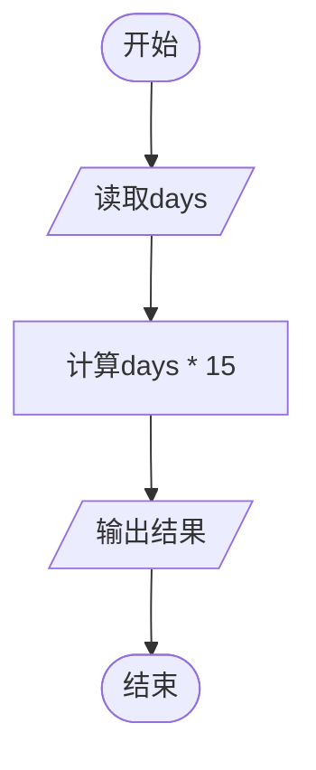

# L1-114 - 要刷多少题（5 分）

- **时间限制**: 400 ms
- **内存限制**: 65536 KB
- **代码长度限制**: 16 KB

---

## 题目描述

老师说：想在天梯赛取得好成绩，第一件事是把前面 $n$ 年的天梯赛真题做一遍。
已知每年的天梯赛有 15 道题目，全新不重复。请你算一下，一共要刷多少道真题？

### 输入格式:

输入第一行给出一个正整数 $n$（$\le 10$），为题面中所述老师提出的比赛年数。

### 输出格式:

在一行中输出学生需要做完的题目总数。

### 输入样例:
```in
2
```

### 输出样例:
```out
30
```

## 示例

### 示例 1

**输入:**
```
2
```

**输出:**
```
30
```

---

## 题目详解

### 一、解题思路

本题根据输入的天数计算需要刷的题目数量。规律为：第 n 天需要刷的题目数量 = n × 15。这是一个简单的乘法运算。

### 二、代码流程说明

1. 读取天数 `days`
2. 计算 `days * 15` 并输出

### 三、代码流程图



### 四、解题流程图

```mermaid
flowchart TD
    A([开始]) --> B[读取天数]
    B --> C[天数乘以15]
    C --> D[输出结果]
    D --> E([结束])