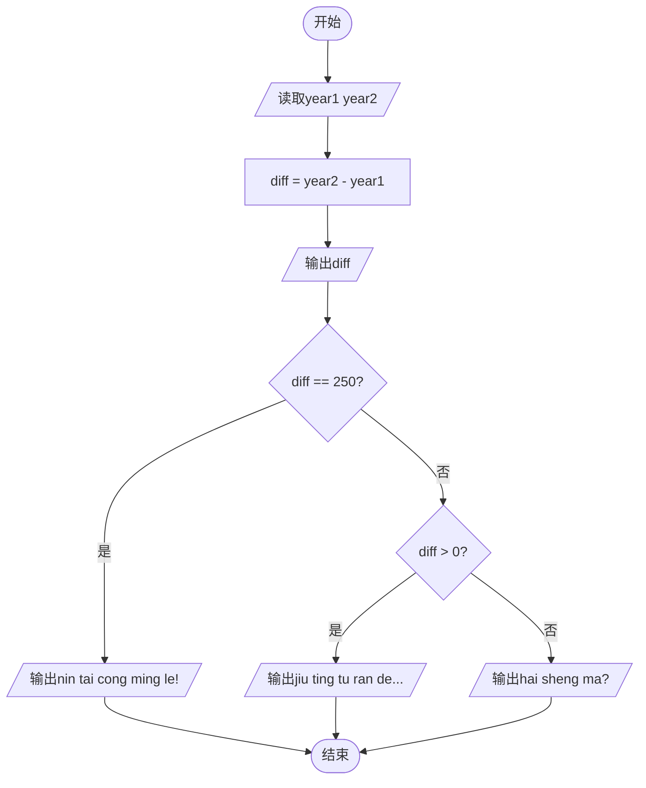

# L1-115 - 就挺突然的（10 分）

- **时间限制**: 400 ms
- **内存限制**: 65536 KB
- **代码长度限制**: 16 KB

---

## 题目描述


上面是新浪微博上的一张图，内容是“蹲厕所时突然想到，2026 年出生的孩子，能活到 3001 年”，就，挺突然的……

本题假设人类最长寿命为 250 岁，请你编写程序判断一下墙上的标语是否合理。

### 输入格式:

输入在一行给出 2 个不超过 5000 的正整数 $A$ 和 $B$，对应的标语为“蹲厕所时突然想到，$A$ 年出生的孩子，能活到 $B$ 年”。

### 输出格式:

首先在第一行输出写标语的人认为 $A$ 年出生的孩子有多长的寿命。如果该寿命超过了人类最长寿命，在第二行中输出 `jiu ting tu ran de...`；如果该寿命不是正数，输出 `hai sheng ma?`；如果寿命在正常范围内，输出 `nin tai cong ming le!`

### 输入样例 1：
```in
2026 3001
```

### 输出样例 1：
```out
975
jiu ting tu ran de...
```

### 输入样例 2：
```in
3001 2026
```

### 输出样例 2：
```out
-975
hai sheng ma?
```

### 输入样例 3：
```in
2025 2275
```

### 输出样例 3：
```out
250
nin tai cong ming le!
```

## 示例

### 示例 1

**输入:**
```
2026 3001
```

**输出:**
```
975
jiu ting tu ran de...
```

### 示例 2

**输入:**
```
3001 2026
```

**输出:**
```
-975
hai sheng ma?
```

### 示例 3

**输入:**
```
2025 2275
```

**输出:**
```
250
nin tai cong ming le!
```

---

## 题目详解

### 一、解题思路

本题根据两个年份的差值判断对应的提示信息：

1. **计算差值**：`diff = year2 - year1`，先输出差值
2. **条件判断**：
   - `diff == 250`：输出 "nin tai cong ming le!"（你太聪明了！）
   - `diff > 0`：输出 "jiu ting tu ran de..."（就挺突然的...）
   - `diff < 0`：输出 "hai sheng ma?"（还剩吗？）

### 二、代码流程说明

1. 读取两个年份 `year1` 和 `year2`
2. 计算差值 `diff = year2 - year1`，输出 `diff`
3. 判断 `diff`：
   - 等于 250 → 输出 "nin tai cong ming le!"
   - 大于 0 → 输出 "jiu ting tu ran de..."
   - 小于等于 0（且不等于250）→ 输出 "hai sheng ma?"

### 三、代码流程图



### 四、解题流程图

```mermaid
flowchart TD
    A([开始]) --> B[读取两个年份]
    B --> C[计算差值并输出]
    C --> D{差值 == 250?}
    D -- 是 --> E[输出你太聪明了]
    D -- 否 --> F{差值 > 0?}
    F -- 是 --> G[输出就挺突然的]
    F -- 否 --> H[输出还剩吗]
    E --> I([结束])
    G --> I
    H --> I