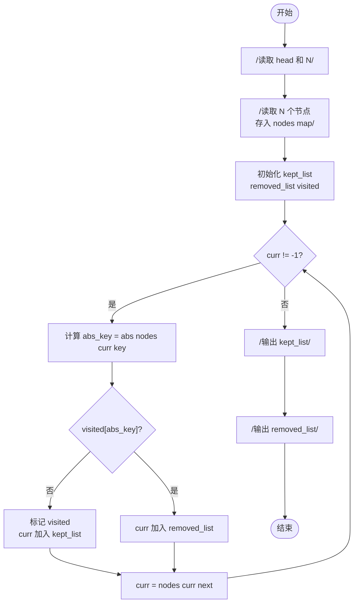
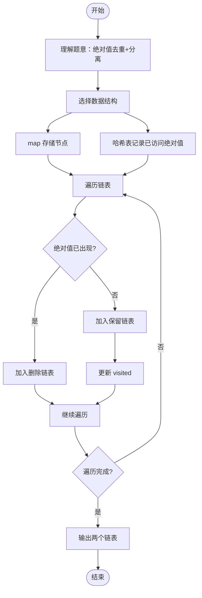

# L2-002 - 链表去重（25 分）

- **时间限制**: 400 ms
- **内存限制**: 65536 KB
- **代码长度限制**: 16 KB

---

## 题目描述

给定一个带整数键值的链表 $$L$$，你需要把其中绝对值重复的键值结点删掉。即对每个键值 $$K$$，只有第一个绝对值等于 $$K$$ 的结点被保留。同时，所有被删除的结点须被保存在另一个链表上。例如给定 $$L$$ 为 21→-15→-15→-7→15，你需要输出去重后的链表 21→-15→-7，还有被删除的链表 -15→15。

### 输入格式:

输入在第一行给出 L 的第一个结点的地址和一个正整数 $$N$$（$$\le 10^5$$，为结点总数）。一个结点的地址是非负的 5 位整数，空地址 NULL 用 $$-1$$ 来表示。

随后 $$N$$ 行，每行按以下格式描述一个结点：
```
地址 键值 下一个结点
```

其中`地址`是该结点的地址，`键值`是绝对值不超过$$10^4$$的整数，`下一个结点`是下个结点的地址。

### 输出格式:

首先输出去重后的链表，然后输出被删除的链表。每个结点占一行，按输入的格式输出。

### 输入样例:
```in
00100 5
99999 -7 87654
23854 -15 00000
87654 15 -1
00000 -15 99999
00100 21 23854
```

### 输出样例:
```out
00100 21 23854
23854 -15 99999
99999 -7 -1
00000 -15 87654
87654 15 -1
```

## 示例

### 示例 1

**输入:**
```
00100 5
99999 -7 87654
23854 -15 00000
87654 15 -1
00000 -15 99999
00100 21 23854
```

**输出:**
```
00100 21 23854
23854 -15 99999
99999 -7 -1
00000 -15 87654
87654 15 -1
```

---

## 题目详解

### 一、解题思路

本题要求对链表进行基于键值绝对值的去重操作。核心思想是使用哈希表记录已经出现过的绝对值：

1. **数据存储**：使用 `map<int, Node>` 以地址为键存储所有节点信息（键值和下一节点指针），便于按地址快速查找。
2. **遍历链表**：从头结点 `head` 开始，沿 `next` 指针逐个遍历节点。
3. **去重判断**：对每个节点计算 `abs_key = abs(nodes[curr].key)`，如果 `visited[abs_key]` 为 false，说明该绝对值首次出现，加入保留链表 `kept_list` 并标记 visited；否则加入删除链表 `removed_list`。
4. **输出链表**：遍历两个链表，根据当前节点在列表中的位置确定 next 指针（列表中下一节点的地址，最后一个节点 next 为 -1）。

### 二、代码流程说明

1. 读取头结点地址 `head` 和节点数 `N`
2. 读取 `N` 个节点，以地址为键存入 `nodes` map
3. 初始化 `kept_list`、`removed_list` 向量和 `visited` 哈希表
4. 从 `head` 开始遍历链表：
   - 计算当前节点键值的绝对值 `abs_key`
   - 判断 `visited[abs_key]` 是否为真
   - 若为假：标记 visited，将当前地址加入 `kept_list`
   - 若为真：将当前地址加入 `removed_list`
   - 移动到下一个节点 `curr = nodes[curr].next`
5. 输出保留链表：遍历 `kept_list`，每个节点输出地址、键值和下一节点地址
6. 输出删除链表：遍历 `removed_list`，同样格式输出

### 三、代码流程图



### 四、解题流程图


