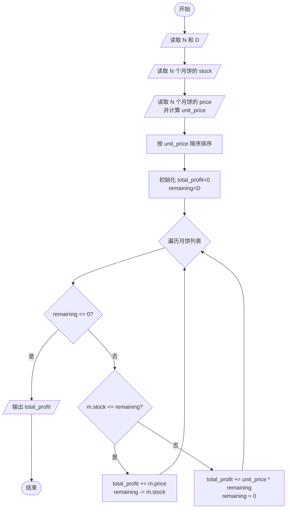
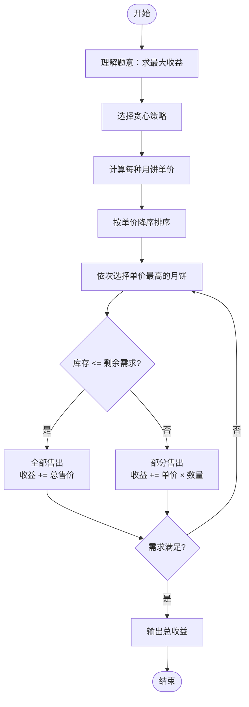

# L2-003 - 月饼（25 分）

- **时间限制**: 150 ms
- **内存限制**: 65536 KB
- **代码长度限制**: 16 KB

---

## 题目描述

月饼是中国人在中秋佳节时吃的一种传统食品，不同地区有许多不同风味的月饼。现给定所有种类月饼的库存量、总售价、以及市场的最大需求量，请你计算可以获得的最大收益是多少。

注意：销售时允许取出一部分库存。样例给出的情形是这样的：假如我们有 3 种月饼，其库存量分别为 18、15、10 万吨，总售价分别为 75、72、45 亿元。如果市场的最大需求量只有 20 万吨，那么我们最大收益策略应该是卖出全部 15 万吨第 2 种月饼、以及 5 万吨第 3 种月饼，获得 72 + 45/2 = 94.5（亿元）。

### 输入格式:

每个输入包含一个测试用例。每个测试用例先给出一个不超过 1000 的正整数 $$N$$ 表示月饼的种类数、以及不超过 500（以万吨为单位）的正整数 $$D$$ 表示市场最大需求量。随后一行给出 $$N$$ 个正数表示每种月饼的库存量（以万吨为单位）；最后一行给出 $$N$$ 个正数表示每种月饼的总售价（以亿元为单位）。数字间以空格分隔。

### 输出格式:

对每组测试用例，在一行中输出最大收益，以亿元为单位并精确到小数点后 2 位。

### 输入样例:
```in
3 20
18 15 10
75 72 45
```

### 输出样例:
```out
94.50
```

## 示例

### 示例 1

**输入:**
```
3 20
18 15 10
75 72 45
```

**输出:**
```
94.50
```

---

## 题目详解

### 一、解题思路

本题是一个经典的贪心算法问题，要求计算月饼的最大收益。核心策略是优先选择单价最高的月饼：

1. **计算单价**：对每种月饼，计算单价 `unit_price = price / stock`（总售价 / 库存量）。
2. **按单价排序**：将所有月饼按单价从高到低排序。
3. **贪心选择**：依次选择单价最高的月饼。如果当前月饼库存小于等于剩余需求量，则全部售出并加入总收益；如果库存大于剩余需求量，则只售出所需部分，收益按单价计算。
4. **终止条件**：当剩余需求量为 0 时停止选择。

### 二、代码流程说明

1. 读取月饼种类数 `N` 和市场最大需求量 `D`
2. 读取每种月饼的库存量 `stock`
3. 读取每种月饼的总售价 `price`，并计算单价 `unit_price`
4. 调用 `sort` 按单价降序排序
5. 初始化 `total_profit = 0`，`remaining = D`
6. 遍历排序后的月饼列表：
   - 若 `remaining <= 0`，跳出循环
   - 若 `m.stock <= remaining`：全部售出，`total_profit += m.price`，`remaining -= m.stock`
   - 否则：部分售出，`total_profit += m.unit_price * remaining`，`remaining = 0`
7. 以保留两位小数的格式输出 `total_profit`

### 三、代码流程图



### 四、解题流程图


