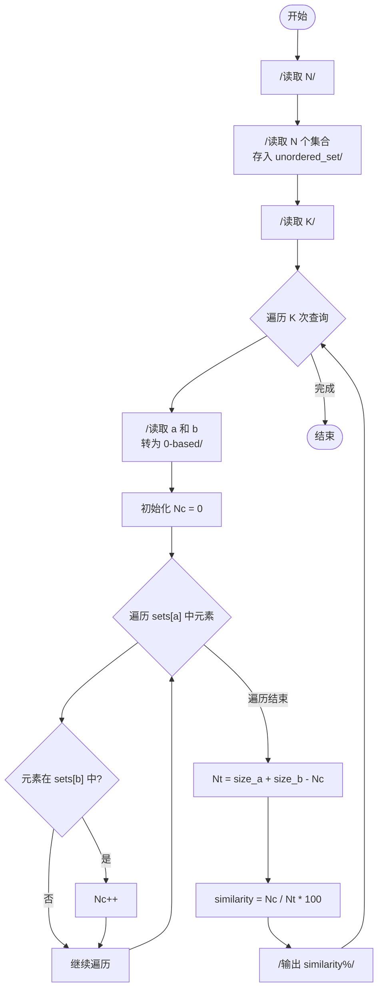
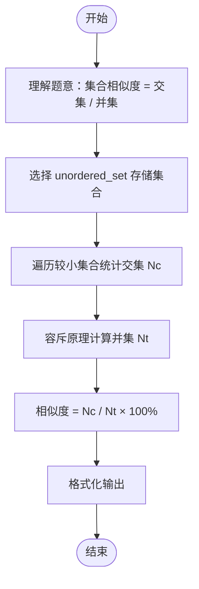

# L2-005 - 集合相似度（25 分）

- **时间限制**: 400 ms
- **内存限制**: 65536 KB
- **代码长度限制**: 16 KB

---

## 题目描述

给定两个整数集合，它们的相似度定义为：$$N_c / N_t \times 100\%$$。其中$$N_c$$是两个集合都有的不相等整数的个数，$$N_t$$是两个集合一共有的不相等整数的个数。你的任务就是计算任意一对给定集合的相似度。

### 输入格式:

输入第一行给出一个正整数$$N$$（$$\le 50$$），是集合的个数。随后$$N$$行，每行对应一个集合。每个集合首先给出一个正整数$$M$$（$$\le 10^4$$），是集合中元素的个数；然后跟$$M$$个$$[0, 10^9]$$区间内的整数。

之后一行给出一个正整数$$K$$（$$\le 2000$$），随后$$K$$行，每行对应一对需要计算相似度的集合的编号（集合从1到$$N$$编号）。数字间以空格分隔。

### 输出格式:

对每一对需要计算的集合，在一行中输出它们的相似度，为保留小数点后2位的百分比数字。

### 输入样例:
```in
3
3 99 87 101
4 87 101 5 87
7 99 101 18 5 135 18 99
2
1 2
1 3
```

### 输出样例:
```out
50.00%
33.33%
```

## 示例

### 示例 1

**输入:**
```
3
3 99 87 101
4 87 101 5 87
7 99 101 18 5 135 18 99
2
1 2
1 3
```

**输出:**
```
50.00%
33.33%
```

---

## 题目详解

### 一、解题思路

本题要求计算两个集合的相似度，公式为 `Nc / Nt × 100%`，其中 `Nc` 是交集大小，`Nt` 是并集大小。

1. **集合存储**：使用 `unordered_set<int>` 存储每个集合，自动去重并提供 O(1) 查找。
2. **计算交集**：对于每对集合，遍历较小的集合（这里遍历 `sets[a]`），统计在另一个集合中也存在的元素个数 `Nc`。
3. **计算并集**：由容斥原理，`Nt = sets[a].size() + sets[b].size() - Nc`。
4. **计算相似度**：`similarity = (double)Nc / Nt * 100`，保留两位小数输出。

### 二、代码流程说明

1. 读取集合数 `N`
2. 读取 `N` 个集合，每个集合用 `unordered_set<int>` 存储
3. 读取查询数 `K`
4. 对每个查询：
   - 读取两个集合编号 `a`、`b`（转换为 0-based 索引）
   - 初始化 `Nc = 0`
   - 遍历 `sets[a]` 中的每个元素，若也在 `sets[b]` 中则 `Nc++`
   - 计算 `Nt = sets[a].size() + sets[b].size() - Nc`
   - 计算相似度 `(double)Nc / Nt * 100`
   - 以 `xx.xx%` 格式输出
5. 结束

### 三、代码流程图



### 四、解题流程图


