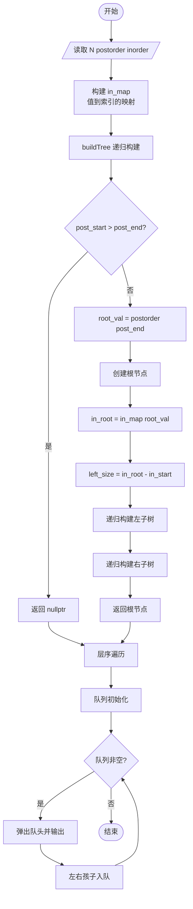
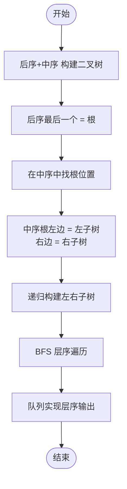

# L2-006 - 树的遍历（25 分）

- **时间限制**: 400 ms
- **内存限制**: 65536 KB
- **代码长度限制**: 16 KB

---

## 题目描述

给定一棵二叉树的后序遍历和中序遍历，请你输出其层序遍历的序列。这里假设键值都是互不相等的正整数。

### 输入格式:

输入第一行给出一个正整数$$N$$（$$\le 30$$），是二叉树中结点的个数。第二行给出其后序遍历序列。第三行给出其中序遍历序列。数字间以空格分隔。

### 输出格式:

在一行中输出该树的层序遍历的序列。数字间以1个空格分隔，行首尾不得有多余空格。

### 输入样例:
```in
7
2 3 1 5 7 6 4
1 2 3 4 5 6 7
```

### 输出样例:
```out
4 1 6 3 5 7 2
```

## 示例

### 示例 1

**输入:**
```
7
2 3 1 5 7 6 4
1 2 3 4 5 6 7
```

**输出:**
```
4 1 6 3 5 7 2
```

---

## 题目详解

### 一、解题思路

本题要求根据二叉树的后序遍历和中序遍历构建二叉树，然后输出层序遍历。

1. **构建二叉树**（由后序+中序）：
   - 后序遍历的最后一个节点是根节点 `root_val`
   - 在中序遍历中找到根节点位置 `in_root`，其左边为左子树，右边为右子树
   - 左子树大小 `left_size = in_root - in_start`
   - 递归构建左子树（后序的前 `left_size` 个节点 + 中序的左半部分）
   - 递归构建右子树（后序的剩余节点 + 中序的右半部分）
2. **层序遍历**：使用队列 `queue<TreeNode*>`，依次将根入队，然后循环弹出队头、输出值、将左右孩子入队。

### 二、代码流程说明

1. 读取节点数 `N`
2. 读取后序遍历序列 `postorder` 和中序遍历序列 `inorder`
3. 构建中序值到索引的映射 `in_map`，便于 O(1) 查找根节点位置
4. 调用 `buildTree` 递归构建二叉树：
   - 终止条件：`post_start > post_end` 或 `in_start > in_end` 返回空
   - 取 `postorder[post_end]` 作为根，创建新节点
   - 在 `in_map` 中找到根在中序的位置 `in_root`
   - 计算左子树大小 `left_size`
   - 递归构建左右子树
5. 使用队列进行层序遍历，依次输出每个节点的值

### 三、代码流程图



### 四、解题流程图


