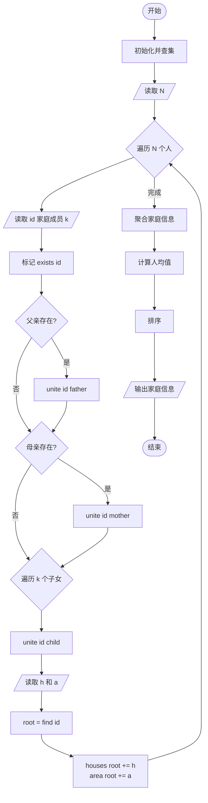
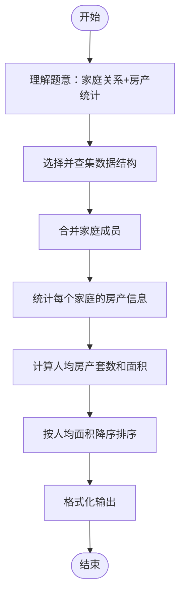

# L2-007 - 家庭房产（25 分）

- **时间限制**: 400 ms
- **内存限制**: 65536 KB
- **代码长度限制**: 16 KB

---

## 题目描述

给定每个人的家庭成员和其自己名下的房产，请你统计出每个家庭的人口数、人均房产面积及房产套数。

### 输入格式:

输入第一行给出一个正整数$$N$$（$$\le 1000$$），随后$$N$$行，每行按下列格式给出一个人的房产：
```
编号 父 母 k 孩子1 ... 孩子k 房产套数 总面积
```
其中`编号`是每个人独有的一个4位数的编号；`父`和`母`分别是该编号对应的这个人的父母的编号（如果已经过世，则显示`-1`）；`k`（$$0\le$$`k`$$\le 5$$）是该人的子女的个数；`孩子i`是其子女的编号。

### 输出格式:

首先在第一行输出家庭个数（所有有亲属关系的人都属于同一个家庭）。随后按下列格式输出每个家庭的信息：
```
家庭成员的最小编号 家庭人口数 人均房产套数 人均房产面积
```
其中人均值要求保留小数点后3位。家庭信息首先按人均面积降序输出，若有并列，则按成员编号的升序输出。

### 输入样例:
```in
10
6666 5551 5552 1 7777 1 100
1234 5678 9012 1 0002 2 300
8888 -1 -1 0 1 1000
2468 0001 0004 1 2222 1 500
7777 6666 -1 0 2 300
3721 -1 -1 1 2333 2 150
9012 -1 -1 3 1236 1235 1234 1 100
1235 5678 9012 0 1 50
2222 1236 2468 2 6661 6662 1 300
2333 -1 3721 3 6661 6662 6663 1 100
```

### 输出样例:
```out
3
8888 1 1.000 1000.000
0001 15 0.600 100.000
5551 4 0.750 100.000
```

## 示例

### 示例 1

**输入:**
```
10
6666 5551 5552 1 7777 1 100
1234 5678 9012 1 0002 2 300
8888 -1 -1 0 1 1000
2468 0001 0004 1 2222 1 500
7777 6666 -1 0 2 300
3721 -1 -1 1 2333 2 150
9012 -1 -1 3 1236 1235 1234 1 100
1235 5678 9012 0 1 50
2222 1236 2468 2 6661 6662 1 300
2333 -1 3721 3 6661 6662 6663 1 100
```

**输出:**
```
3
8888 1 1.000 1000.000
0001 15 0.600 100.000
5551 4 0.750 100.000
```

---

## 题目详解

### 一、解题思路

本题使用并查集（Union-Find）处理家庭关系，统计每个家庭的人口数、人均房产套数和人均面积。

1. **并查集合并家庭成员**：将每个人与其父母、子女合并到同一集合中。使用路径压缩优化的 `find` 函数和 `unite` 函数合并集合。
2. **维护家庭信息**：每个集合（家庭）维护：
   - `min_id`：家庭成员的最小编号
   - `people`：家庭人口数
   - `houses`：家庭房产总套数
   - `area`：家庭房产总面积
3. **处理输入**：对每个人，读取其父母编号和子女编号，合并家庭关系；读取该人的房产信息，累加到所在家庭的根节点。
4. **统计家庭**：遍历所有出现过的人员，按根节点聚合成家庭，计算人均值。
5. **排序输出**：按人均面积降序，若并列按成员编号升序排序。

### 二、代码流程说明

1. 初始化并查集：每个节点的 parent、min_id 为自身，people=1，houses=0，area=0
2. 读取人数 `N`
3. 对每个人：
   - 读取编号、父亲、母亲、子女数 `k`
   - 标记 `exists[id] = true`
   - 若父亲/母亲存在，合并 `unite(id, father/mother)`
   - 读取 `k` 个子女，合并 `unite(id, child)`
   - 读取房产套数 `h` 和总面积 `a`
   - 找到根节点 `root = find(id)`，累加到根节点的 `houses` 和 `area`
4. 遍历所有 `exists` 的人员，以根节点为键聚合家庭信息
5. 构建 `Family` 结构体（min_id、people、avg_house、avg_area）
6. 按 `compare` 排序（人均面积降序，编号升序）
7. 输出家庭数和每个家庭的信息

### 三、代码流程图



### 四、解题流程图


