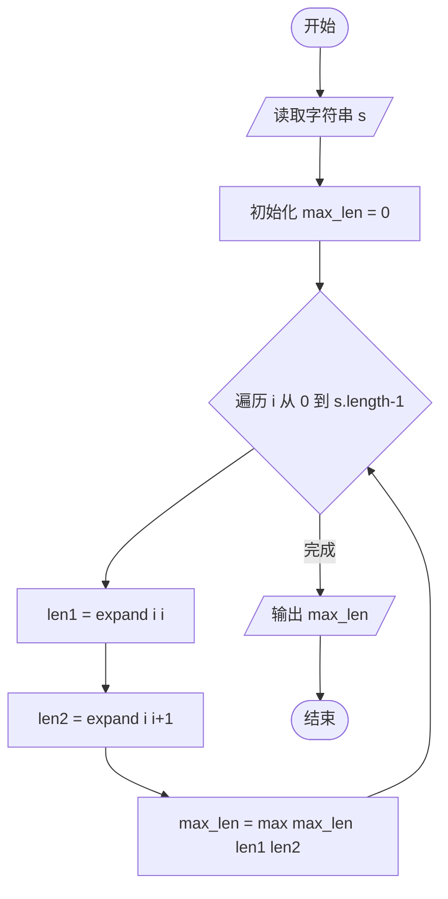
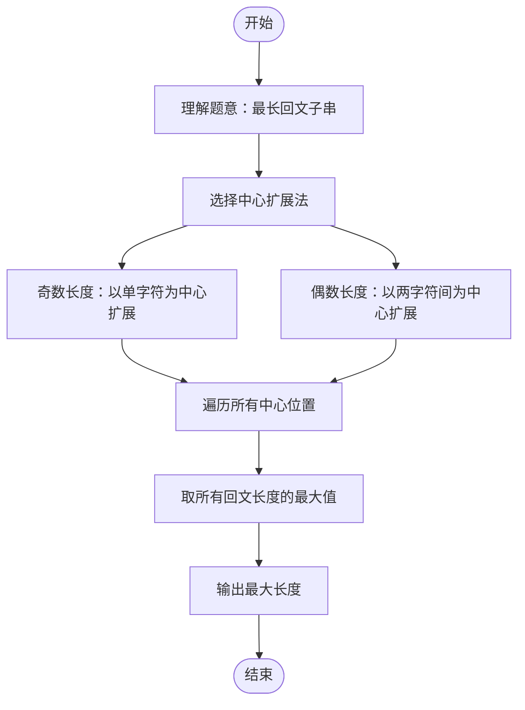

# L2-008 - 最长对称子串（25 分）

- **时间限制**: 200 ms
- **内存限制**: 65536 KB
- **代码长度限制**: 16 KB

---

## 题目描述

对给定的字符串，本题要求你输出最长对称子串的长度。例如，给定`Is PAT&TAP symmetric?`，最长对称子串为`s PAT&TAP s`，于是你应该输出11。

### 输入格式:

输入在一行中给出长度不超过1000的非空字符串。

### 输出格式:

在一行中输出最长对称子串的长度。

### 输入样例:
```in
Is PAT&TAP symmetric?
```

### 输出样例:
```out
11
```

## 示例

### 示例 1

**输入:**
```
Is PAT&TAP symmetric?
```

**输出:**
```
11
```

---

## 题目详解

### 一、解题思路

本题要求找出字符串中最长的对称子串（回文子串），使用中心扩展法。

1. **回文子串类型**：
   - 奇数长度回文：以单个字符为中心（如 `"aba"`，中心为 `'b'`）
   - 偶数长度回文：以两个相邻字符之间为中心（如 `"abba"`，中心为两个 `'b'` 之间）
2. **中心扩展法**：
   - 对字符串中每个位置 `i`，以 `s[i]` 为中心向两边扩展（奇数长度）
   - 以 `s[i]` 和 `s[i+1]` 为中心向两边扩展（偶数长度）
   - 扩展条件：左右指针在有效范围内且字符相等
3. **取最大值**：遍历所有中心位置，取所有可能回文子串长度的最大值。

### 二、代码流程说明

1. 读取字符串 `s`
2. 初始化 `max_len = 0`
3. 遍历字符串每个位置 `i`：
   - 调用 `expandAroundCenter(s, i, i)` 计算奇数长度回文长度 `len1`
   - 调用 `expandAroundCenter(s, i, i+1)` 计算偶数长度回文长度 `len2`
   - `max_len = max(max_len, max(len1, len2))`
4. 输出 `max_len`

`expandAroundCenter` 函数：
- 从 `left` 和 `right` 开始，当 `left >= 0`、`right < s.length()` 且 `s[left] == s[right]` 时，`left--`、`right++`
- 返回 `right - left - 1`（即回文长度）

### 三、代码流程图



### 四、解题流程图


