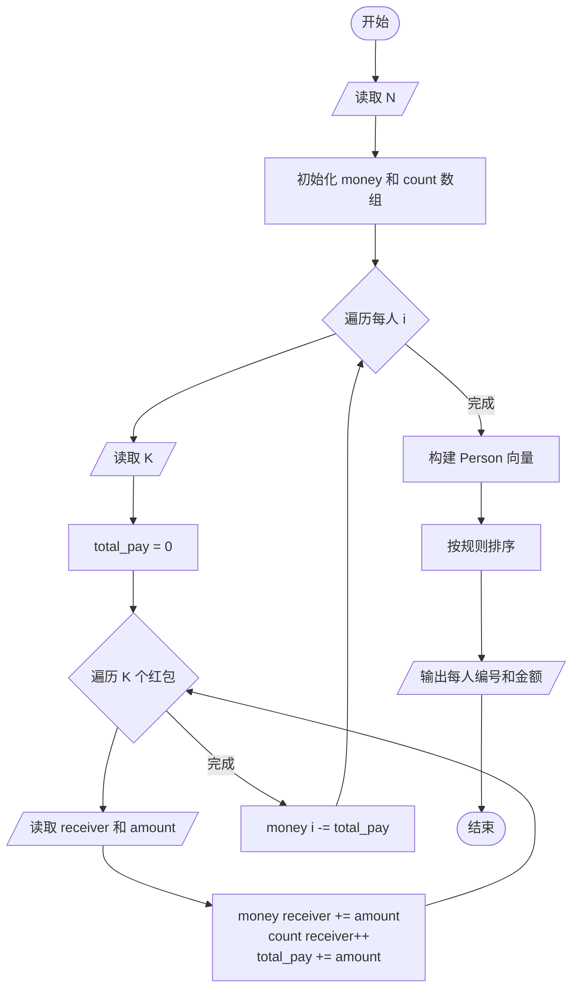
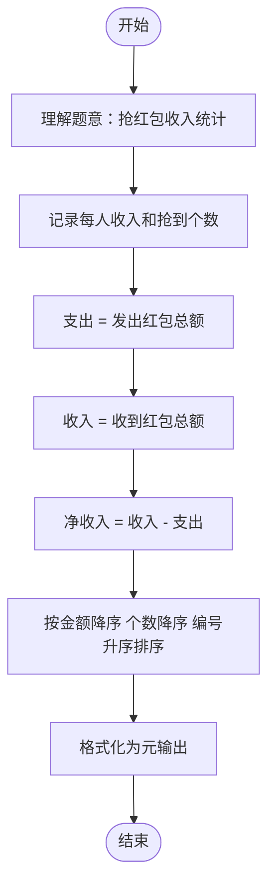

# L2-009 - 抢红包（25 分）

- **时间限制**: 300 ms
- **内存限制**: 65536 KB
- **代码长度限制**: 16 KB

---

## 题目描述

没有人没抢过红包吧…… 这里给出$$N$$个人之间互相发红包、抢红包的记录，请你统计一下他们抢红包的收获。

### 输入格式:

输入第一行给出一个正整数$$N$$（$$\le 10^4$$），即参与发红包和抢红包的总人数，则这些人从1到$$N$$编号。随后$$N$$行，第$$i$$行给出编号为$$i$$的人发红包的记录，格式如下：

$$K\quad N_1\quad P_1\quad \cdots\quad N_K\quad P_K$$

其中$$K$$（$$0 \le K \le 20$$）是发出去的红包个数，$$N_i$$是抢到红包的人的编号，$$P_i$$（$$>0$$）是其抢到的红包金额（以分为单位）。注意：对于同一个人发出的红包，每人最多只能抢1次，不能重复抢。

### 输出格式:

按照收入金额从高到低的递减顺序输出每个人的编号和收入金额（以元为单位，输出小数点后2位）。每个人的信息占一行，两数字间有1个空格。如果收入金额有并列，则按抢到红包的个数递减输出；如果还有并列，则按个人编号递增输出。

### 输入样例:
```in
10
3 2 22 10 58 8 125
5 1 345 3 211 5 233 7 13 8 101
1 7 8800
2 1 1000 2 1000
2 4 250 10 320
6 5 11 9 22 8 33 7 44 10 55 4 2
1 3 8800
2 1 23 2 123
1 8 250
4 2 121 4 516 7 112 9 10
```

### 输出样例:
```out
1 11.63
2 3.63
8 3.63
3 2.11
7 1.69
6 -1.67
9 -2.18
10 -3.26
5 -3.26
4 -12.32
```

## 示例

### 示例 1

**输入:**
```
10
3 2 22 10 58 8 125
5 1 345 3 211 5 233 7 13 8 101
1 7 8800
2 1 1000 2 1000
2 4 250 10 320
6 5 11 9 22 8 33 7 44 10 55 4 2
1 3 8800
2 1 23 2 123
1 8 250
4 2 121 4 516 7 112 9 10
```

**输出:**
```
1 11.63
2 3.63
8 3.63
3 2.11
7 1.69
6 -1.67
9 -2.18
10 -3.26
5 -3.26
4 -12.32
```

---

## 题目详解

### 一、解题思路

本题统计 `N` 个人抢红包的收入情况，按规则排序输出。

1. **收入计算**：
   - 每个人发出红包时，金额从自己的收入中扣除（`money[i] -= total_pay`）
   - 收到红包的人金额加到其收入中（`money[receiver] += amount`）
   - 同时统计每人抢到的红包个数 `count[receiver]++`
2. **排序规则**：
   - 第一优先级：收入金额降序
   - 第二优先级：抢到红包个数降序
   - 第三优先级：个人编号升序
3. **输出**：以元为单位（分/100），保留两位小数。

### 二、代码流程说明

1. 读取人数 `N`
2. 初始化 `money` 和 `count` 数组（大小 N+1，初始值 0）
3. 对每个人 `i`（1 到 N）：
   - 读取发红包个数 `K`
   - 初始化 `total_pay = 0`
   - 对每个红包：读取接收者 `receiver` 和金额 `amount`
     - `money[receiver] += amount`，`count[receiver]++`，`total_pay += amount`
   - 发放者扣除支出：`money[i] -= total_pay`
4. 构建 `Person` 结构体向量，每个人记录 id、money、count
5. 按 `compare` 函数排序
6. 遍历排序结果，将金额转换为元（`money / 100.0`），保留两位小数输出

### 三、代码流程图



### 四、解题流程图


