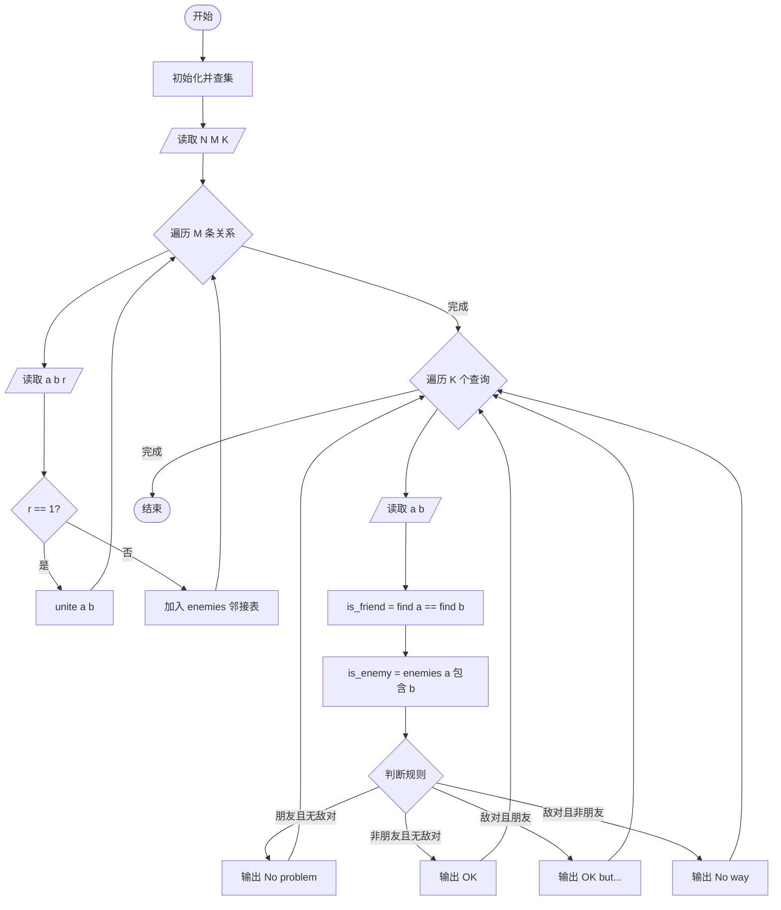
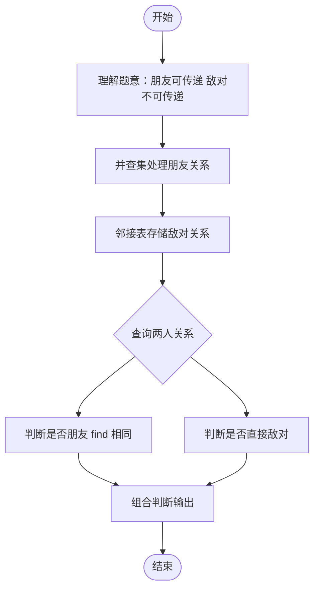

# L2-010 - 排座位（25 分）

- **时间限制**: 150 ms
- **内存限制**: 65536 KB
- **代码长度限制**: 16 KB

---

## 题目描述

布置宴席最微妙的事情，就是给前来参宴的各位宾客安排座位。无论如何，总不能把两个死对头排到同一张宴会桌旁！这个艰巨任务现在就交给你，对任何一对客人，请编写程序告诉主人他们是否能被安排同席。

### 输入格式:

输入第一行给出3个正整数：`N`（$$\le$$100），即前来参宴的宾客总人数，则这些人从1到`N`编号；`M`为已知两两宾客之间的关系数；`K`为查询的条数。随后`M`行，每行给出一对宾客之间的关系，格式为：`宾客1 宾客2 关系`，其中`关系`为1表示是朋友，-1表示是死对头。注意两个人不可能既是朋友又是敌人。最后`K`行，每行给出一对需要查询的宾客编号。

这里假设朋友的朋友也是朋友。但敌人的敌人并不一定就是朋友，朋友的敌人也不一定是敌人。只有单纯直接的敌对关系才是绝对不能同席的。

### 输出格式:

对每个查询输出一行结果：如果两位宾客之间是朋友，且没有敌对关系，则输出`No problem`；如果他们之间并不是朋友，但也不敌对，则输出`OK`；如果他们之间有敌对，然而也有共同的朋友，则输出`OK but...`；如果他们之间只有敌对关系，则输出`No way`。

### 输入样例:
```in
7 8 4
5 6 1
2 7 -1
1 3 1
3 4 1
6 7 -1
1 2 1
1 4 1
2 3 -1
3 4
5 7
2 3
7 2
```

### 输出样例:
```out
No problem
OK
OK but...
No way
```

## 示例

### 示例 1

**输入:**
```
7 8 4
5 6 1
2 7 -1
1 3 1
3 4 1
6 7 -1
1 2 1
1 4 1
2 3 -1
3 4
5 7
2 3
7 2
```

**输出:**
```
No problem
OK
OK but...
No way
```

---

## 题目详解

### 一、解题思路

本题使用并查集处理朋友关系（朋友的朋友也是朋友），使用邻接表处理直接的敌对关系，根据规则判断两人是否能同席。

1. **朋友关系**：使用并查集（Union-Find）维护，合并所有朋友关系。`find(a) == find(b)` 表示两人是朋友（包括传递性的朋友关系）。
2. **敌对关系**：使用 `unordered_set` 邻接表存储直接的敌对关系。注意：只有直接的敌对关系才阻止同席，敌人的敌人不一定是朋友。
3. **判断规则**：
   - `No problem`：是朋友且无敌对关系
   - `OK`：不是朋友也不敌对
   - `OK but...`：有敌对但有共同朋友（朋友关系+敌对关系并存）
   - `No way`：只有敌对关系（非朋友+敌对）

### 二、代码流程说明

1. 初始化并查集：每个节点 parent 为自身
2. 读取人数 `N`、关系数 `M`、查询数 `K`
3. 初始化 `enemies` 邻接表（大小 N+1）
4. 遍历 `M` 条关系：
   - 读取 `a`、`b`、`r`
   - 若 `r == 1`（朋友）：`unite(a, b)`
   - 若 `r == -1`（敌对）：将 `b` 加入 `enemies[a]`，将 `a` 加入 `enemies[b]`
5. 遍历 `K` 个查询：
   - 读取 `a`、`b`
   - `is_friend = (find(a) == find(b))`
   - `is_enemy = (enemies[a].count(b) > 0)`
   - 根据规则输出结果
6. 结束

### 三、代码流程图



### 四、解题流程图


