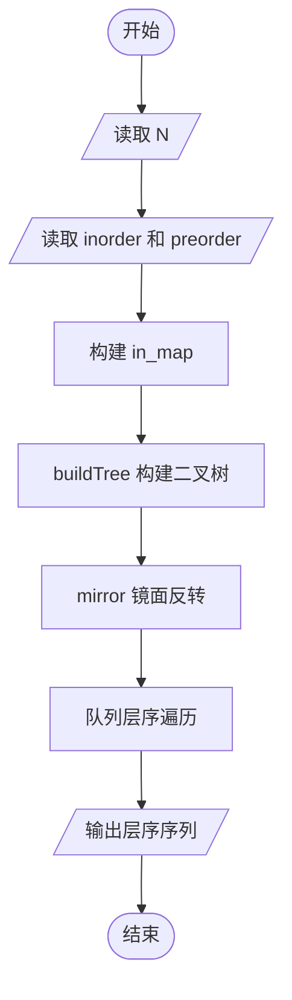
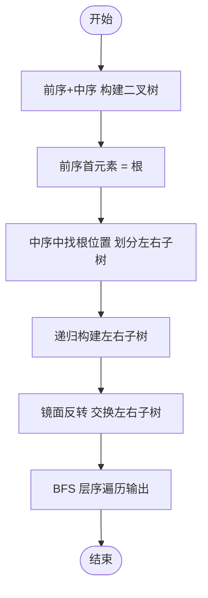

# L2-011 - 玩转二叉树（25 分）

- **时间限制**: 400 ms
- **内存限制**: 65536 KB
- **代码长度限制**: 16 KB

---

## 题目描述

给定一棵二叉树的中序遍历和前序遍历，请你先将树做个镜面反转，再输出反转后的层序遍历的序列。所谓镜面反转，是指将所有非叶结点的左右孩子对换。这里假设键值都是互不相等的正整数。

### 输入格式:

输入第一行给出一个正整数`N`（$$\le$$30），是二叉树中结点的个数。第二行给出其中序遍历序列。第三行给出其前序遍历序列。数字间以空格分隔。

### 输出格式:

在一行中输出该树反转后的层序遍历的序列。数字间以1个空格分隔，行首尾不得有多余空格。

### 输入样例:
```in
7
1 2 3 4 5 6 7
4 1 3 2 6 5 7
```

### 输出样例:
```out
4 6 1 7 5 3 2
```

## 示例

### 示例 1

**输入:**
```
7
1 2 3 4 5 6 7
4 1 3 2 6 5 7
```

**输出:**
```
4 6 1 7 5 3 2
```

---

## 题目详解

### 一、解题思路

本题要求根据中序遍历和前序遍历构建二叉树，进行镜面反转后输出层序遍历。

1. **构建二叉树**（由前序+中序）：
   - 前序遍历的第一个节点是根节点 `root_val`
   - 在中序遍历中找到根节点位置 `in_root`，左边为左子树，右边为右子树
   - 左子树大小 `left_size = in_root - in_start`
   - 递归构建左右子树
2. **镜面反转**：递归交换每个节点的左右子树（`swap(root->left, root->right)`）。
3. **层序遍历**：使用队列，按层序输出反转后的二叉树节点。

### 二、代码流程说明

1. 读取节点数 `N`
2. 读取中序遍历序列 `inorder` 和前序遍历序列 `preorder`
3. 构建 `in_map` 映射表（值→索引）
4. 调用 `buildTree` 由前序+中序递归构建二叉树
5. 调用 `mirror` 对二叉树进行镜面反转
6. 使用队列进行层序遍历并输出

### 三、代码流程图



### 四、解题流程图


