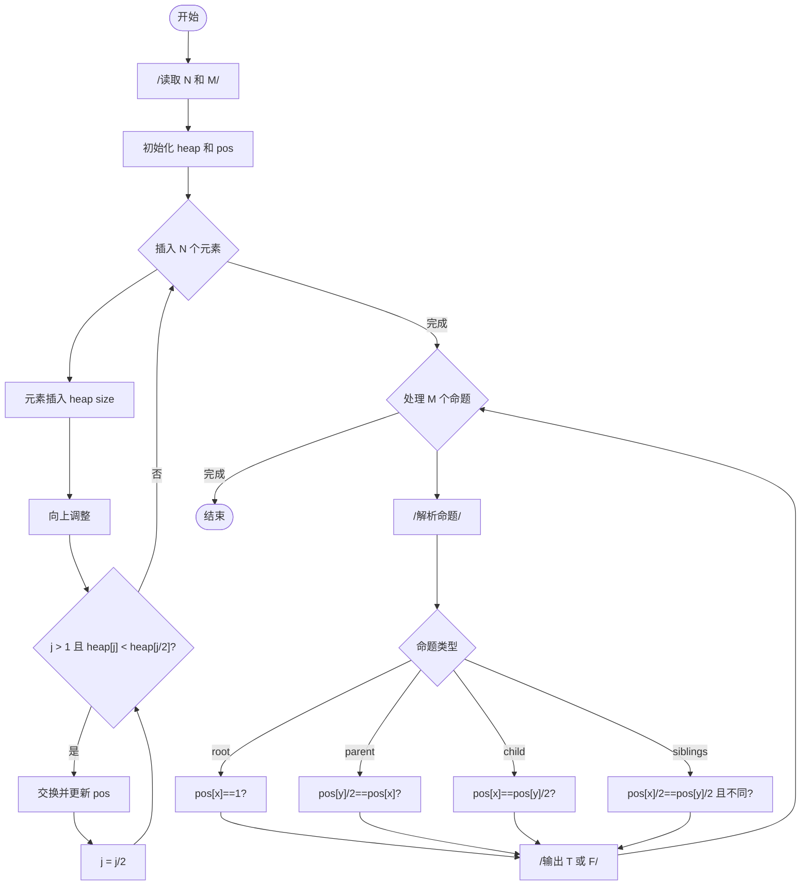
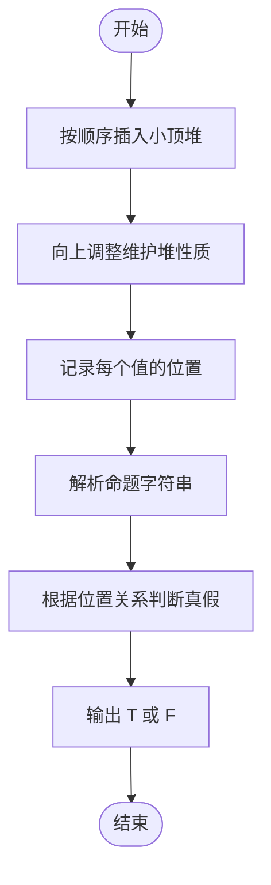

# L2-012 - 关于堆的判断（25 分）

- **时间限制**: 400 ms
- **内存限制**: 65536 KB
- **代码长度限制**: 16 KB

---

## 题目描述

将一系列给定数字顺序插入一个初始为空的小顶堆`H[]`。随后判断一系列相关命题是否为真。命题分下列几种：

- `x is the root`：`x`是根结点；
- `x and y are siblings`：`x`和`y`是兄弟结点；
- `x is the parent of y`：`x`是`y`的父结点；
- `x is a child of y`：`x`是`y`的一个子结点。

### 输入格式:

每组测试第1行包含2个正整数`N`（$$\le$$ 1000）和`M`（$$\le$$ 20），分别是插入元素的个数、以及需要判断的命题数。下一行给出区间$$[-10000, 10000]$$内的`N`个要被插入一个初始为空的小顶堆的整数。之后`M`行，每行给出一个命题。题目保证命题中的结点键值都是存在的。

### 输出格式:

对输入的每个命题，如果其为真，则在一行中输出`T`，否则输出`F`。

### 输入样例:
```in
5 4
46 23 26 24 10
24 is the root
26 and 23 are siblings
46 is the parent of 23
23 is a child of 10
```

### 输出样例:
```out
F
T
F
T
```

## 示例

### 示例 1

**输入:**
```
5 4
46 23 26 24 10
24 is the root
26 and 23 are siblings
46 is the parent of 23
23 is a child of 10
```

**输出:**
```
F
T
F
T
```

---

## 题目详解

### 一、解题思路

本题要求模拟小顶堆的插入过程，然后判断一系列关于堆中节点关系的命题。

1. **模拟堆插入**：使用数组 `heap` 存储小顶堆，从位置 1 开始插入。每次插入新元素后，进行向上调整（与父节点比较并交换），直到满足堆性质。
2. **记录位置**：使用 `pos` 哈希表记录每个值在堆中的位置，便于快速查询。
3. **判断命题**：根据 `pos` 中的位置信息判断：
   - `x is the root`：`pos[x] == 1`
   - `x is the parent of y`：`pos[y] / 2 == pos[x]`
   - `x is a child of y`：`pos[x] == pos[y] / 2`
   - `x and y are siblings`：`pos[x] / 2 == pos[y] / 2 && pos[x] != pos[y]`

### 二、代码流程说明

1. 读取 `N` 和 `M`
2. 初始化 `heap` 数组和 `pos` 哈希表，`size = 0`
3. 插入 `N` 个元素：
   - 放入 `heap[++size]`，记录 `pos[x] = size`
   - 从 `j = size` 开始向上调整：若 `heap[j] < heap[j/2]` 则交换并更新 `pos`
4. 处理 `M` 个命题：
   - 解析字符串，提取 `x` 和操作符
   - 对不同命题类型进行判断并输出 `T` 或 `F`

### 三、代码流程图



### 四、解题流程图


