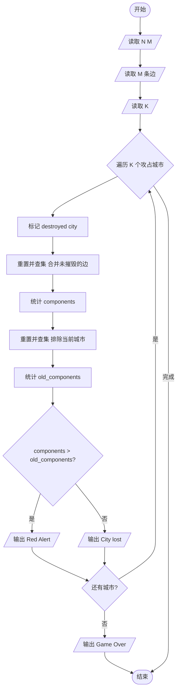
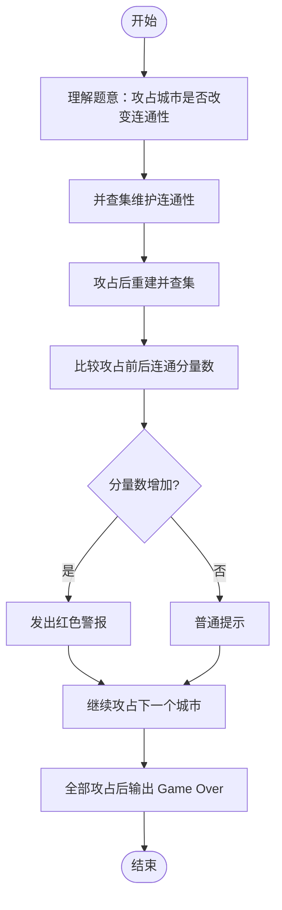

# L2-013 - 红色警报（25 分）

- **时间限制**: 400 ms
- **内存限制**: 65536 KB
- **代码长度限制**: 16 KB

---

## 题目描述

战争中保持各个城市间的连通性非常重要。本题要求你编写一个报警程序，当失去一个城市导致国家被分裂为多个无法连通的区域时，就发出红色警报。注意：若该国本来就不完全连通，是分裂的k个区域，而失去一个城市并不改变其他城市之间的连通性，则不要发出警报。

### 输入格式:

输入在第一行给出两个整数`N`（0 $$<$$ `N` $$\le$$ 500）和`M`（$$\le$$ 5000），分别为城市个数（于是默认城市从0到`N`-1编号）和连接两城市的通路条数。随后`M`行，每行给出一条通路所连接的两个城市的编号，其间以1个空格分隔。在城市信息之后给出被攻占的信息，即一个正整数`K`和随后的`K`个被攻占的城市的编号。

注意：输入保证给出的被攻占的城市编号都是合法的且无重复，但并不保证给出的通路没有重复。

### 输出格式:

对每个被攻占的城市，如果它会改变整个国家的连通性，则输出`Red Alert: City k is lost!`，其中`k`是该城市的编号；否则只输出`City k is lost.`即可。如果该国失去了最后一个城市，则增加一行输出`Game Over.`。

### 输入样例:
```in
5 4
0 1
1 3
3 0
0 4
5
1 2 0 4 3
```

### 输出样例:
```out
City 1 is lost.
City 2 is lost.
Red Alert: City 0 is lost!
City 4 is lost.
City 3 is lost.
Game Over.
```

## 示例

### 示例 1

**输入:**
```
5 4
0 1
1 3
3 0
0 4
5
1 2 0 4 3
```

**输出:**
```
City 1 is lost.
City 2 is lost.
Red Alert: City 0 is lost!
City 4 is lost.
City 3 is lost.
Game Over.
```

---

## 题目详解

### 一、解题思路

本题使用并查集维护城市连通性，当攻占一个城市时判断是否改变了连通分量数量。

1. **并查集维护**：使用 `parent` 数组，支持路径压缩的 `find` 和 `unite` 操作。
2. **模拟攻占过程**：每攻占一个城市 `city`：
   - 标记 `destroyed[city] = true`
   - 重新构建并查集（重置 parent），将所有未被攻占的城市按边合并
   - 统计当前连通分量数 `components`
   - 再计算假设不攻占该城市时的连通分量数 `old_components`
   - 若 `components > old_components`，说明攻占该城市导致连通分量增加，发出红色警报
3. **游戏结束**：当所有城市被攻占后输出 `Game Over.`

### 二、代码流程说明

1. 读取城市数 `N` 和道路数 `M`
2. 读取 `M` 条边存入 `edges` 向量
3. 读取攻占城市数 `K`
4. 初始化 `destroyed` 数组为 false
5. 对每个被攻占的城市：
   - 标记 `destroyed[city] = true`
   - 重置并查集，合并所有未被攻占城市的边
   - 统计当前连通分量数（根节点为自身且未被攻占）
   - 再次重置并查集，合并时排除当前城市
   - 统计不攻占该城市时的连通分量数
   - 比较两者，决定是否发出红色警报
   - 若所有城市已攻占，输出 `Game Over.`

### 三、代码流程图



### 四、解题流程图


