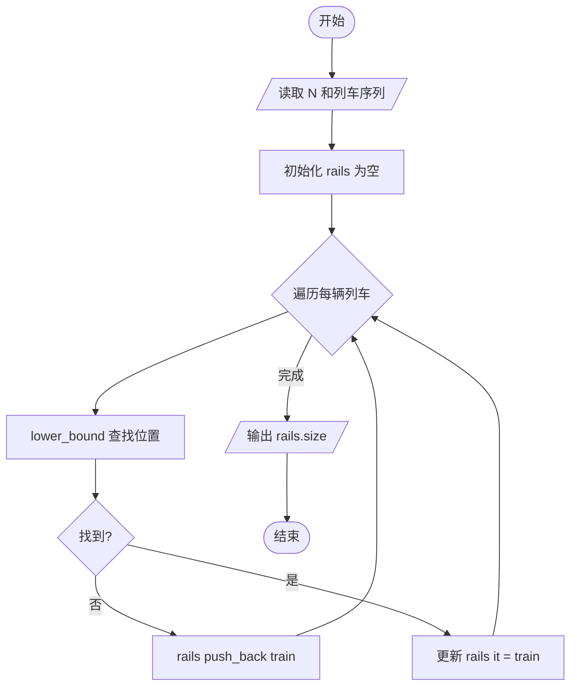
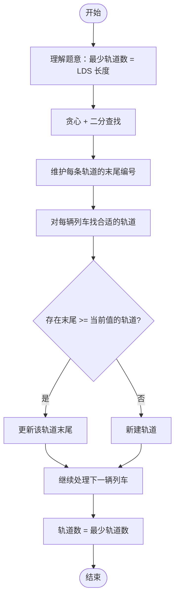

# L2-014 - 列车调度（25 分）

- **时间限制**: 300 ms
- **内存限制**: 65536 KB
- **代码长度限制**: 16 KB

---

## 题目描述

火车站的列车调度铁轨的结构如下图所示。


两端分别是一条入口（Entrance）轨道和一条出口（Exit）轨道，它们之间有`N`条平行的轨道。每趟列车从入口可以选择任意一条轨道进入，最后从出口离开。在图中有9趟列车，在入口处按照{8，4，2，5，3，9，1，6，7}的顺序排队等待进入。如果要求它们必须按序号递减的顺序从出口离开，则至少需要多少条平行铁轨用于调度？

### 输入格式:

输入第一行给出一个整数`N` (2 $$\le$$ `N` $$\le 10^5$$)，下一行给出从1到`N`的整数序号的一个重排列。数字间以空格分隔。

### 输出格式:

在一行中输出可以将输入的列车按序号递减的顺序调离所需要的最少的铁轨条数。

### 输入样例:
```in
9
8 4 2 5 3 9 1 6 7
```

### 输出样例:
```out
4
```

## 示例

### 示例 1

**输入:**
```
9
8 4 2 5 3 9 1 6 7
```

**输出:**
```
4
```

---

## 题目详解

### 一、解题思路

本题本质上是经典的「最长递减子序列（LDS）」问题。列车按顺序进入轨道，每条轨道上的列车编号必须递减。对于每辆列车，需要找到一条末尾编号大于当前列车编号的轨道，将其放入。

1. **贪心策略**：维护每条轨道末尾的列车编号数组 `rails`。对于每辆列车 `train`：
   - 使用 `lower_bound` 找到第一条末尾编号 >= `train` 的轨道
   - 如果不存在这样的轨道（`it == rails.end()`），新建一条轨道（`push_back`）
   - 如果存在，将该轨道的末尾编号更新为 `train`
2. **结果**：最终 `rails` 数组的大小就是最少轨道数。

### 二、代码流程说明

1. 读取列车数 `N`
2. 初始化 `rails` 向量为空
3. 依次处理每辆列车：
   - 使用 `lower_bound` 在 `rails` 中查找第一个 >= `train` 的位置
   - 若未找到（`it == rails.end()`）：`rails.push_back(train)` 新建轨道
   - 若找到：`*it = train` 更新该轨道的末尾编号
4. 输出 `rails.size()`

### 三、代码流程图



### 四、解题流程图


