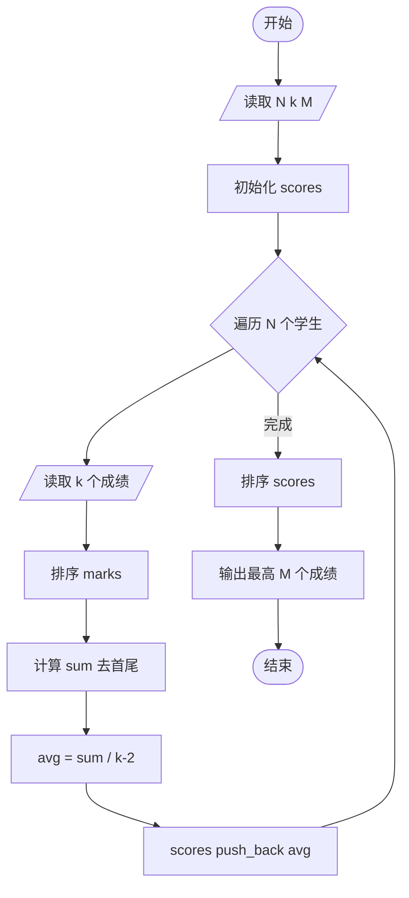
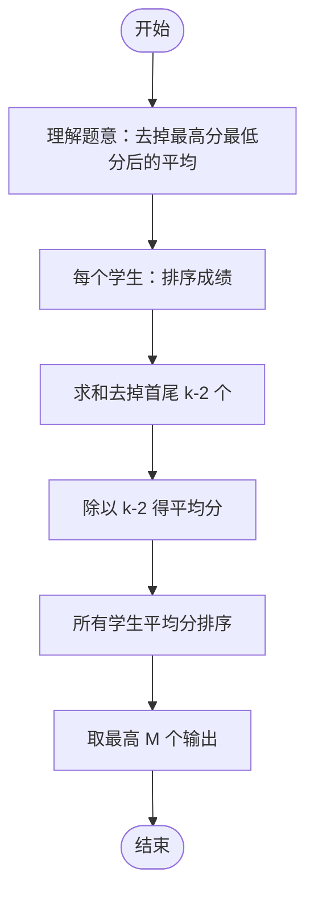

# L2-015 - 互评成绩（25 分）

- **时间限制**: 300 ms
- **内存限制**: 65536 KB
- **代码长度限制**: 16 KB

---

## 题目描述

学生互评作业的简单规则是这样定的：每个人的作业会被`k`个同学评审，得到`k`个成绩。系统需要去掉一个最高分和一个最低分，将剩下的分数取平均，就得到这个学生的最后成绩。本题就要求你编写这个互评系统的算分模块。

### 输入格式:

输入第一行给出3个正整数`N`（3 $$<$$ `N` $$\le 10^4$$，学生总数）、`k`（3 $$\le$$ `k` $$\le$$ 10，每份作业的评审数）、`M`（$$\le$$ 20，需要输出的学生数）。随后`N`行，每行给出一份作业得到的`k`个评审成绩（在区间[0, 100]内），其间以空格分隔。

### 输出格式:

按非递减顺序输出最后得分最高的`M`个成绩，保留小数点后3位。分数间有1个空格，行首尾不得有多余空格。

### 输入样例:
```in
6 5 3
88 90 85 99 60
67 60 80 76 70
90 93 96 99 99
78 65 77 70 72
88 88 88 88 88
55 55 55 55 55
```

### 输出样例:
```out
87.667 88.000 96.000
```

## 示例

### 示例 1

**输入:**
```
6 5 3
88 90 85 99 60
67 60 80 76 70
90 93 96 99 99
78 65 77 70 72
88 88 88 88 88
55 55 55 55 55
```

**输出:**
```
87.667 88.000 96.000
```

---

## 题目详解

### 一、解题思路

本题要求计算每个学生的互评成绩（去掉一个最高分和一个最低分后的平均分），并输出最高的 `M` 个成绩。

1. **计算互评成绩**：对每个学生的 `k` 个评审成绩排序后，去掉首尾各一个分数（即排序后从索引 1 到 k-2 的求和），再除以 `k-2` 得到平均分。
2. **排序输出**：将所有学生的平均分排序后，取最高的 `M` 个，按非递减顺序输出，保留 3 位小数。

### 二、代码流程说明

1. 读取学生数 `N`、评审数 `k`、输出数 `M`
2. 初始化 `scores` 向量
3. 对每个学生：
   - 读取 `k` 个成绩存入 `marks` 数组
   - 调用 `sort` 排序
   - 计算去掉首尾后的总分 `sum`（从 `marks[1]` 到 `marks[k-2]`）
   - 计算平均分 `avg = sum / (k - 2)`
   - 将 `avg` 加入 `scores`
4. 对 `scores` 排序
5. 从 `scores.size() - M` 开始输出 `M` 个成绩，保留 3 位小数

### 三、代码流程图



### 四、解题流程图


