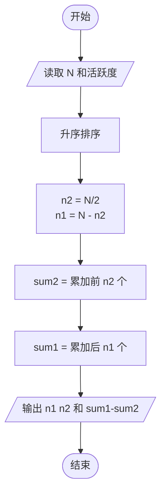
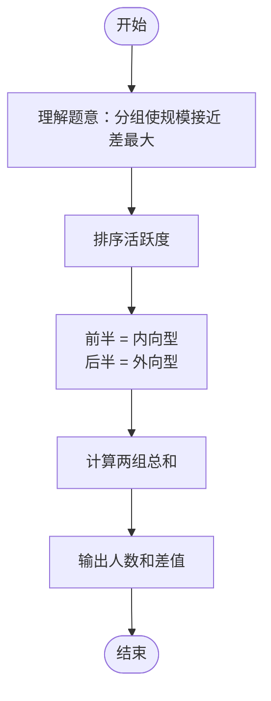

# L2-017 - 人以群分（25 分）

- **时间限制**: 150 ms
- **内存限制**: 65536 KB
- **代码长度限制**: 16 KB

---

## 题目描述

社交网络中我们给每个人定义了一个“活跃度”，现希望根据这个指标把人群分为两大类，即外向型（outgoing，即活跃度高的）和内向型（introverted，即活跃度低的）。要求两类人群的规模尽可能接近，而他们的总活跃度差距尽可能拉开。

### 输入格式:

输入第一行给出一个正整数$$N$$（$$2 \le N \le 10^5$$）。随后一行给出$$N$$个正整数，分别是每个人的活跃度，其间以空格分隔。题目保证这些数字以及它们的和都不会超过$$2^{31}$$。

### 输出格式:

按下列格式输出：

```
Outgoing #: N1
Introverted #: N2
Diff = N3
```

其中`N1`是外向型人的个数；`N2`是内向型人的个数；`N3`是两群人总活跃度之差的绝对值。

### 输入样例 1：
```in
10
23 8 10 99 46 2333 46 1 666 555
```

### 输出样例 1：
```out
Outgoing #: 5
Introverted #: 5
Diff = 3611
```

### 输入样例 2：
```in
13
110 79 218 69 3721 100 29 135 2 6 13 5188 85
```

### 输出样例 2：
```out
Outgoing #: 7
Introverted #: 6
Diff = 9359
```

## 示例

### 示例 1

**输入:**
```
10
23 8 10 99 46 2333 46 1 666 555
```

**输出:**
```
Outgoing #: 5
Introverted #: 5
Diff = 3611
```

### 示例 2

**输入:**
```
13
110 79 218 69 3721 100 29 135 2 6 13 5188 85
```

**输出:**
```
Outgoing #: 7
Introverted #: 6
Diff = 9359
```

---

## 题目详解

### 一、解题思路

本题将人群分为外向型（活跃度高）和内向型（活跃度低），要求两类规模尽可能接近、总活跃度差距尽可能大。

1. **排序**：将所有人的活跃度排序。
2. **分组**：取前 `N/2` 个人为内向型（活跃度较低），后 `N - N/2` 个人为外向型（活跃度较高）。
   - 当 N 为偶数：两派各 N/2 人
   - 当 N 为奇数：外向型 (N+1)/2 人，内向型 N/2 人
3. **计算总和**：分别计算两组的活跃度总和，差值为 `外向型总和 - 内向型总和`。

### 二、代码流程说明

1. 读取人数 `N`
2. 读取 `N` 个活跃度存入 `activity` 数组
3. 调用 `sort` 升序排序
4. 计算 `n2 = N / 2`（内向型人数），`n1 = N - n2`（外向型人数）
5. 计算 `sum2`：累加 `activity[0]` 到 `activity[n2-1]`
6. 计算 `sum1`：累加 `activity[n2]` 到 `activity[N-1]`
7. 按格式输出 `n1`、`n2` 和 `sum1 - sum2`

### 三、代码流程图



### 四、解题流程图


