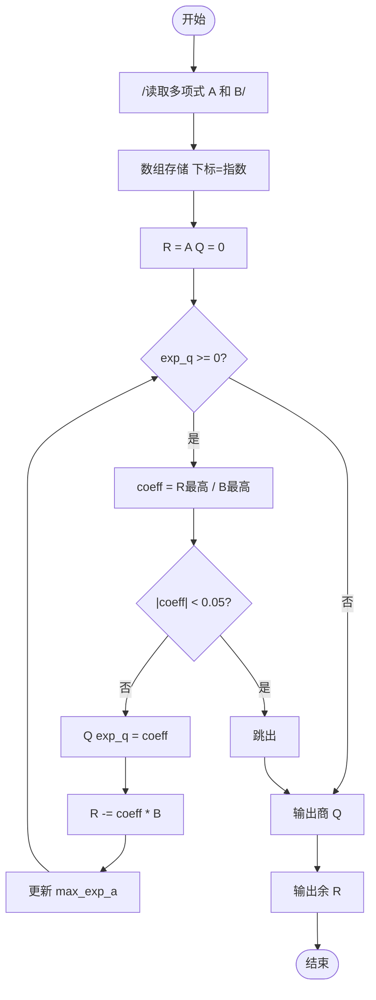
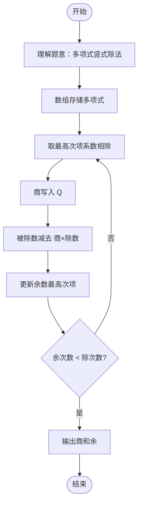

# L2-018 - 多项式A除以B（25 分）

- **时间限制**: 400 ms
- **内存限制**: 65536 KB
- **代码长度限制**: 16 KB

---

## 题目描述

这仍然是一道关于A/B的题，只不过A和B都换成了多项式。你需要计算两个多项式相除的商Q和余R，其中R的阶数必须小于B的阶数。

### 输入格式:

输入分两行，每行给出一个非零多项式，先给出A，再给出B。每行的格式如下：

```
N e[1] c[1] ... e[N] c[N]
```

其中`N`是该多项式非零项的个数，`e[i]`是第`i`个非零项的指数，`c[i]`是第`i`个非零项的系数。各项按照指数递减的顺序给出，保证所有指数是各不相同的非负整数，所有系数是非零整数，所有整数在整型范围内。

### 输出格式:

分两行先后输出商和余，输出格式与输入格式相同，输出的系数保留小数点后1位。同行数字间以1个空格分隔，行首尾不得有多余空格。注意：零多项式是一个特殊多项式，对应输出为`0 0 0.0`。但非零多项式不能输出零系数（包括舍入后为0.0）的项。在样例中，余多项式其实有常数项`-1/27`，但因其舍入后为0.0，故不输出。

### 输入样例:
```in
4 4 1 2 -3 1 -1 0 -1
3 2 3 1 -2 0 1
```

### 输出样例:
```out
3 2 0.3 1 0.2 0 -1.0
1 1 -3.1
```

## 示例

### 示例 1

**输入:**
```
4 4 1 2 -3 1 -1 0 -1
3 2 3 1 -2 0 1
```

**输出:**
```
3 2 0.3 1 0.2 0 -1.0
1 1 -3.1
```

---

## 题目详解

### 一、解题思路

本题要求计算多项式 A 除以多项式 B 的商 Q 和余 R。使用竖式多项式除法。

1. **多项式存储**：用数组表示多项式，下标表示指数，值表示系数。`A[e] = c` 表示 `c * x^e`。
2. **除法过程**（迭代）：
   - 从最高次项开始，用 A 的最高次项除以 B 的最高次项，得到商的系数 `coeff`
   - 将 `coeff * B` 从 A 中减去（对应位数相减）
   - 确定商的指数位置，记录到 `Q`
   - 更新 A 的最高次项（跳过接近 0 的项）
   - 重复直到 A 的次数小于 B 的次数
3. **输出**：按格式输出商 Q 和余 R，系数保留 1 位小数，0.05 以下的项被截断。

### 二、代码流程说明

1. 读取多项式 A：构建数组 `A[10010]`，记录 `max_exp_a`
2. 读取多项式 B：构建数组 `B[10010]`，记录 `max_exp_b`
3. 初始化 `Q` 为全零，`R = A`
4. 计算 `exp_q = max_exp_a - max_exp_b`
5. 当 `exp_q >= 0` 时循环：
   - `coeff = R[max_exp_a] / B[max_exp_b]`
   - 若 `|coeff| < 0.05`，跳出循环
   - `Q[exp_q] = coeff`
   - 从 `R` 中减去 `coeff * B`（对应指数位置相减）
   - 更新 `max_exp_a`（跳过接近 0 的项）
   - 更新 `exp_q`
6. 输出商 Q 和余 R（过滤 0.05 以下的项）

### 三、代码流程图



### 四、解题流程图


